# 香火债 · Incense Debt

**纸、墨、火、红绳与铜器构成的离线单人 2D 房间动作肉鸽。**  
**An offline, single-player 2D room-action roguelite built around paper, ink, incense, red thread, and brass.**

[中文说明](#zh-guide) · [English guide](#en-guide) · [实机与 GIF / Screenshots & GIFs](#showcase) · [菜单示意 / Menu diagram](#menu-diagram) · [运行 / Run](#zh-run) · [Build](#en-build) · [设计文档 / Design documents](docs/incense-debt/README.md)

**[下载 v0.1.0-alpha.1 / Download the prerelease](https://github.com/wikigsroom/joss-debt/releases/tag/v0.1.0-alpha.1)** · [中英发布说明 / Bilingual release notes](docs/releases/v0.1.0-alpha.1.md) · [安装与操作 / Installation and controls](docs/releases/START-HERE.md)

| 项目 / Item | 当前情况 / Current state |
| --- | --- |
| 游戏名 / Game title | 《香火债》 / **Incense Debt**；仓库名为 `joss-debt` / repository name: `joss-debt` |
| 版本 / Version | **0.1.0 · 十一层可玩 Alpha / playable eleven-floor Alpha** |
| 类型 / Genre | 平面房间探索、实时战斗、随机成长、风险交易 / room exploration, real-time combat, randomized builds, risk-based bargains |
| 引擎 / Engine | **Godot 4.7.2 · GDScript · Compatibility / OpenGL** |
| 画面 / Presentation | 1280 × 720 基准视口、横屏；60 Hz 战斗模拟 / reference landscape viewport; 60 Hz combat simulation |
| 游玩 / Play | 离线、单人、本地存档；无需生成接口或账号 / offline, single-player, local saves; no generation API or account required |
| 游戏语言 / Game language | 当前界面与叙事为简体中文；本 README 为中英双语 / the game currently uses Simplified Chinese; this README is bilingual |
| 平台 / Platforms | Windows 已原生运行验证；Android 已构建并检查 APK；iOS 已准备共享源码交接 / native Windows verified; Android APK built and inspected; iOS source handoff prepared |

当前范围以[交付状态](docs/incense-debt/reports/current-product-status.md)、[结构化状态](docs/incense-debt/reports/current-product-status.json)与实际源码为准。较早的三章报告保留为历史兼容证据，不代表当前正式局只有三层。  
Current scope is defined by the [delivery status](docs/incense-debt/reports/current-product-status.md), [machine-readable status](docs/incense-debt/reports/current-product-status.json), and source code. Older three-chapter reports are retained as historical compatibility evidence.

<a id="showcase"></a>
## 实机展示 / Native gameplay showcase

以下截图来自当前 Windows 原生版本，菜单图是依据实现绘制的说明图。普通游玩 GIF 使用纸童的正常初始数值和实际战斗输入；其他 GIF 使用原生测试场景展示指定特效、环境或后段 Boss。GIF 无声音。  
Screenshots come from the native Windows build. The menu diagram documents the implemented flow. The normal-play GIF uses Paper Child's unchanged initial stats and real combat input; the other clips use native test scenes to demonstrate effects, scenery, or later-floor bosses. GIFs have no audio.

### 普通游玩 / Normal gameplay

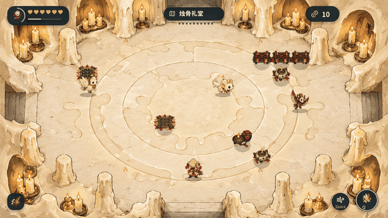

24 秒原生战斗采样，120 帧、5 fps，战斗模拟为 60 Hz；输入由行动机器人驱动，包含真实射击、焚债、敌人行为和门口移动。录制不读写玩家愿簿。它用于展示实际运行画面，不能替代真人手感评测。  
A 24-second native capture: 120 frames at 5 fps, with combat simulated at 60 Hz. An action bot supplies real shooting, Burn Debt, enemy interaction, and movement through doors. Recording does not access player save slots. This demonstrates actual rendering and gameplay, rather than human playtest results.

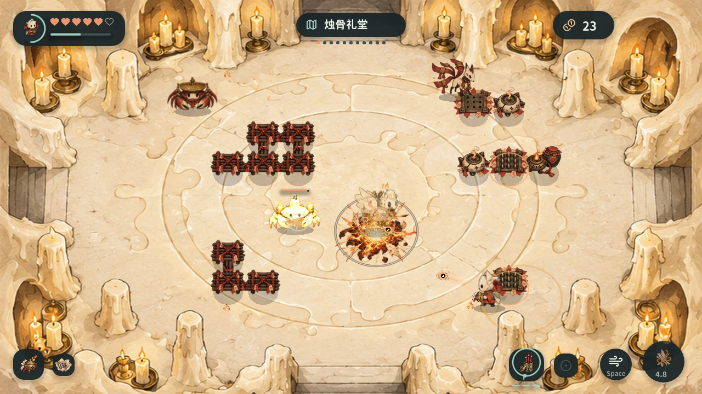

### 射线与范围爆发 / Beams and area bursts

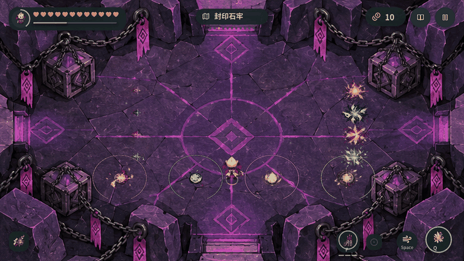

原生特效演示：蓄势、射线主体、粒子、扩张和余辉，包含按内墙裁切的视觉表达。  
Native effects demonstration: anticipation, beam bodies, particles, expansion, afterglow, and inner-wall clipping.

### 环境与后段首领 / Scenery and later-floor bosses

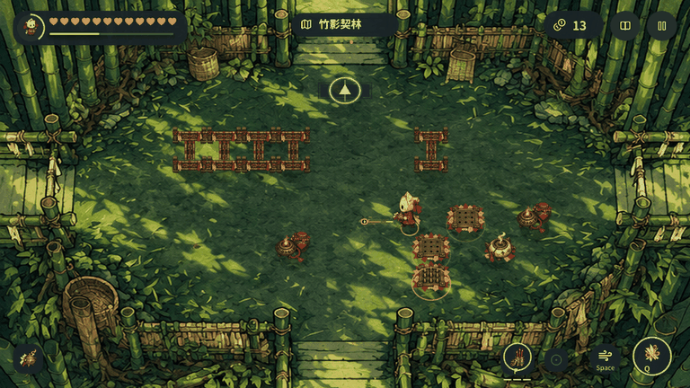

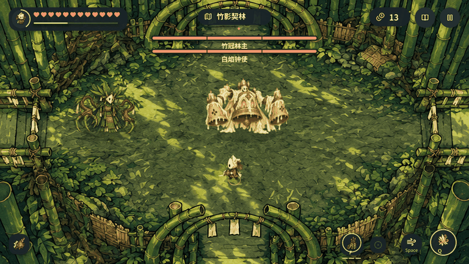

双首领演示对应后段玩法；第 1—5 层的两个 Boss 各在独立房间中。  
The paired-boss demonstration represents later-floor encounters. Floors 1–5 place their two bosses in separate rooms.

原始来源、压缩方式、构建与媒体 SHA-256 见[媒体说明](docs/media/README.md)、[媒体清单](docs/media/manifest.json)及[普通游玩记录](docs/media/gameplay-capture.json)。  
See the [media notes](docs/media/README.md), [media manifest](docs/media/manifest.json), and [normal-play capture record](docs/media/gameplay-capture.json) for provenance, encoding, and SHA-256 hashes.

<a id="zh-guide"></a>
## 中文说明

### 阅读导航

[世界与核心循环](#zh-loop) · [内容规模](#zh-content) · [角色与技能](#zh-characters) · [武器](#zh-weapons) · [地图与房间](#zh-maps) · [菜单与 UI](#zh-menus) · [操作](#zh-controls) · [成长与成就](#zh-progression) · [存档](#zh-saves) · [美术与声音](#zh-art) · [运行与构建](#zh-run) · [工程与验证](#zh-engineering) · [当前边界](#zh-status)

<a id="zh-loop"></a>
### 世界观与核心战斗循环

未还的愿望会化成债，账上的名字会被吞没。玩家扮演由未尽之愿化生的纸灵，经过十一重旧账，搜集供物、选择赊愿或偿还，最后决定总账的落款。还愿庭承担故事回顾、成长、图鉴、训练和角色留名。

游戏从《以撒的结合》的相邻房间探索与风险奖励结构、《元气骑士》的武器差异与即时战斗体验中获得启发，围绕“**挂余烬 → 连债 → 焚债 → 收灰**”形成自己的主要节奏：

1. **挂余烬**：主攻击命中敌人，为目标留下余烬标记。基础标记最多三层，并有持续时间；武器、角色与遗物可改变标记行为。
2. **连债**：距离合适的已标记目标形成债链。走位和目标顺序会影响一次爆发覆盖多少敌人。
3. **焚债**：使用 `Q` 或鼠标右键施放角色技能，消耗香火，让余烬和债链产生集中爆发。不同技能改变范围、方向、防御和延迟方式。
4. **收灰**：击杀产生的自然香灰补充香火，支持下一次技能。主攻击本身不消耗香火，身法有独立冷却。
5. **成长与风险**：清房后选择遗物、行愿节点或技能演化；用纸钱交易，或者接受需要日后偿还的债约。
6. **真正走门**：清房后，朝房间对应方向的门口移动，进入相邻房间。行路图用于查看路径，切房由实际位置与门口触发。

射击方向会改变角色朝向和手持器具姿态。命中、蓄力、冲刺、受击、爆发与击杀有各自的动画、音效和反馈；相关动态强度可在辅助设置中调节。

<a id="zh-content"></a>
### 当前内容规模

| 系统 | 当前数量与范围 |
| --- | --- |
| 正式流程 | 11 层；最终层 40 房、6 个连续独立首领房与最终总账 |
| 环境 | 20 套独立主题、每套 A/B 两张背景，共 40 张 |
| 角色 / 路线 | 6 名角色、6 条成长路线 |
| 武器 / 技能 | 32 件器具、18 种角色技能形态，每人 3 种 |
| 局内成长 | 54 件遗物、36 个行愿节点、24 套登记的联动组合 |
| 风险与局外 | 9 类债约、22 项局外解锁、5 位功能 NPC |
| 遭遇库 | 296 种普通敌人、99 名首领、6 种精英变体；含原始通用与兼容内容 |
| 主题专属池 | 每主题 12 种小怪与 3 名 Boss；最终天穹为 7 名 Boss，即每主题 15—19 种专属遭遇 |
| 成就与愿簿 | 32 项成就，其中每名角色 4 项、另有 8 项共享成就；3 个独立存档槽 |
| 动画与资源 | 2,730 条动画、16,628 张方向动作帧；3,665 项实际运行资源 |
| 战斗关键帧 | 新增 8 条射线 / 范围特效条，共 48 张生成关键帧 |
| 声音 | 9 套音乐主题、25 条音乐分层；运行音频共 112 项 |

主题数量表示地图池的规模，不表示一局有二十层；敌人与首领数量是整个库的数量，不表示每局全部出现。登记的 24 套联动也不是所有搭配的穷举。完整条目见[内容数据库](game/data/catalog.json)、[扩展规则](game/data/expansion.json)与[生成目录](docs/incense-debt/16-content-catalog.generated.md)。

<a id="zh-characters"></a>
### 六名角色与十八种技能

纸童初始可用，其他角色通过实际游玩行为与进度解锁。角色详情页显示被动、路线、解锁条件、个人任务和技能；锁定角色也可预览、试演。试演与训练隔离于正式局，不发放正式局奖励。

| 角色 / ID | 初始心火 / 移速 | 初始器具 | 本职路线 | 核心被动 |
| --- | --- | --- | --- | --- |
| 纸童 `c_paper` | 6 / 240 | 香炉丸 | 归灰、烬火 | 每次焚债的首个击杀额外恢复 4 香火 |
| 铃师 `c_bell` | 5 / 260 | 牵魂铃 | 红绳、游风 | 基础债链上限 4、连接距离 200 |
| 灯客 `c_lantern` | 5 / 240 | 守夜灯 | 烬火、墨契 | 主攻击首次命中增加一层灼烧 |
| 傩面 `c_mask` | 8 / 200 | 镇门印 | 镇印、归灰 | 三次主攻击命中获得纸甲，受冷却与层数限制 |
| 伞灵 `c_umbrella` | 5 / 265 | 回魂伞 | 游风、归灰 | 自然香灰额外恢复香火，扩大拾灰半径 |
| 墨吏 `c_ink` | 6 / 230 | 勾愿笔 | 墨契、红绳 | 余烬持续加长，可穿透主弹额外穿透 |

移速为基准视口下的模拟单位；上述数值是角色初始值，会受本局构筑影响。

| 角色 | 基础技能 | 演化一 | 演化二 |
| --- | --- | --- | --- |
| 纸童 | **撒灰**：范围引爆余烬与相连债链 | **纸燕**：灰燕追索固定标记集合 | **爆竹**：四向窄道集中爆发 |
| 铃师 | **铃断**：优先引爆最大的债链 | **赤网**：短暂收紧后爆发，Boss 免疫定身 | **回音**：对固定集合追加延迟回响 |
| 灯客 | **灯宴**：爆发后留下火区 | **烛龙**：长而窄的线状爆发 | **走马灯**：移动火区跟随玩家 |
| 傩面 | **镇印**：近距引爆与短暂正面招架 | **护门**：正面阻挡，格挡弹强化反击 | **破阵**：近距击退并破除可破铜盾 |
| 伞灵 | **回伞**：回收自然香灰并引爆标记 | **雨帐**：多段定点落灰 | **借风**：轻推小怪并加快回旋弹返程 |
| 墨吏 | **勾销**：沿瞄准线合并债链爆发 | **飞白**：三条窄线 | **重书**：沿原固定线追加延迟伤害 |

演化会改变技能的用途、花费与冷却；固定目标集合、次级伤害来源和派生深度限制用于控制多段联动，避免无限递归触发。具体参数见[技能目录](game/data/catalog.json)。

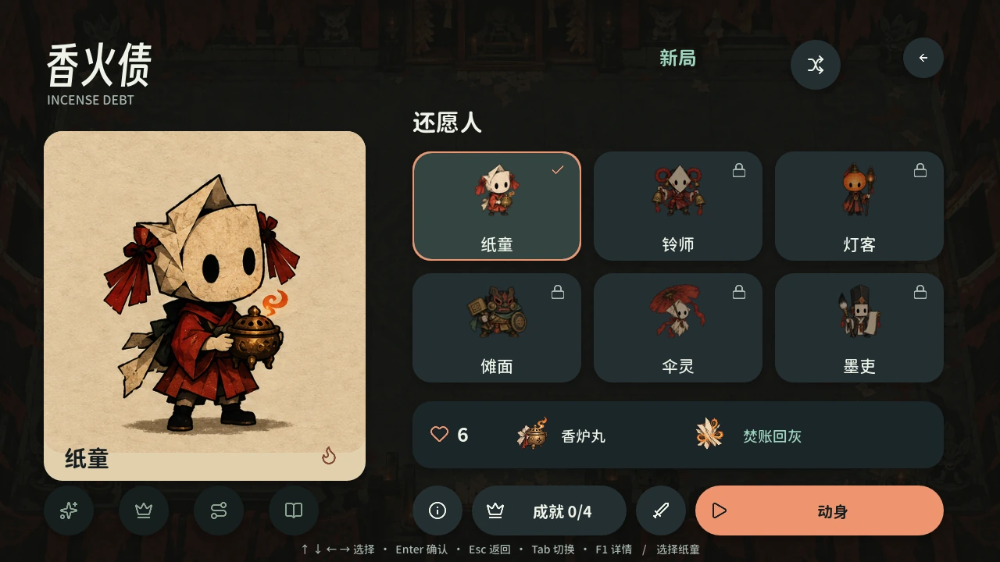

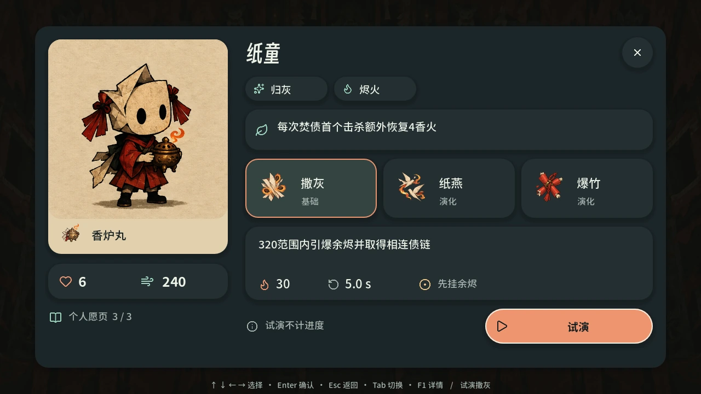

<a id="zh-weapons"></a>
### 三十二件器具与攻击模式

器具决定主攻击的轨迹、命中窗口与走位要求，技能仍由角色和演化决定。遗物、行愿和债约可以改变标记、传播、回收与伤害事件，构成跨武器搭配。灯摊待售器具可进入独立靶场试射；返回后钱包、候选、随机流和挂起进度保持一致。

| ID | 器具 | 主要攻击形式 |
| --- | --- | --- |
| `w01` | 香炉丸 | 香火弹丸 |
| `w02` | 牵魂铃 | 铃响弹 |
| `w03` | 守夜灯 | 火焰弹 |
| `w04` | 镇门印 | 近距锥形打击 |
| `w05` | 回魂伞 | 返程弹 |
| `w06` | 勾愿笔 | 穿透弹 |
| `w07` | 纸钱散 | 扇形散射 |
| `w08` | 爆香筒 | 爆炸弹 |
| `w09` | 铜钱轮 | 弹跳弹 |
| `w10` | 引灰灯 | 寻敌弹 |
| `w11` | 判官笔 | 蓄力直线攻击 |
| `w12` | 灰骨刃 | 弧形近战 |
| `w13` | 三芯灯 | 三发散射 |
| `w14` | 照骨镜 | 射线 |
| `w15` | 引魂纸鸢 | 可操控子弹 |
| `w16` | 断愿铜钺 | 蓄力近战弧 |
| `w17` | 星灯簇 | 连发簇射 |
| `w18` | 香雾盒 | 持续云雾区域 |
| `w19` | 碎愿风轮 | 环绕刀刃 |
| `w20` | 纸雨伞 | 落雨攻击 |
| `w21` | 铜霆护铃 | 连锁雷击 |
| `w22` | 莲灯散瓣 | 放射弹 |
| `w23` | 墨潮尺 | 波形攻击 |
| `w24` | 牵魂索 | 牵引连索 |
| `w25` | 裂页签 | 分裂弹 |
| `w26` | 回愿铎 | 回旋弧 |
| `w27` | 镇愿地印 | 地雷 / 地印 |
| `w28` | 灯蜂匣 | 追踪弹簇 |
| `w29` | 红线剪 | 横扫近战 |
| `w30` | 裂空铜镜 | 棱镜分束 |
| `w31` | 愿灯飞符 | 引导符群 |
| `w32` | 万愿轮 | 新星爆发 |

射线和范围攻击按“预备 → 主体 → 扩张 / 爆发 → 余辉”表现，使用琥珀、墨、红线、棱镜，以及火、莲、冲击波等视觉家族。射线长度由真实内墙和障碍裁切；关闭强闪光或减少粒子只调整表现。

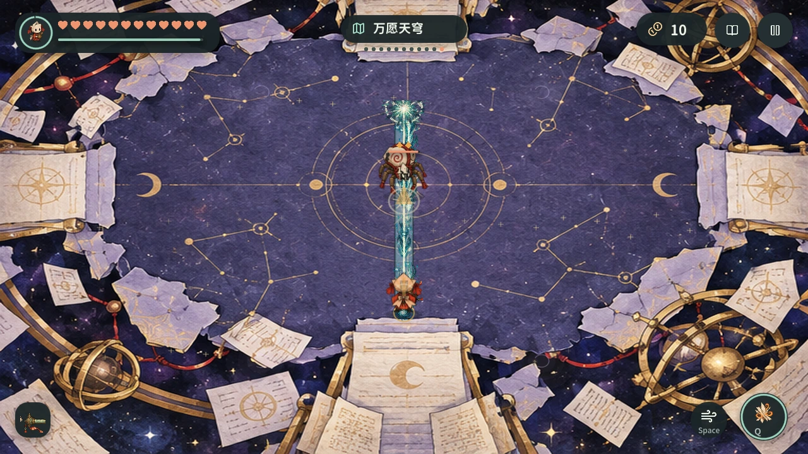

<a id="zh-maps"></a>
### 十一层、二十套主题与房间结构

每层从主题池选择环境；环境通过独立主色、材质、建筑、地面图案、天气和动态颗粒区分。每套有 A/B 两张背景和配套怪物、Boss，美术和碰撞以背景的内侧围墙为边界。

| ID | 主题 | English description |
| --- | --- | --- |
| `m01` | 灯市后巷 | Lantern Market Alley |
| `m02` | 纸渡河埠 | Paper Ferry Wharf |
| `m03` | 铜钱旧库 | Old Coin Vault |
| `m04` | 苔庭香径 | Moss Court and Incense Path |
| `m05` | 墨雨书院 | Ink-Rain Academy |
| `m06` | 赤绫戏楼 | Crimson Silk Theater |
| `m07` | 烛骨礼堂 | Candle-Bone Chapel |
| `m08` | 雷鼓山门 | Thunder-Drum Gate |
| `m09` | 灰窑遗坊 | Ash Kiln Ruins |
| `m10` | 莲灯水阁 | Lotus-Lantern Pavilion |
| `m11` | 白绫桥院 | White-Silk Bridge Court |
| `m12` | 钟楼余响 | Bell-Tower Echo |
| `m13` | 竹影契林 | Bamboo Pact Grove |
| `m14` | 镜池回廊 | Mirror-Pool Cloister |
| `m15` | 封印石牢 | Sealed Stone Prison |
| `m16` | 万签焚堂 | Hall of Burning Vows |
| `m17` | 绳塔悬阁 | Rope-Tower Gallery |
| `m18` | 无名陵园 | Nameless Graveyard |
| `m19` | 守名判殿 | Namekeeper Judgment Hall |
| `m20` | 万愿天穹 | Sky of Ten Thousand Vows |

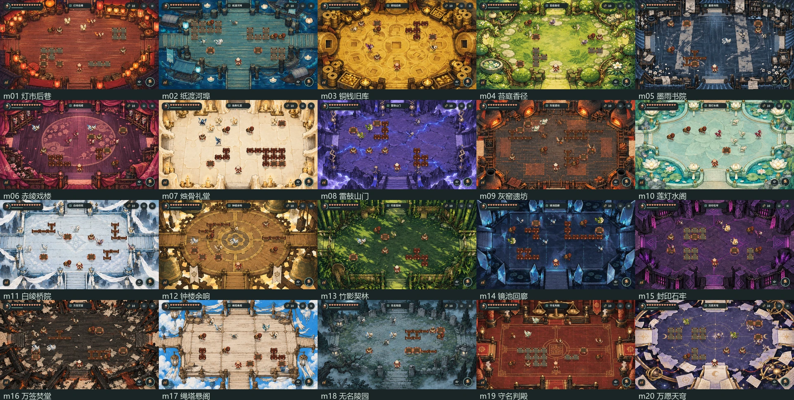

**遭遇混编。** 正式遭遇采用 **60% 本土 + 40% 外来**。每层从其他主题中挑选一个随机、高对比的客场主题，并在该层保持一致；选择考虑色相、亮度和饱和度，避免怪物与地面过度同色。10 只小怪的常见配置是 6 本土 + 4 外来，极小波次按累计比例处理。精英、召唤与挑战也沿用该层客场来源。随机 Boss 槽按全局配额接近 60/40 分配，固定剧情 Boss 保留身份。

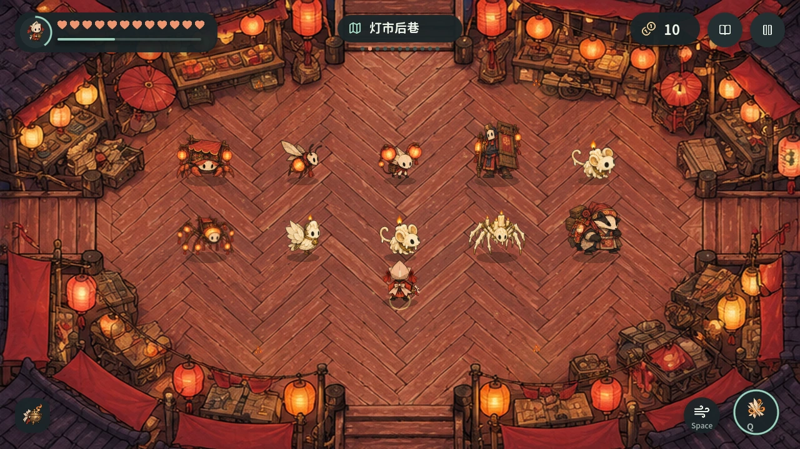

**首领分布。** 第 **1—5 层每层两个独立单 Boss 房**：一个位于主线出口，一个位于随机支路；每间只放一个 Boss。第 6 层为固定剧情首领守名大判；第 7—10 层保留主线双首领强度；第 11 层包含 40 房、连续六个独立首领房，最终面对万愿总账并进入结尾叙事。

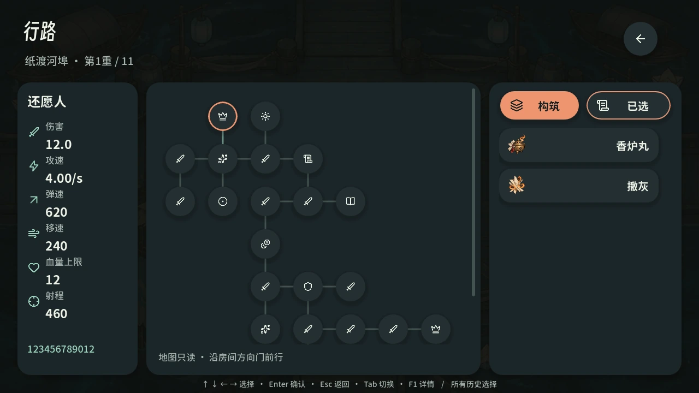

| 第一间首领房 / First boss chamber | 第二间首领房 / Second boss chamber |
| --- | --- |
| 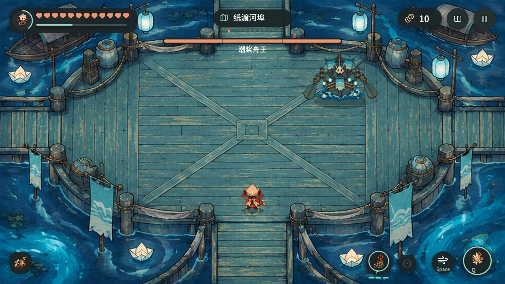 | 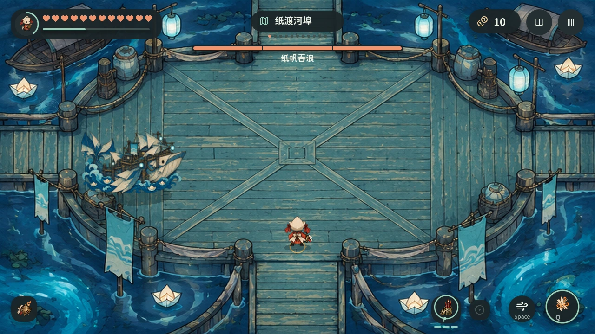 |

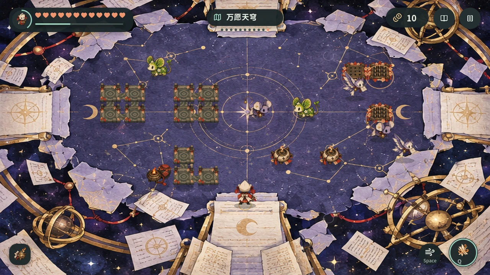

**走门与回访。** 战斗房清空全部波次后才开放方向门；玩家走到门的有效通道才能切房。已清房可回访，敌人与奖励不会重新刷新。秘密断页入口需要靠近发现，再使用交互。地图显示发现状态、方向连接、主线和支路，不能点击地图直接传送。

**碰撞与可互动环境。** 40 张背景分别校准内墙轮廓，玩家、敌人、NPC、冲刺、击退、寻路、弹道和射线共享几何规则；角色碰撞考虑实体半径。环境包含动态与可交互障碍。狭窄通道寻路使用细网格与局部回退，保持物理门口可达。

| 房间 | 主要用途与风险 |
| --- | --- |
| 普通 / 精英战房 | 随机遭遇与成长；后段部分房间分波次，阵间可收灰 |
| 供物与成长房 | 遗物、行愿与技能候选，含替换及多阶段选择 |
| 灯摊商店 | 使用纸钱购买器具、遗物或疗愈；器具可免费独立试射 |
| 献灯房 | 消耗心火换取成长，每间献灯次数受限 |
| 判官房 | 用当前心火押注强器具或稀有供物，承担明确代价 |
| 观音房 | 疗愈、提升心火上限或获得行愿祝福 |
| 破阵房 | 主动接受连续三轮挑战，完成后获得成长奖励 |
| 债约与事件 | 即时收益、未来利息 / 惩罚、故事选择与偿债 |
| 秘密与首领房 | 发现支路、选择风险、获取首领奖励和推进楼层 |

<a id="zh-menus"></a>
### 菜单层级与现代游戏 UI

界面采用大圆角面板、圆形图标、胶囊行动按钮、紧凑 HUD 和按需展开的详情。面板基准圆角为 24，工具图标共 57 个；焦点边框、选中颜色与底部提示支持纯键盘操作。战斗 HUD 以心火、香火、纸钱、楼层与行动图标为主，构筑和长说明放入独立页面。

<a id="menu-diagram"></a>
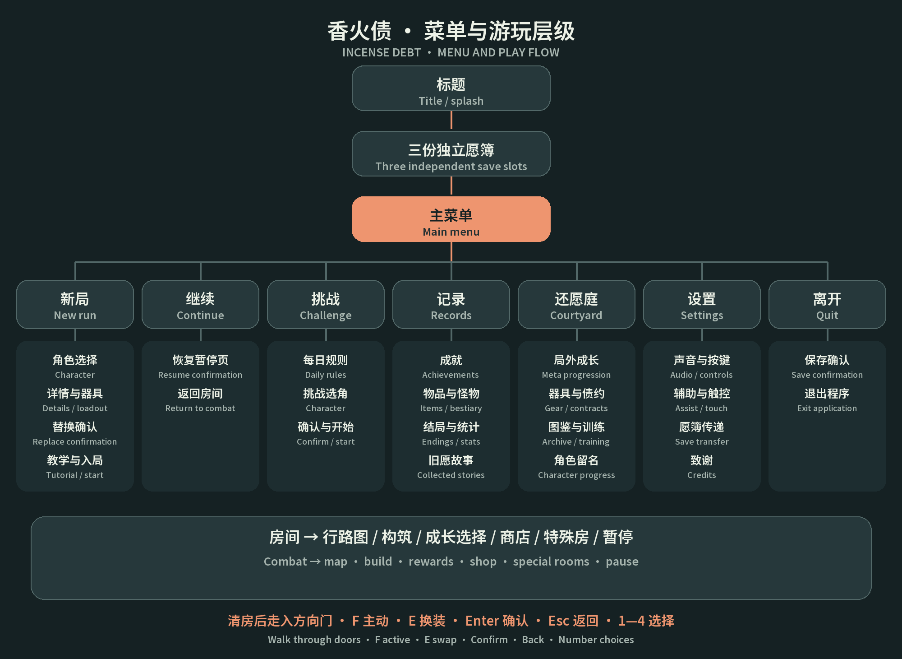

```text
标题 → 三个愿簿槽 → 主菜单
  ├─ 新局 → 角色 → 详情 / 器具 / 个人成就 → 确认 → 教学 → 战斗
  ├─ 继续 → 恢复暂停确认 → 战斗
  ├─ 挑战 → 每日规则 → 挑战选角 → 确认 → 挑战局
  ├─ 记录 → 成就 / 物品 / 怪物 / 结局 / 统计 / 旧愿故事
  ├─ 还愿庭 → 局外成长 / 图鉴 / 训练 / 债约 / 器具 / 角色进度
  ├─ 设置 → 声音 / 操作 / 辅助 / 触控布局 / 愿簿传递 / 致谢
  └─ 离开 → 保存确认

战斗 → Tab 行路图 / I 构筑 / 成长候选 / 商店与特殊房 / Esc 暂停
暂停 → 继续 / 成长与本局记录 / 成就 / 设置 / 保存回主菜单
胜利 → 结局选择 → 结算与复盘；失败 → 结算与复盘 → 主菜单或重开
```

新局替换未完成局前有明确确认；取消会保留旧局。恢复游戏先停在暂停确认，后台返回和转回横屏也需要主动继续。`Esc` 按层级返回，商店试射返回原商店，连续奖励逐步提交；菜单的禁用项不占用可选焦点。

| 主菜单 / Main menu | 三个愿簿槽 / Three save slots |
| --- | --- |
| 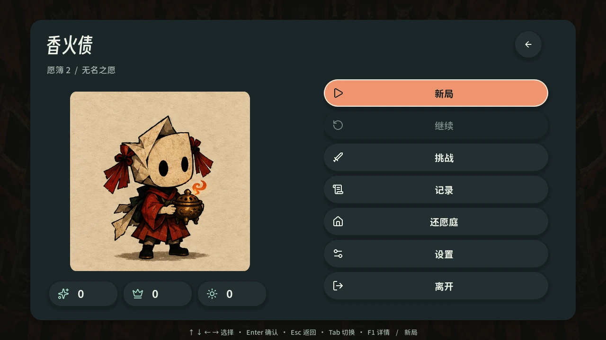 | 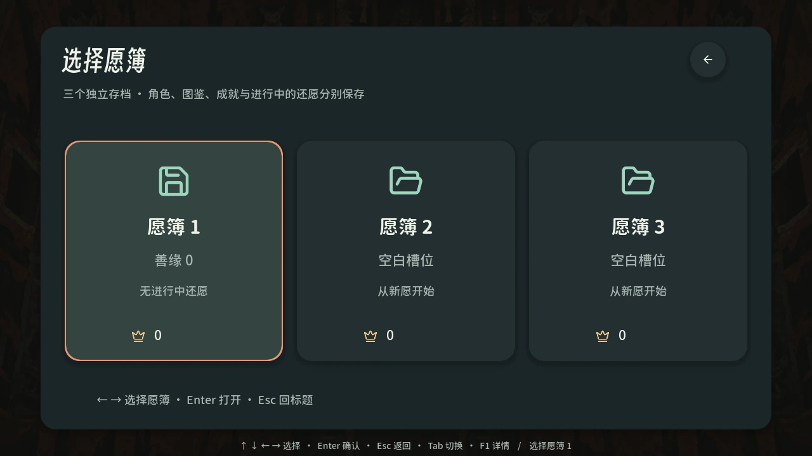 |

| 暂停 / Pause | 行路图与完整构筑 / Map and complete build |
| --- | --- |
| 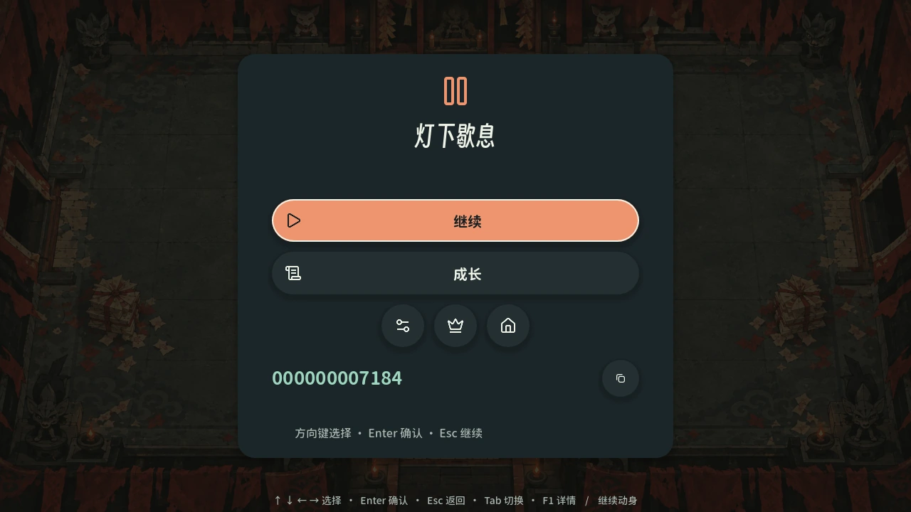 | 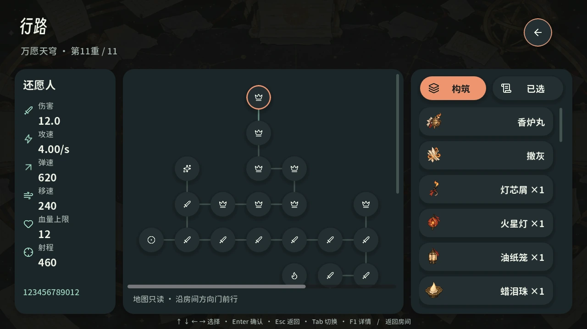 |

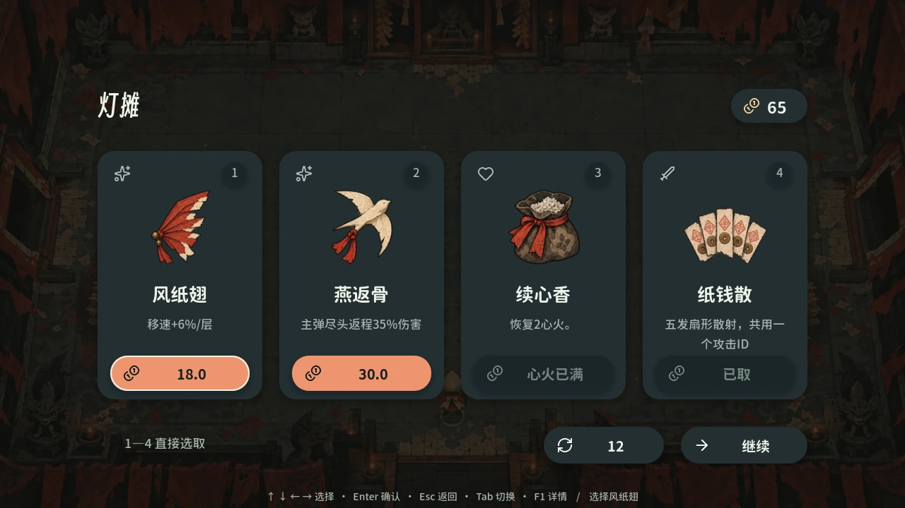

<a id="zh-controls"></a>
### PC、手柄与触控操作

| 动作 | PC 默认操作 | 手柄默认操作 |
| --- | --- | --- |
| 移动 | `W / A / S / D` | 左摇杆 |
| 瞄准与主攻击 | 鼠标瞄准 + 按住左键，或按住方向键瞄准并射击 | 右摇杆瞄准 + `RT` |
| 焚债 / 角色技能 | `Q` / 鼠标右键 | `RB` |
| 身法 | `Space` | `LT` |
| 交互 | `E`；相邻房间由实际走门进入 | `A` |
| 奖励、技能、商店、债约候选 | `1 / 2 / 3 / 4` 直接选择；或方向键 + `Enter` | 焦点选择与确认 |
| 行路图 | `Tab` 打开 / 收起 | 界面入口 |
| 本局构筑 | `I`；暂停页也能查看完整成长历史 | 界面入口 |
| 暂停 / 返回 | `Esc` | `Start`；菜单中 `B` 返回 |
| 全屏 | `F11` | — |

**纯键盘菜单闭环：** 方向键移动选择，`Enter` 确认，`Esc` 返回上一层；`Tab / Shift+Tab` 循环焦点，`F1` 查看完整说明。长列表使用 `PageUp / PageDown / Home / End`，地图内可用 `Ctrl+Tab` 切换区域；音量滑块左右调整、上下换项。按键录入中 `Esc` 取消录入，文本框与触控编辑区可用 `Tab` 离开。

方向键松开即停止主攻击，但保留最后瞄准方向；实际移动鼠标才重新切回鼠标瞄准。技能多选、供物替换、特殊房、偿债、层间叙事、结局与试射返回都有键盘路径。

手机采用左移动 / 右瞄准双摇杆和独立身法、焚债按钮，可第三指同时施术；触控布局支持左右镜像、拖动调整或方向键编辑。竖屏 / 窄屏触发暂停保护。操作页支持鼠键和手柄重映射、冲突交换；辅助页包括死区、辅助瞄准、固定摇杆、切换攻击、拾取范围、触觉、震动 / 强闪 / 粒子与愿页字号设置。手柄和移动端的真实设备验收仍见[当前边界](#zh-status)。

### 种子与每日挑战

角色页可输入 12 位种子，保留前导零，仅作用于紧接着启动的一局；启动后输入自动清空。暂停页能查看、复制本局种子。每日挑战有独立规则与选角入口；随机流分离地图、内容与战斗派生，保存恢复延续同一局的状态。相同种子并不保证不同版本、不同解锁状态下内容完全相同。

<a id="zh-progression"></a>
### 成长、联动、债约与角色成就

| 路线 | 战斗侧重 | 示例思路 |
| --- | --- | --- |
| 烬火 `fire` | 灼烧、区域、烧尽 | 集中挂标记，再把敌人留在火区 |
| 红绳 `thread` | 连债、控制、传播 | 通过聚敌和链长提高一轮爆发收益 |
| 归灰 `ash` | 拾灰、能量、返击 | 回收香灰维持技能循环 |
| 镇印 `seal` | 招架、纸甲、破阵 | 格挡与贴身反击，处理防御型敌人 |
| 游风 `wind` | 身法、回旋、路径 | 把冲刺、返程弹与站位结合 |
| 墨契 `ink` | 穿透、延迟、勾销 | 贯穿敌群，利用固定线和延迟回响 |

**局内成长**包括可叠加遗物、36 个行愿节点、角色技能演化、器具更换和路线联动。选择记录保留每次获得 / 替换的历史；暂停页的成长入口及行路图分别展示当前数值、当前构筑与本局完整历史，便于理解多段技能和加成从何而来。

**局外成长**在还愿庭使用善缘与已完成条件解锁遗物池、混合路线和便利功能。22 项局外解锁、角色留名、故事、发现图鉴和结局记录随所选愿簿保存。5 位 NPC 分别负责故事与愿簿、图鉴训练、债约偿还、商店试器、个人进度。

**债约**提前提供供物收益，同时附带催账敌人、敌方债线、延迟拾灰、疗愈涨价、纸钱减收、身法冷却、香火返还限制或阶段护印等代价。九类为借火、牵线、借灰、借命、铜息、行债、空名、镇门、总账；出现楼层、本金、利息上限和可保留奖励由数据规定。收益和风险会跨房延续，偿债改变后续压力。

**成就**共有 32 项：每名角色 4 项，加 8 项全局成就。个人四项对应角色特色行为、一次胜利、两条本职路线和三页个人愿簿；例如纸童统计焚债爆发，铃师统计连线峰值，傩面统计防御，伞灵统计回灰。全局统计胜利次数、六角色留名、结局、首领发现、路线、供物和正式局次数。成就观察防止重复领取，角色详情与记录页都可查看进度。定义见[成就数据](game/data/achievements.json)。

<a id="zh-saves"></a>
### 存档、恢复与跨设备传递

存档以 **三个独立愿簿槽**为入口。各槽保存角色解锁、成长、成就、故事、结局、设置及当前整局，不会把账号成长和本局检查点分开覆盖。

| 项目 | 规则 |
| --- | --- |
| Windows 位置 | `%APPDATA%\IncenseDebt\` |
| 槽位 1 | 兼容原 `user://save_bundle/` |
| 槽位 2 / 3 | 独立 `user://slots/slot_N/` |
| 格式 | schema 2；账号与单局共同写入带校验的记录 |
| 备份 | 两代完整记录；最新代损坏时尝试上一代并提示 |
| 保存时机 | 房间转移、领取与关键操作、保存退出及生命周期处理 |
| 恢复 | 载入后先暂停，确认继续再恢复战斗 |
| 旧局 | 迁移旧格式，保留原文件；旧位置按新内墙约束，早期双 Boss 旧局拆分兼容 |
| 未知新版本 | 保护原文件并限制覆盖，不把无法识别的档案当作空档 |

**传递流程：** 设置 → 愿簿传递 → 导出文件 / 复制压缩文字 → 另一设备导入 / 粘贴 → 预览 → 确认换入。账号和当前整局一起传递；默认保留目标设备的操作、声音设置，也可选择带入。导入前进度保留为“回到导入前”，关闭游戏后仍能恢复。再次导入会更新这份备份。

目前采用本地存档与手动传递，没有云同步。备份整个目录前请关闭游戏；Android 私有目录通常随卸载删除。带新数值编码的愿簿需要匹配版本，两端传递时应一并更新。移动设备的文件选择器、软键盘与剪贴板仍需真机验证。存档实现见 [save_store.gd](game/scripts/core/save_store.gd)、[save_migrations.gd](game/scripts/core/save_migrations.gd)与 [save_transfer.gd](game/scripts/core/save_transfer.gd)。

<a id="zh-art"></a>
### 美术、字体、动效与声音

**视觉语言。** 角色以纸偶、纸面具、短朱袍、灯、铃、伞、铜印与账卷形成可辨识剪影；环境采用纸张、墨痕、铜锈、苔、绫与烛骨等材质。20 套主题的独立配色与建筑打破同质化，混编怪物提供额外对比。UI 采用深墨绿、暖纸色、桃橙强调色与圆角、图标、少量主行动文字。

**字体。** 正文为资源圆体的授权子集 `IncenseRoundedMedium / Bold`，标题为得意黑 `SmileySansOblique`，完整中文回退为 `Noto Sans SC`。字体在工程内打包，无需依赖玩家电脑已安装字体。授权文件保留在 [fonts](game/assets/fonts) 中。

**素材与动画。** 角色、器具、环境和关键帧图使用指定的 **sub2-image-gen / gpt-image-2.5** 生产并保留来源。正式精灵经过透明处理、切片、统一锚点和加载核对。角色与手持动作采用预生成纸偶变形条；射线 / 范围新增 48 张独立生成关键帧，构成 8 条特效。剧情过场使用静帧序列、镜头运动与转场。实际动画方法见[素材生产](docs/incense-debt/11-asset-production.md)与[视觉约定](docs/incense-debt/17-visual-contract.md)。

**音乐。** 当前是 9 套音乐主题、25 条同步分层，依据环境家族、探索、战斗、紧张与 Boss 状态切换和混合；20 套地图共用部分音乐家族，尚非每主题一套独有曲目。主要旋律、编曲与打击音效由本地工具原创合成；四份 CC0 素材用作低音量环境纹理，来源见[音频审计](docs/incense-debt/reports/runtime/audio-source-research.json)。

**反馈。** 各类器具的出手、蓄力、弹道、打击、受击、格挡、破盾、击杀与 UI 操作有分层音效。总音量、BGM、SFX 分开调节；暂停保留低音量音乐，切后台停止声音。运行音频已随源码提交，游玩无需在线模型；重新编曲可使用本机 FFmpeg 与 [compose_music.py](tools/runtime/compose_music.py)。

<a id="zh-run"></a>
### 获取源码与直接运行

工程已包含运行所需美术、字体、声音、数据和源代码。无需 Node.js、Docker、WSL 或素材生成网关即可运行；首次打开由 Godot 生成本地导入缓存。仓库包含大量图像和原始板，首次克隆与导入需要相应磁盘和时间。

```powershell
git clone git@github.com:wikigsroom/joss-debt.git
cd joss-debt

# 使用已安装并在 PATH 中的 Godot 4.7.2
godot --editor --path game

# 不打开编辑器，直接游玩
godot --path game
```

也可在 Godot 项目管理器中导入 [game/project.godot](game/project.godot)，再按 `F6 / F5` 运行场景 / 工程。Compatibility 渲染器是当前基线。初始流程为标题 → 选择愿簿 → 新局 → 纸童 → 确认与教学。

**Windows 本地便携工具路线：** 需要本机 Python；运行游戏不需要 Python，以下依赖仅用于构建、素材处理和验证。

```powershell
python -m pip install -r requirements.txt
python tools/runtime/fetch_godot.py
& ".local-tools/godot-4.7.2/Godot_v4.7.2-stable_win64_console.exe" --path game

# 只有导出应用才需要匹配版本的导出模板
python tools/runtime/fetch_export_templates.py
python tools/runtime/build_native.py windows
```

Windows 导出生成 `build/windows/IncenseDebt.exe`，资源嵌入程序，玩家运行 EXE 无需安装 Godot；分发时保留生成的字体、图标与 Godot 授权文件。当前程序未做发行者代码签名。

**Android：** `python tools/runtime/build_native.py android` 生成 arm64 调试 APK，最低 API 24、目标 API 36，仅启用 `VIBRATE`，不启用网络权限。脚本使用 `%LOCALAPPDATA%/Android/Sdk` 与固定 JDK 21 安装路径；请按实际本机位置调整脚本配置，或在 Godot 编辑器导出设置中配置自己的 SDK / JDK。模板下载并不会安装 Android SDK。

```powershell
python tools/runtime/build_native.py android

# 正式签名需要产品所有者自己的 release keystore
python tools/runtime/build_native.py android --android-build release
```

release 模式使用独立输出；缺少发布密钥时清除未签名半成品并报告错误。Android 包当前通过结构和签名检查，尚无手机实机运行结论。

**iOS：** Windows 可运行 `python tools/runtime/prepare_ios_handoff.py` 准备共享源码交接。真正导出需要实体 macOS、Godot 4.7.2、匹配模板、Xcode 和实际 Apple 开发团队；在 Mac 上使用 [export_ios_on_mac.py](tools/runtime/export_ios_on_mac.py)，再由 Xcode 完成签名、安装与验收。[iOS 交接说明](build/ios-handoff/README.md)列出操作步骤，目前没有已签名 IPA。

**仓库与发布附件：** 仓库提交源代码、运行资源、原始素材、设计数据、验证记录和 README 媒体；`.local-tools/`、`.godot/`、EXE / APK / 大型 ZIP、可再生音频母带和大量逐帧 QA 截图由 `.gitignore` 排除。文档直接引用的原始截图保留。应用包可在 [GitHub Release](https://github.com/wikigsroom/joss-debt/releases/tag/v0.1.0-alpha.1) 下载，也可本机导出。[交付清单](build/delivery-manifest.json)保留此前本地验证基线，[发布清单](docs/releases/v0.1.0-alpha.1.manifest.json)记录新 Windows release 导出与实际发布附件。

<a id="zh-engineering"></a>
### 工程结构与验证方法

```text
joss-debt/
├─ README.md                     中英双语产品与开发入口
├─ requirements.txt              可选 Python 工具依赖
├─ game/
│  ├─ project.godot / main.tscn   Godot 工程与主场景
│  ├─ scripts/main.gd            主流程、固定步长战斗与界面装配
│  ├─ scripts/core/              内容、种子、房间图、成长、存档与迁移
│  ├─ scripts/combat/            世界模拟、几何、武器、敌人、Boss 与环境
│  ├─ scripts/ui/                渲染、菜单、输入、触控、音乐与复盘
│  ├─ data/                      运行内容、扩展、边界、故事、成就与资源表
│  ├─ assets/                    正式精灵、背景、动画、字体、图标与音频
│  └─ tests/                     无界面回归、实际行动机器人与完整局测试
├─ docs/
│  ├─ incense-debt/              设计圣经、数据、生产提示词、验收报告
│  └─ media/                     README 截图、示意图、GIF 与来源记录
├─ tools/
│  ├─ design/                    目录生成与设计校验
│  ├─ runtime/                   素材处理、构建、原生 QA 与平台核对
│  └─ documentation/             README 原生捕获与媒体压缩
├─ output/imagegen/              生成原始板与可追溯素材来源
├─ output/audio/                 部分音频来源与元数据
└─ build/                        导出说明 / 清单；二进制输出不进入 Git
```

战斗状态由 [world.gd](game/scripts/combat/world.gd) 统一结算；[room_geometry.gd](game/scripts/combat/room_geometry.gd) 负责内墙与通道，[expanded_campaign.gd](game/scripts/core/expanded_campaign.gd) 负责扩展流程。渲染和输入独立于模拟，菜单、地图和保存恢复围绕同一份本局状态工作。内容使用稳定 ASCII ID，界面显示中文名。

常用源代码回归命令如下；`godot` 需指向对应 4.7.2 可执行文件。

```powershell
godot --headless --path game --script tests/combat_revision.gd
godot --headless --path game --script tests/expansion_systems.gd
godot --headless --path game --script tests/save_transfer.gd
godot --headless --path game --script tests/impact_and_resume.gd
godot --headless --path game --script tests/achievements.gd
godot --headless --path game --script tests/expanded_full_run.gd -- --character=c_umbrella --report-suffix=c_umbrella
```

原生 GUI、键盘、扩展与音频 QA 使用实际图形环境。先导出 Windows 应用，再运行：

```powershell
python tools/runtime/run_native_qa.py --packaged
python tools/runtime/run_keyboard_qa.py --packaged
python tools/runtime/run_expansion_qa.py --packaged
python tools/runtime/run_audio_qa.py --packaged
```

当前记录包括 373 项边界 / 混编 / 房间检查、509 项扩展系统检查、285 项打包扩展检查、75 项原生 GUI 操作、105 项纯键盘流程、22 项原生音频检查与 3,313 项素材来源核对。存档传递的 51 项检查及受击 / 恢复的 54 项检查有独立报告。这些检查类别存在交集，不将数量相加作为覆盖率。

当前完整局证据为 **1 次正常初始数值的伞灵行动机器人十一层胜利**，包含 129 次清房、153 次物理门口切房和 10 次层间保存恢复。它证明软件流程可达，真人难度、手感与平衡仍需评测。来源哈希与结果见[完整局记录](docs/incense-debt/reports/runtime/expanded-full-run.json)。

记录绑定当时源码和应用哈希；重新构建后需重新运行相关检查，历史报告不会自动验证新包。部分图片审计依赖本地完整捕获目录，首次执行请先运行相应原生 QA 生成被忽略的原始截图。README 普通游玩可用 `python tools/documentation/capture_readme_gameplay.py` 重新录制；该工具需要已导出的 Windows 应用，并会关闭自己创建的窗口。

<a id="zh-status"></a>
### 当前交付边界与后续验收

| 平台 / 项目 | 已有证据 | 尚需完成 |
| --- | --- | --- |
| Windows | 原生 EXE 运行、真实资源加载、菜单与键盘 QA、原生截图、音频采样 | 真人长期游玩、画面 / 手感 / 平衡验收、发行签名 |
| Android | arm64 调试 APK，结构、权限、签名与导入资源检查 | 真机安装、触控、软键盘、剪贴板、温控及生命周期 |
| iOS | 共享源码与模板交接，内容一致性检查 | 实体 Mac 导出、Xcode 工程、签名 IPA、iPhone / iPad 验收 |
| 输入 | 纯键盘流程和鼠键原生操作；手柄 / 触控映射已实现 | 真实手柄与移动设备体验 |
| 内容 | 十一层 Alpha 与上述系统、素材、自动流程证据 | 更多角色 / 种子的完整局和真人构筑平衡 |
| 语言 | 完整中文界面；双语项目说明 | 英文游戏界面与叙事本地化 |

版本仍为 Alpha；当前没有联网多人、在线账号或云同步。GitHub 提供 Windows 运行包、Android 调试 APK 与 iOS 源码交接预发布。项目级许可证尚未选定，第三方素材授权单独保留，见文末[授权说明](#licenses)。

<a id="en-guide"></a>
## English guide

### Navigation

[World and combat loop](#en-loop) · [Content](#en-content) · [Characters](#en-characters) · [Weapons](#en-weapons) · [Maps and rooms](#en-maps) · [Menus and controls](#en-controls) · [Progression](#en-progression) · [Saves](#en-saves) · [Art and audio](#en-art) · [Run and build](#en-build) · [Architecture and validation](#en-engineering) · [Delivery status](#en-status)

<a id="en-loop"></a>
### World and combat loop

Unfulfilled wishes turn into debts, and names disappear into the ledger. Six wish-born paper spirits travel through eleven layers of old accounts, collect offerings, borrow power or repay bargains, and choose how the final ledger should end. The Courtyard provides story review, progression, training, archives, and character records.

Incense Debt draws inspiration from The Binding of Isaac's connected-room exploration and risk/reward structure, and Soul Knight's weapon variety and immediate combat. Its own central mechanic is **Mark → Chain → Burn Debt → Recover Ash**:

1. **Mark:** Primary attacks place Ember Marks on enemies. Marks have a duration and a base three-stack limit; characters, relics, and weapons can modify their behavior.
2. **Chain:** Nearby marked enemies form Debt Chains. Positioning and target order affect how much one burst can reach.
3. **Burn Debt:** `Q` or right mouse activates the character skill, consuming Incense to detonate marks and connected targets. Evolutions change direction, area, defense, and timing.
4. **Recover Ash:** Natural ash from kills replenishes Incense and fuels the next cast. Primary attacks do not consume Incense; the dodge has its own cooldown.
5. **Build and bargain:** Choose relics, talents, or skill evolutions, spend Paper Money, or accept a debt contract with later costs.
6. **Walk through doors:** Clear a room and physically enter the doorway in the appropriate direction. The map shows connections; room transitions are triggered by position and door geometry.

Shooting changes character facing and held-weapon pose. Hits, charging, dodging, damage, detonations, and kills have distinct visual and audio feedback. Accessibility settings adjust presentation intensity.

<a id="en-content"></a>
### Current content

| System | Implemented scope |
| --- | --- |
| Campaign | 11 floors; final floor has 40 rooms, 6 consecutive separate boss rooms, and the final ledger |
| Environments | 20 themes, two A/B backgrounds each, 40 backgrounds total |
| Characters and routes | 6 playable characters and 6 progression routes |
| Weapons and skills | 32 weapons, 18 character skill forms, three per character |
| Run progression | 54 relics, 36 talent nodes, 24 registered synergy combinations |
| Risk and meta progression | 9 debt contracts, 22 persistent unlocks, 5 functional NPCs |
| Encounter library | 296 regular enemies, 99 bosses, 6 elite variants; includes original/common compatibility content |
| Theme-specific pools | 12 mobs + 3 bosses per theme; the final sky theme has 7 bosses, giving 15–19 native encounter types per theme |
| Achievements and saves | 32 achievements: 4 per character plus 8 shared achievements; 3 independent save slots |
| Animation and assets | 2,730 strips, 16,628 directional action frames, 3,665 runtime resources |
| New combat keyframes | 8 beam/area strips derived from 48 generated keyframes |
| Audio | 9 musical themes, 25 stems, 112 runtime audio resources in total |

These are library counts, rather than the number of encounters in one run. Twenty environment themes do not mean twenty campaign floors. The 24 registered synergies are examples with explicit definitions, rather than an exhaustive list of possible builds. See the [catalog](game/data/catalog.json), [expansion data](game/data/expansion.json), and [generated reference](docs/incense-debt/16-content-catalog.generated.md).

<a id="en-characters"></a>
### Characters and skill evolutions

Paper Child is available initially. Other characters unlock through gameplay behavior and progress. Character details expose passive abilities, routes, unlock conditions, personal tasks, and skill previews. Locked characters can be inspected and demonstrated without unlocking them or changing a suspended run.

The English names below are explanatory translations; current in-game names and narration remain Chinese.

| Character / ID | Starting HP / speed | Starting weapon | Routes | Passive |
| --- | --- | --- | --- | --- |
| 纸童 · Paper Child `c_paper` | 6 / 240 | Incense Orb | Ash, Fire | First kill in each Burn Debt restores 4 additional Incense |
| 铃师 · Bell Weaver `c_bell` | 5 / 260 | Soul-Tether Bell | Thread, Wind | Base chain cap 4, connection range 200 |
| 灯客 · Lantern Wanderer `c_lantern` | 5 / 240 | Nightwatch Lantern | Fire, Ink | First primary hit adds a burn stack |
| 傩面 · Nuo Mask `c_mask` | 8 / 200 | Gate Seal | Seal, Ash | Three primary hits grant paper armor, subject to cooldown and cap |
| 伞灵 · Umbrella Spirit `c_umbrella` | 5 / 265 | Returning Umbrella | Wind, Ash | Natural ash yields more Incense; larger ash collection radius |
| 墨吏 · Ink Clerk `c_ink` | 6 / 230 | Wish-Scribing Brush | Ink, Thread | Longer marks and one extra penetration for piercing primary shots |

Speed uses simulation units at the reference viewport. Run progression modifies these initial values.

| Character | Base skill | First evolution | Second evolution |
| --- | --- | --- | --- |
| Paper Child | 撒灰: area mark/chain detonation | 纸燕: ash swallows pursue a fixed marked set | 爆竹: concentrated four-direction blast |
| Bell Weaver | 铃断: detonate the largest chain | 赤网: brief tightening before detonation; bosses resist rooting | 回音: delayed echo on a fixed target set |
| Lantern Wanderer | 灯宴: explosion followed by a fire field | 烛龙: long, narrow line burst | 走马灯: a fire field follows the player |
| Nuo Mask | 镇印: close detonation and brief front parry | 护门: front guard; blocked shots strengthen retaliation | 破阵: close knockback and breakable copper-shield removal |
| Umbrella Spirit | 回伞: recover natural ash and detonate marks | 雨帐: repeated ash rain at fixed points | 借风: push mobs and accelerate returning projectiles |
| Ink Clerk | 勾销: aimed-line detonation with connected chains | 飞白: three narrow lines | 重书: a delayed repeat along the original line |

Evolutions alter role, cost, and cooldown. Fixed target sets, secondary-damage attribution, and generation-depth limits keep multi-hit builds from recursively triggering without bounds. Exact values are data-driven in the [catalog](game/data/catalog.json).

<a id="en-weapons"></a>
### Weapon families and all 32 weapons

Weapons define primary-attack geometry and timing; the character and its evolution define Burn Debt. Relics, talents, and contracts modify marking, propagation, collection, and damage events. The shop offers isolated weapon trials that retain the current build but preserve the real wallet, candidates, random stream, and suspended save when you return.

| ID | Chinese name | Main attack pattern |
| --- | --- | --- |
| `w01` | 香炉丸 | Incense orb |
| `w02` | 牵魂铃 | Bell projectile |
| `w03` | 守夜灯 | Flame orb |
| `w04` | 镇门印 | Close cone strike |
| `w05` | 回魂伞 | Returning projectile |
| `w06` | 勾愿笔 | Piercing projectile |
| `w07` | 纸钱散 | Fan spread |
| `w08` | 爆香筒 | Explosive projectile |
| `w09` | 铜钱轮 | Ricochet |
| `w10` | 引灰灯 | Target seeker |
| `w11` | 判官笔 | Charged line |
| `w12` | 灰骨刃 | Melee arc |
| `w13` | 三芯灯 | Triple spread |
| `w14` | 照骨镜 | Beam |
| `w15` | 引魂纸鸢 | Controllable projectile |
| `w16` | 断愿铜钺 | Charged melee arc |
| `w17` | 星灯簇 | Burst fire |
| `w18` | 香雾盒 | Persistent cloud |
| `w19` | 碎愿风轮 | Orbiting blade |
| `w20` | 纸雨伞 | Rain attack |
| `w21` | 铜霆护铃 | Chained lightning |
| `w22` | 莲灯散瓣 | Radial shot |
| `w23` | 墨潮尺 | Wave |
| `w24` | 牵魂索 | Tether |
| `w25` | 裂页签 | Splitting projectile |
| `w26` | 回愿铎 | Boomerang arc |
| `w27` | 镇愿地印 | Mine / ground seal |
| `w28` | 灯蜂匣 | Homing cluster |
| `w29` | 红线剪 | Melee sweep |
| `w30` | 裂空铜镜 | Prism split |
| `w31` | 愿灯飞符 | Guided swarm |
| `w32` | 万愿轮 | Nova burst |

Beam and area effects have anticipation, active bodies, expansion or impact, and afterglow. Visual families include amber, ink, red thread, prism, flame, lotus, and shockwaves. Walls and obstacles clip beams using the same geometry as combat. Reduced flashes and particles alter visual presentation only.

<a id="en-maps"></a>
### Campaign, themes, encounters, and rooms

The [twenty-theme table and native overview](#zh-maps) list every environment in Chinese and English. Themes differ in palette, material, architecture, ground motifs, weather, and ambient motion. Each has two A/B backgrounds, a native mob pool, and themed bosses.

**Mixed encounters:** Regular encounters use **60% local + 40% guest** enemies. Each floor selects one randomized, visually contrasting guest theme and keeps that source throughout the floor. Hue, luminance, and saturation contribute to guest selection. A ten-mob group normally has six local and four guest mobs; small waves use cumulative allocation. Elites, summons, and challenge groups share that guest source. Random boss slots use a campaign-wide allocation close to the same ratio; story bosses keep their fixed identities.

**Boss structure:** Floors **1–5 have two separate single-boss rooms per floor**: one main exit and one randomized side branch, with one boss per chamber. Floor 6 has the fixed Namekeeper Judge story boss. Floors 7–10 retain paired main-route boss encounters. Floor 11 has 40 rooms, six consecutive separate boss chambers, the final ledger boss, and an epilogue.

**Physical navigation:** Doors open after all waves are defeated. Enter an actual doorway to move to an adjacent room. Revisited cleared rooms do not respawn enemies or rewards. Hidden torn-page entrances are discovered by approaching, then entered through interaction. The route map documents discovered paths and branches; it does not teleport the player.

**Collision and scenery:** All 40 backgrounds have calibrated inner-wall contours. Player and enemy bodies, NPC movement, dashes, knockback, navigation, projectiles, and beams share geometry rules with entity-radius clearance. Interactive/dynamic scenery changes encounter space; fine-grid navigation and local fallback keep narrow corridors reachable.

| Room | Purpose and tradeoff |
| --- | --- |
| Regular / elite combat | Random encounters and rewards; some later rooms have multiple waves with ash-recovery gaps |
| Offering / growth | Relic, talent, and skill choices, including replacement and sequential choices |
| Lantern shop | Spend Paper Money on weapons, relics, or healing; free isolated weapon trials |
| Sacrifice / 献灯 | Trade HP for growth; sacrifices are limited per room |
| Judge / 判官 | Risk current HP for powerful weapons or rare offerings |
| Guanyin / 观音 | Healing, increased max HP, or a talent blessing |
| Challenge / 破阵 | Opt into three consecutive waves for a growth reward |
| Contract / event | Immediate benefits, later interest or penalties, repayment, and narrative choices |
| Secret / boss | Discover branches, choose risk, claim boss rewards, and advance floors |

<a id="en-controls"></a>
### Menu hierarchy, UI, and controls

The interface uses large rounded panels, circular icons, capsule buttons, a compact combat HUD, and expandable detail pages. The baseline panel radius is 24; 57 tool icons support main actions. Focus borders, highlight colors, and footer hints make keyboard navigation visible. Long build descriptions live in dedicated pages.

The [bilingual menu diagram](#menu-diagram) and [native menu screenshots](#zh-menus) show the actual structure:

```text
Title → Three save slots → Main menu
  ├─ New run → Character → Details / loadout / personal achievements → Confirm → Tutorial
  ├─ Continue → Paused resume confirmation → Combat
  ├─ Challenge → Daily rules → Character → Confirm → Daily run
  ├─ Records → Achievements / items / bestiary / endings / stats / collected stories
  ├─ Courtyard → Meta progression / archive / training / contracts / gear / character progress
  ├─ Settings → Audio / controls / assist / touch layout / save transfer / credits
  └─ Quit → Save confirmation

Combat → Map / build / reward choices / shops and special rooms / pause
Pause → Continue / growth and full run history / achievements / settings / save to menu
Victory → Ending choice → Results and review; defeat → Results and review → Menu or retry
```

Replacing an unfinished run requires confirmation; canceling preserves it. Loaded runs, returning from background, and returning to landscape stop at confirmation before resuming combat. `Esc` returns one menu layer at a time. Trials return to the original shop, sequential rewards commit step by step, and disabled entries are skipped.

| Action | Default PC input | Default gamepad input |
| --- | --- | --- |
| Move | `W / A / S / D` | Left stick |
| Aim and primary fire | Mouse aim + held left button, or held arrow keys to aim and fire | Right stick + `RT` |
| Burn Debt / skill | `Q` / right mouse | `RB` |
| Dodge | `Space` | `LT` |
| Interact | `E`; adjacent rooms require walking through doors | `A` |
| Reward / skill / shop / contract options | `1 / 2 / 3 / 4`, or arrows + `Enter` | Focus and confirm |
| Route map | Toggle `Tab` | UI entry |
| Current build | `I`, also accessible from pause with full selection history | UI entry |
| Pause / back | `Esc` | `Start`; `B` in menus |
| Fullscreen | `F11` | — |

**Keyboard-only flow:** Arrows navigate, `Enter` confirms, `Esc` returns, `Tab / Shift+Tab` cycles focus, and `F1` expands details. Long lists use `PageUp / PageDown / Home / End`; `Ctrl+Tab` cycles map regions. Left/right adjusts audio sliders and up/down changes rows. `Esc` cancels key capture, and `Tab` exits text fields or the touch-layout editor.

Releasing arrow keys stops firing while retaining the last aim until the mouse actually moves. Sequential skill choices, relic replacement, special rooms, repayment, floor narratives, ending choices, and trial returns have keyboard paths.

Touch uses separate movement and aiming sticks plus dodge and Burn Debt buttons, including third-finger casting. Layout supports mirroring, drag editing, and directional editing. Portrait or narrow-screen layouts pause combat. Settings include remapping with conflict swaps, aim assistance, deadzones, fixed sticks, toggle fire, pickup radius, haptics, shake/flash/particle intensity, and narrative text size. Physical gamepad and mobile acceptance remains pending.

**Seeds and daily challenges:** A 12-digit seed entry preserves leading zeros and applies to the next run only; it clears after starting. Pause displays and copies the active seed. Daily challenges have separate rules and character selection. Map/content/combat randomness is separated, and saves preserve the running state. Identical seeds across different versions or unlock states do not guarantee identical content.

<a id="en-progression"></a>
### Progression, synergies, contracts, and achievements

| Route | Focus | Build idea |
| --- | --- | --- |
| 烬火 · Fire | Burn, areas, consumption | Mark groups and keep them inside fire fields |
| 红绳 · Thread | Chains, control, propagation | Group enemies to improve chain-burst coverage |
| 归灰 · Ash | Collection, energy, retaliation | Recover ash to sustain skill cycles |
| 镇印 · Seal | Parry, armor, defense-breaking | Front guard and close retaliation |
| 游风 · Wind | Dodge, return paths, positioning | Combine movement with returning shots |
| 墨契 · Ink | Piercing, delay, cancellation | Line up groups and exploit delayed echoes |

**Run growth** includes stackable relics, 36 talents, skill evolutions, weapon swaps, and route synergies. History records choices and replacements, while pause/map distinguish current stats, current build, and the complete selection history.

**Persistent progression** spends earned meta currency in the Courtyard to unlock relic pools, hybrid routes, and convenience features. The selected save slot owns 22 unlocks plus character records, stories, discovered items/enemies, and endings. Five NPCs cover wish/story records, archive/training, contracts/repayment, shop/weapon trials, and personal progress.

**Contracts** grant an immediate offering and impose later costs: collection enemies, hostile debt lines, delayed ash attraction, expensive healing, reduced money, longer dodge cooldowns, lost energy refunds, or extra phase seals. The nine contracts are 借火, 牵线, 借灰, 借命, 铜息, 行债, 空名, 镇门, and 总账. Floor eligibility, principal, interest caps, and retained rewards are data-driven. Costs persist between rooms until resolved through repayment or the relevant rules.

**Achievements** total 32: four per character and eight shared. Each character tracks a signature behavior, a victory, its two native routes, and three personal story pages. Examples include Paper Child's detonations, Bell Weaver's chain peak, Nuo Mask's defenses, and Umbrella Spirit's ash recovery. Shared goals track victories, all-character victories, endings, bosses, routes, offerings, and formal runs. Repeated observation does not grant rewards twice. Both records and character details expose progress; see [achievement definitions](game/data/achievements.json).

<a id="en-saves"></a>
### Save slots, recovery, and transfer

Three independent ledgers store character unlocks, meta progression, achievements, stories, endings, settings, and the active run together. Profile and run checkpoints are saved as one validated unit.

| Item | Behavior |
| --- | --- |
| Windows location | `%APPDATA%\IncenseDebt\` |
| Slot 1 | Compatible with the original `user://save_bundle/` |
| Slots 2 / 3 | Independent `user://slots/slot_N/` |
| Format | Schema 2; profile and run are written together with integrity checks |
| Recovery | Two complete generations; fall back to the older generation if the latest is damaged |
| Save points | Room transitions, rewards, important actions, save-and-quit, and lifecycle handling |
| Resume | Load paused and require explicit confirmation |
| Migration | Preserve old files; adapt legacy positions to inner walls and split legacy early paired bosses |
| Unknown newer versions | Protect original files and restrict overwrites |

Transfer uses **Settings → Save transfer → Export file / Copy compressed text → Import / Paste on the other device → Preview → Confirm**. It moves the profile and active run together. Target-device audio/input settings stay by default, with an option to import them. A persistent pre-import backup supports undo after restart; another import replaces that backup with the newly displaced state.

Saves are local with manual transfer, rather than cloud-synchronized. Close the game before copying the whole save directory. Uninstalling Android usually removes app-private data. New numeric encodings require compatible versions, so update both endpoints together. Mobile pickers, keyboards, and clipboard behavior still need device acceptance. Implementation: [save_store.gd](game/scripts/core/save_store.gd), [save_migrations.gd](game/scripts/core/save_migrations.gd), [save_transfer.gd](game/scripts/core/save_transfer.gd).

<a id="en-art"></a>
### Art direction, animation, typography, and audio

**Art:** Paper masks, red robes, lanterns, bells, umbrellas, brass seals, and ledgers give the characters distinct silhouettes. Environments use paper, ink, verdigris, moss, silk, and candle-bone materials. Each theme changes color and architecture, and guest enemies add visual contrast. UI combines deep ink-green, warm paper, peach accents, rounded surfaces, and icons.

**Typography:** Body text uses licensed Resource Han Rounded subsets renamed `IncenseRoundedMedium / Bold`; headings use `SmileySansOblique`; `Noto Sans SC` provides full Chinese fallback. All fonts are bundled, with notices in [fonts](game/assets/fonts).

**Production:** Character, weapon, environment, and keyframe art was generated through the requested **sub2-image-gen / gpt-image-2.5** pipeline. Runtime assets have transparency, slicing, anchor normalization, and loading checks. Actor/held-weapon animation uses baked paper-puppet deformation; the new beam/area strips use 48 separately generated keyframes. Cinematics combine still sequences, camera motion, and transitions. See the [asset-production guide](docs/incense-debt/11-asset-production.md) and [visual contract](docs/incense-debt/17-visual-contract.md).

**Music:** Nine musical themes and 25 synchronized stems respond to environment family, exploration, combat, tension, and bosses. Some of the twenty environments share musical families; each environment does not yet have a unique soundtrack. Foreground composition and combat SFX are locally synthesized originals. Four CC0 sources supply quiet ambient texture; provenance is recorded in the [audio audit](docs/incense-debt/reports/runtime/audio-source-research.json).

**Feedback and mixing:** Attacks, charging, projectiles, hits, player damage, parries, shield breaks, kills, and UI have event-specific audio. Master/BGM/SFX volume is separate. Pausing retains quiet music; backgrounding stops sound. Checked-in audio runs offline. Optional recomposition uses native FFmpeg and [compose_music.py](tools/runtime/compose_music.py); gameplay needs neither Python nor a generation API.

<a id="en-build"></a>
### Clone, run, and build

Runtime art, audio, fonts, data, and source are included. Running requires native Godot 4.7.2 with Compatibility rendering; Node.js, Docker, WSL, and generation credentials are unnecessary. Godot regenerates its local import cache on first open. The repository includes substantial image/source-board content, so allow space and time for cloning and importing.

```powershell
git clone git@github.com:wikigsroom/joss-debt.git
cd joss-debt
godot --editor --path game
godot --path game
```

Alternatively import [game/project.godot](game/project.godot) in Godot's project manager and press `F5` to run the project. Start with Title → Save slot → New run → Paper Child → Confirmation/tutorial.

The Windows helper workflow uses native Python for tooling only:

```powershell
python -m pip install -r requirements.txt
python tools/runtime/fetch_godot.py
& ".local-tools/godot-4.7.2/Godot_v4.7.2-stable_win64_console.exe" --path game

# Matching export templates are required only when exporting applications.
python tools/runtime/fetch_export_templates.py
python tools/runtime/build_native.py windows
```

Windows exports to `build/windows/IncenseDebt.exe` with embedded resources. Distribute the emitted font, icon, and Godot notices alongside it. End users do not need Godot. Publisher code signing has not been applied.

**Android:** `python tools/runtime/build_native.py android` creates an arm64 debug APK, min API 24 / target API 36, with `VIBRATE` and no network permission. The helper expects `%LOCALAPPDATA%/Android/Sdk` and a pinned JDK 21 installation path. Adapt its configuration to your installed SDK/JDK or configure exports in the Godot editor. Downloading export templates does not install the Android SDK.

```powershell
python tools/runtime/build_native.py android
python tools/runtime/build_native.py android --android-build release
```

Release export requires the owner's signing keystore, uses a separate output, and removes incomplete unsigned output on signing failure. Current Android evidence covers package structure/signature/resources, not physical-phone operation.

**iOS:** Windows can prepare the source handoff with `python tools/runtime/prepare_ios_handoff.py`. Export on a real Mac with Godot 4.7.2, matching templates, Xcode, and an actual Apple development team:

```bash
python3 tools/runtime/export_ios_on_mac.py \
  --godot /Applications/Godot.app/Contents/MacOS/Godot \
  --team-id YOUR_ACTUAL_APPLE_TEAM_ID
```

Then use Xcode for signing, installation, and device validation. Follow the [iOS handoff instructions](build/ios-handoff/README.md). No signed IPA or verified iOS runtime is currently supplied.

**Versioned vs. release assets:** Source, runtime assets, original image boards, design data, evidence records, and README media are tracked. `.local-tools/`, `.godot/`, EXE/APK/large export ZIPs, reproducible audio masters, and most raw QA frames are excluded. Original images directly referenced by documentation are retained. Download applications from the [GitHub prerelease](https://github.com/wikigsroom/joss-debt/releases/tag/v0.1.0-alpha.1) or build them locally. The [delivery manifest](build/delivery-manifest.json) retains the earlier verified local baseline; the [release manifest](docs/releases/v0.1.0-alpha.1.manifest.json) records the fresh Windows release export and published attachments.

<a id="en-engineering"></a>
### Architecture, tests, and evidence

The [directory tree](#zh-engineering) shows the layout. `game/scripts/core/` contains content, seeds, room graphs, progression, saves, and migrations. `combat/` owns authoritative simulation, geometry, attacks, enemies, bosses, and scenery. `ui/` owns rendering, menus, input, touch, adaptive audio, and run review. Runtime definitions use stable ASCII IDs with Chinese display names.

Key entry points are [main.gd](game/scripts/main.gd), [world.gd](game/scripts/combat/world.gd), [room_geometry.gd](game/scripts/combat/room_geometry.gd), and [expanded_campaign.gd](game/scripts/core/expanded_campaign.gd). Rendering and input are separate from combat state; menus, maps, and save recovery consume that shared run state.

```powershell
godot --headless --path game --script tests/combat_revision.gd
godot --headless --path game --script tests/expansion_systems.gd
godot --headless --path game --script tests/save_transfer.gd
godot --headless --path game --script tests/impact_and_resume.gd
godot --headless --path game --script tests/achievements.gd
godot --headless --path game --script tests/expanded_full_run.gd -- --character=c_umbrella --report-suffix=c_umbrella
```

For native QA, first export Windows and use a real graphical environment:

```powershell
python tools/runtime/run_native_qa.py --packaged
python tools/runtime/run_keyboard_qa.py --packaged
python tools/runtime/run_expansion_qa.py --packaged
python tools/runtime/run_audio_qa.py --packaged
```

Recorded checks include 373 combat-boundary/mixing/room checks, 509 expansion-system checks, 285 packaged-expansion checks, 75 native GUI interactions, 105 keyboard-flow checks, 22 native audio checks, and 3,313 source-bound asset checks. Separate reports cover 51 save-transfer and 54 impact/resume checks. Categories overlap; their sum is not a coverage metric.

The current full-run evidence is **one eleven-floor Umbrella Spirit action-bot victory with unchanged initial player stats**, including 129 cleared rooms, 153 physical doorway transitions, and ten floor-transition save/restores. It establishes a reachable software route, rather than human balance or feel. Read the [full-run record and source hashes](docs/incense-debt/reports/runtime/expanded-full-run.json).

Evidence is bound to its recorded source and artifact hashes. Rebuilding requires fresh relevant validation; old reports do not automatically validate new binaries. Some image audits need the full local capture directory, so generate omitted raw frames with the corresponding native QA first. `python tools/documentation/capture_readme_gameplay.py` recreates the ordinary README clip from an exported Windows artifact and closes its own temporary window.

<a id="en-status"></a>
### Delivery status and remaining acceptance

| Area | Existing evidence | Remaining acceptance |
| --- | --- | --- |
| Windows | Native executable operation, all runtime assets loaded, GUI/keyboard QA, captures and audio samples | Human visual/feel/balance review, long sessions, publisher signing |
| Android | arm64 debug APK, structure, permissions, signature, and imported-resource checks | Phone installation, touch/keyboard/clipboard, thermals, lifecycle |
| iOS | Shared-source/template handoff and content-parity inspection | Real Mac export, Xcode project, signed IPA, iPhone/iPad operation |
| Inputs | Keyboard-only flow and native mouse/keyboard interactions; gamepad/touch mappings implemented | Physical controller and mobile-device experience |
| Content | Eleven-floor Alpha with the documented systems and automated route | More characters/seeds and human build balancing |
| Language | Chinese game UI/story, bilingual repository guide | English game localization |

The game remains an Alpha, with no online multiplayer, online accounts, or cloud sync. GitHub provides a prerelease with the Windows application, Android debug APK, and iOS shared-source handoff. The project-wide license has not yet been selected; third-party notices remain separately applicable.

<a id="references"></a>
## 资料与证据 / Documentation and evidence

| 入口 / Entry | 用途 / Purpose |
| --- | --- |
| [设计文档首页 / Design index](docs/incense-debt/README.md) | 00—26 篇设计、工程、制作与迭代来源 / design, engineering, production, and revisions |
| [方向提案 / Original five directions](docs/游戏方向提案-五案.md) | 五案选型记录 / historical concept selection |
| [系统圣经 / System bible](docs/incense-debt/20-direction1-system-bible.md) | 核心体系与总装配入口 / core systems and integration reference |
| [菜单、存档与成就 / Menus, saves, achievements](docs/incense-debt/22-menu-save-achievements.md) | 层级与操作约定 / hierarchy and interaction contracts |
| [十一层扩展 / Eleven-floor expansion](docs/incense-debt/23-eleven-floor-expansion.md) | 关卡与流程 / campaign structure |
| [环境主题 / Environment revision](docs/incense-debt/24-environment-theme-revision.md) | 二十套主题与四十背景 / twenty themes, forty backgrounds |
| [主题怪物 / Themed encounters](docs/incense-debt/25-themed-encounters.md) | 各主题小怪与首领池 / theme-specific mob and boss pools |
| [边界、混编与特效 / Boundary, mixing, and VFX revision](docs/incense-debt/26-combat-boundary-mixed-encounters.md) | 内墙、60/40、独立首领房与关键帧 / inner walls, mixing, separate chambers, keyframes |
| [当前状态 / Current status](docs/incense-debt/reports/current-product-status.json) | 各平台与当前版本事实 / current platform and version facts |
| [扩展交付 / Expansion delivery](docs/incense-debt/reports/expansion-delivery.json) | 内容数量、检查及来源 / counts, checks, provenance |
| [边界回归 / Combat regression](docs/incense-debt/reports/runtime/combat-revision/systems.json) | 实际几何与遭遇规则 / actual geometry and encounter rules |
| [键盘流程 / Keyboard flow](docs/incense-debt/reports/platforms/windows/keyboard/keyboard-flow.json) | 纯键盘闭环证据 / keyboard-only flow evidence |
| [音频 QA / Audio QA](docs/incense-debt/reports/platforms/windows/audio/native-audio.json) | 原生混音与事件检查 / native mix and event checks |
| [平台一致性 / Platform parity](docs/incense-debt/reports/platforms/platform-parity.json) | 共享源码、数据与资源静态核对 / static shared source/data/resource verification |
| [交付哈希 / Delivery hashes](build/delivery-manifest.json) | 本地应用包 SHA-256 / recorded local artifact hashes |
| [外部验收 / External acceptance](docs/incense-debt/21-external-acceptance-runbook.md) | 真人与设备验收步骤 / human and device acceptance procedure |

<a id="licenses"></a>
## 授权与来源 / Licenses and provenance

本仓库尚未指定整项目的开源许可证；公开源码与素材不等于所有内容采用同一授权。第三方字体、图标、引擎声明和音频来源保留各自条款。重新生成美术需要个人本机的生成工具配置，凭据不进入源码；现有成品素材足以离线运行。  
A project-wide open-source license has not been chosen. Public source and assets do not imply a single license for every component. Third-party fonts, icons, engine notices, and audio sources retain their own terms. Art regeneration needs separately configured local tooling; credentials are not part of the repository, and checked-in assets are sufficient for offline gameplay.

| 内容 / Component | 授权或来源 / Notice or provenance |
| --- | --- |
| Noto Sans SC | [SIL Open Font License 1.1](game/assets/fonts/OFL.txt) |
| 资源圆体及重命名字体子集 / Resource Han Rounded and renamed subsets | [SIL Open Font License 1.1](game/assets/fonts/ResourceHanRounded-OFL.txt) |
| 得意黑 / Smiley Sans | [SIL Open Font License 1.1](game/assets/fonts/SmileySans-OFL.txt) |
| Lucide 图标 / Lucide icons | [ISC notice](game/assets/ui/icons/Lucide-LICENSE.txt) |
| Godot 及第三方组件 / Godot and bundled third parties | [Engine notices](game/assets/licenses/Godot-THIRDPARTY.txt) |
| 四份环境音纹理 / Four ambience sources | CC0，逐项来源见 [audio-source-research.json](docs/incense-debt/reports/runtime/audio-source-research.json) |
| 项目美术 / Project art | Sub2 生成原始板、处理脚本与来源记录 / generated source boards, processing scripts, and provenance records |
| 主要配乐与 SFX / Foreground music and SFX | 本地原创编曲与合成脚本 / local original composition and synthesis tooling |

项目入口 / Repository: [wikigsroom/joss-debt](https://github.com/wikigsroom/joss-debt)
