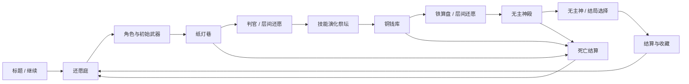

# 游戏结构、单局流程与关卡

## 四层循环

| 层级 | 输入与选择 | 反馈 | 持续时间目标 |
| --- | --- | --- | --- |
| 单次交锋 | 移动、射击挂余烬、闪避、焚债 | 命中、连债、纸屑爆发、灰烬回流 | 2–8 秒 |
| 一间战房 | 读阵型、处理威胁、创造连锁窗口 | 清房资源、愿力、支路开放 | 25–45 秒，熟练可更短 |
| 一层区域 | 战斗路线、商店、奖励、债约、Boss | 构筑成型、技能演化机会、故事页 | 5–8 分钟 |
| 多局循环 | 新角色、还愿簿、试武器、任务和结局 | 横向解锁与操作成长 | 一局 18–25 分钟 |

## 状态流

## 三层结构

每层基础十一房：六间普通战房、一间精英房、一间奖励房、一间商店、一间债约/还愿房、一间 Boss 房；可额外出现零至两间秘密或事件支房。主路沿图至少经过四间普通战房，探索全部战房获得更充分的资源；主路与支路差异明确画在地图上。

第一个奖励房不晚于第二间普通战房之后。每层商店在 Boss 前可抵达。第一个债约房开放后仍可绕行，Boss 门外永远有安全准备点。第二层起点固定安排一次专属技能演化二选一，不从普通随机奖励中抽取。

| 区域 | 空间玩法 | 新敌人规则 | 特殊房 |
| --- | --- | --- | --- |
| 纸灯巷 | 纸堆阻挡视线、门边灯架可破坏；宽阔初始地面 | 追踪、单向射击、冲锋预警 | 断灯房、红线祭坛 |
| 铜钱库 | 铜柱形成反弹角、移动钱阵周期让路 | 朝向盾、分裂弹、召唤上限 | 称愿秤、铜钱选择房 |
| 无主神殿 | 可预览的印区切换、短时安全路线变化 | 延迟墨弹、施法阵、账页护盾 | 空名页、总账侧室 |

## 房间模板规则

以统一的 64 世界单位网格组织墙、门和碰撞。房间逻辑画面基准 1280×720，标准可行走区域 1152×576。房门与出生位置由模板定义，装饰层独立于碰撞层。每条相邻图边绑定北、南、东或西的一扇物理门；清房后门口才亮起，玩家沿门的朝向走入才切换房间，进入下一房间后从对应反向门出现。

普通房有开阔、双柱、折线、回环、双岛连桥和侧门六种布局族；每族三种布置，共十八个基础战房模板。精英房每层两种，Boss 房每位一套，安全房共四套模板。镜像只用于轴对称合理的模板。

特殊房间沿用同一张方向门图：献灯房从普通支路可达，判官房和观音房分别作为高代价与高回复的可选支路，破阵房则以三轮连续战斗换取高阶供物。它们不弹出传送菜单；玩家必须清房后沿地图标出的方向走到实体门口，穿过门槛进入下一房。交易房不刷普通敌群，以祭坛、秤盘或莲灯作为中心交互点；破阵房保留战斗波次，清房后才打开供物选择，并把领取结果写入本局一次性房间账本。

模板必须证明入口到每扇开启门有通路。不可把商店或唯一奖励放在无法抵达的密室。敌人出生点离玩家至少 220 单位，离门口 96 单位；触控遮挡角落周围不得作为没有前摇的攻击出生点。

首层前两房限制敌人种类和波数，不引入催账鬼。普通房每波三至六名敌人，最多同时八名；精英最多一名配六名普通；Boss 可同时拥有最多六名辅助单位。后续难度增加阵型与配合，攻击前摇保留最低可读长度。

## 种子与可复现性

布局、遭遇、奖励、商店和装饰分别拥有独立的随机流，从单局种子和对应房间 ID 派生。移动与命中不消耗奖励随机流，读取图鉴不改变掉落。保存完整随机流状态，恢复后不会重复生成已经领过的资源。

还愿庭的“每日”入口使用本地日期和规则版本生成稳定挑战种子，并锁定 `initial-v1` 初始供物池、纸钱拾取和可选首领条件。相同日期在离线设备上得到相同的地图、遭遇和候选序列；每日挑战照常写入单局存档，可暂停、恢复和失败重开，但结算不会写入善缘、角色解锁或路线历史。它是可复现的单机挑战，不假设网络时钟、排行榜或服务器。

秘密房位置由生成阶段决定，破坏或接近只触发显露。隐藏入口有环境线索。任何需要特殊武器开启的隐藏房只提供额外奖励，通关主路不依赖该武器。

## 教程与失败体验

教程由安全靶场、单灯鬼房、两目标连债房组成。教程展示一次焚债能量恢复和一张简单行愿选择。可跳过教程并在还愿庭重播。开局纸童可选，首次完成三目标连债解锁铃师；切片开发阶段直接开放前三名便于比较。

受伤显示明确来源；死亡画面显示击杀源、核心遗物和已完成任务。善缘与任务进度在清房时写入，死亡不会二次吞掉已记录收益。重开可一键使用相同角色，新的随机种子产生新的地图。

## 挂起与退出

每次清房、交易完成、演化选择和层间迁移生成保存点。进入后台时先冻结输入和战斗，再保存当前房间快照。当前战房无法恢复快照时，回到该房开战前的资源与随机状态；该房的掉落、善缘与清房记录一起回滚，保持同一结算边界。

恢复一律先显示暂停画面，玩家主动确认后再继续。确认操作不穿透为焚债或射击。保存与奖励记账的事务细节见跨端工程。
## 2026-10-04 运行记录

运行版每章十一间基础节点，含六普通战房、一精英、一供物、一借愿、一灯摊和一主账；另有零至二条事件/断绳支路，第二、三章满足账号条件时加入可选首领支路。所有主账路径都经过早期供物与至少四间普通战房。十八个战房布局已有独立障碍几何与通路验证；1,500 组章节种子检查可达性。

断绳入口在供物房侧墙保留破纸和松绳线索，尚未发现时不显示在行路图，也不能指定房间绕过发现。清房后，在可通行的检查点80单位内停留0.45秒，绳结展开并保存显露状态；离开范围会重置未完成的检查。显露后走到105单位内的入口并沿入口方向走入才进入断页；交互键与“拂绳 · 入断页”按钮只作为靠近后的辅助提示，行路图只读展示可走路线，不传送玩家。奖励包含真实供物与利息页选择；未发现的支路不承担主路资源。旧存档中本来公开的支路保持可通行。

行路图可返回通过已清路径连接的房间，但地图是路线读出而不是传送菜单；选择节点后回到当前房间，沿发光的对应门口实际走入。回访恢复原障碍布局、未取治疗和房间状态，不重生敌人、不重抽供物、不增加清房数或善缘。已领治疗继续保留已领状态；跨章后清除上一章回访记录。

物理门口回归见 [route-navigation-tests.json](reports/runtime/route-navigation-tests.json)：固定 tick 逐一检查南、北、东、西四向门的阈值穿越、反方向输入拒绝、反向回访和对应出生侧；行路图与 `advance_room(destination)` 都不能直接传送。

第一章前两间教学房固定一阵、三名敌人，只引入灯鬼和冲锋纸兽。各章后段普通房以及第二、三章中段主路房使用两阵，每阵三至六名；其余普通房一阵。第一阵结束后保留1.2秒收灰窗口，清除上一阵的敌方弹与印区，下一阵在合法远处以0.8秒圈形预警登场，预警期间不攻击、不受击、不挂烬。只有最后一阵结算清房经验与奖励；催账按房间计数，次阵不再次刷催账鬼。计划、波数和预警截止时间随快照恢复，不重新抽敌人。

死亡体验已接入实际终局：保留击杀来源、已消耗回魂签及最多十二次近期受击；核心供物以图标直达本局构筑。愿页展开只展示已经提交的本局基础与额外善缘、实际完成个人页和新留名角色，既不追补旧档归属，也不重复发放。重开保留角色并创建不同种子与单局ID，清除上一局受击历史；结算详情返回保持暂停。
