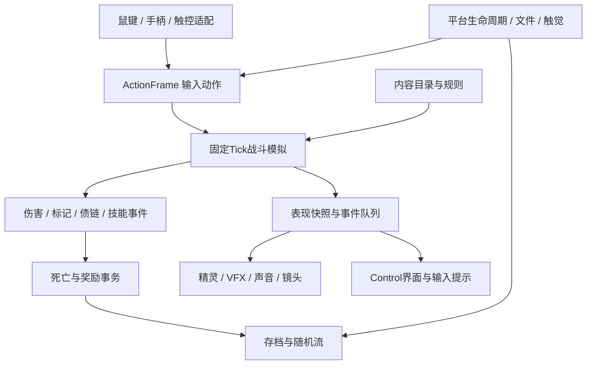

# PC、Android、iOS 跨端工程方案

## 引擎决定 ADR-001

产品以原生三端成品为目标，采用 **Godot 4.7.2 标准版 + GDScript + Compatibility**，同一工程导出 Windows、Android 与 iOS。此前五案阶段的 Phaser 建议服务于浏览器原型；本阶段优先共享原生输入、生命周期、资源与导出流程。

2026-10-03核对的官方Windows稳定下载为4.7.2；正式开始工程时锁定实际下载的二进制、导出模板和哈希。GDScript避免为本作引入额外C#运行时，官方移动端C#导出仍标有实验性限制。[Godot官方Windows下载](https://godotengine.org/download/windows/)、[Android导出](https://docs.godotengine.org/en/stable/tutorials/export/exporting_for_android.html)、[iOS导出](https://docs.godotengine.org/en/stable/tutorials/export/exporting_for_ios.html)。

Compatibility适用于本作的平面精灵、少量灯光和图形特效，有利于覆盖较旧移动设备。纸纹、焚债环和连线优先用纹理、Line2D与轻量材质，避免把计算着色器或全屏后处理变成核心玩法依赖。[官方渲染器选择](https://docs.godotengine.org/en/stable/tutorials/rendering/renderers.html)。

## 工程模块



规则层拥有实体ID、血量、碰撞、随机状态、状态效果、装备、技能计时和奖励资格；表现层拥有Sprite、AnimationPlayer、纸屑、镜头与音频。表现事件可以降级，规则事件按同一预算执行。

Godot `Control/CanvasLayer`处理菜单与HUD，`Node2D`处理战场。输入每帧转换为统一ActionFrame，模拟只读取移动向量、瞄准向量和动作边沿。菜单抢占输入后清空开火状态。

## 目录与职责约定

```text
game/
  project.godot, main.tscn, export_presets.cfg
  scripts/
    main.gd     主菜单、流程、生命周期、现代Control界面
    core/       内容、随机流、双代存档、账号、故事、章节图
    combat/     权威模拟、几何、遗物效果、敌人与首领阵型
    ui/         输入、纸偶、战场、HUD、还愿庭、行路与声音
  data/         内容、规则、故事与实际资源注册表
  assets/       参考锁定素材、动作、字体、声音与许可证
  tests/        规则、账号、输入、整局与素材验收
build/          Windows、Android与iOS源码交接
```

这是生产结构约定；具体运行文件存在并通过引擎导入后才将模块标为已实现。设计目录中的 `data/` 为当前内容来源，构建工具复制/转换并登记内容版本。

## 随机、模拟与性能

固定60Hz逻辑tick；渲染在目标60FPS和低功耗30FPS之间选择。布局、遭遇、奖励和装饰随机流独立。跨端保证相同种子的布局、奖励与规则参数一致；浮点物理不作为跨架构逐比特回放承诺。

每日种子继续使用同一套整数随机流和内容版本，不读取网络时间：设备本地日期只负责生成 `YYYY-MM-DD` 挑战键，存档保存键、规则版本和随机流快照。这样 PC、Android 与 iOS 在同一日期共享可比较的内容池，同时保留离线单机边界。

当前使用带上限的实体集合、障碍包围范围排除、编号索引去重及按需动作资源缓存。对象池与进一步空间索引作为后续真机剖析的优化选项；不将设计策略写成已经测得的性能结论。所有平台模拟投射物预算240、普通敌人同时最多8、单链派生事件最多48；这些是相同规则边界。表现纸屑PC320、移动120。移动端新增运行时质量 governor：自动档在持续约27ms帧耗时后把纸屑比例收至0.55、短特效队列收至72项，稳定约5秒后逐步恢复；高画质和省电档可由玩家锁定，三者都只改变表现层。

达到投射物预算时优先合并低优先级友方派生表现，并保持原始伤害结果；原始敌方攻击与前摇不能因渲染掉帧被删除。该策略须用满屏联动场景验证，不把帧率变化写进伤害规则。

设计预算：纹理驻留120MB、工作集350MB、发布包100MB；场景转换预加载与释放按区域进行。普通房、精英房、Boss与长局均记录帧时间P50/P05/P95和资源峰值。预算是待验证目标。

共享平台契约由 `game/tests/platform_contract.gd` 锁定：固定帧率、移动/桌面弹丸与粒子预算、纹理/工作集/包体预算、Android/iOS触控下限、刘海安全区、横屏滞回、触觉优先级、动态质量 governor、字体与运行资源注册均在同一套36项检查中核对。该检查证明软件契约和几何边界可复现，不替代真实设备的帧率、温度、扬声器、系统文件接口或签名验收。

## 存档与更新

存档版本2，使用稳定内容ID并保存实际内容版本。账号进度与当前单局共同提交到`save_bundle`双代日志，完整记录包含随机流游标、房间状态、库存、合同、治疗保底、候选列表、已提交奖励键、特殊房间领取账本 `special_rooms` 与逐项成长历史 `growth_log`。序列化使用完整浮点精度，保证恢复后不因JSON截断改变计时或随机结果；跨CPU架构仍不承诺逐比特浮点回放。

原生UI文件往返发现十进制JSON读回可能改变小数计时器最后一位。当前写入以number_encoding=ieee754-f64-v1标明小数编码，有限小数用校验后的16位十六进制保存双精度位；整数和已有Vector2/Rect2规则保留。没有编码标记的旧JSON继续读取，未知编码和非有限/畸形位串在恢复前拒绝。实际文件、压缩文字与重开日志的回归证据见[数值记录](reports/runtime/ui-refresh/save-roundtrip-regression.json)。它保证同一运行环境保存值不变，不扩大跨CPU模拟承诺。

写入顺序：序列化一致快照→写临时文件→flush→计算并验证SHA-256→原子替换本代文件→保留上一代。读取时按提交序号查找最新有效代，损坏则回退上一代，并显示恢复说明。签名校验仅用于完整性检测，不声称能防止用户改档。

购买、领取、偿还和清房把资源变化与领取键一起提交；任何中断不会留下“钱已扣但奖励未给”的混合状态。当前房间回滚时，元进度与随机流也回滚到同一房间边界。

更新迁移明确支持账号与单局schema1→2。旧`profile`与`saves`先读取和验证，稳定内容ID原样保留，补齐已知缺字段后写入新的整体日志；旧文件字节保持不变。未知schema、内容版本或内容ID先保护原文件并给可读恢复说明，禁止自动写盘与手动覆盖，不猜测替代装备、技能或任务。

跨设备手动共享已提供带SHA-256校验的JSON文件与压缩传递文字，PC与手机共用格式。导入先校验版本、容量、数据类型、内容ID和完整快照，再预览角色、善缘、结局与所在房间；确认才提交账号与单局。默认保留本机设置，可明确带入操作和声音设置。导入前的完整记录作为独立备份保留在新日志内，重启后可确认恢复；失败提交不会改变当前进度或备份。恢复后停在角色页，再从暂停页继续。云同步为后续平台适配项目，需要独立冲突解决和账号设计。

## 三平台构建路线

| 平台 | 目标与产物 | 构建环境 | 必须验证 |
| --- | --- | --- | --- |
| PC | Windows x64 EXE/PCK，窗口与全屏 | Windows本机Godot及同版本导出模板 | 鼠键、手柄、分辨率、存档路径、断电恢复 |
| Android | arm64 APK测试包 / 签名AAB发行包，横屏 | Windows本机JDK、Android SDK、Godot模板 | 真机触控、返回、后台、热稳定、安装升级 |
| iOS | arm64 Xcode项目 / 签名构建，横屏 | macOS、Xcode、Godot模板、合法签名配置 | iPhone/iPad实机、安全区、触觉、恢复、安装升级 |

Android官方建议OpenJDK17，较高版本也支持；构建时锁定所用SDK/Build Tools/NDK/CMake及模板版本。已定位本机JDK21与Android SDK，构建工具使用绝对路径调用Godot和ADB，不依赖PATH。[Android导出要求](https://docs.godotengine.org/en/stable/tutorials/export/exporting_for_android.html)。

iOS必须从macOS加Xcode环境导出和构建，当前Windows不能直接证明iOS安装包可用。iOS目标规格与共享代码可以在Windows编写，签名与真机验收要在真实macOS环境完成；本项目不使用Docker、WSL或其他本地虚拟化绕过这一条件。[iOS官方要求](https://docs.godotengine.org/en/stable/tutorials/export/exporting_for_ios.html)。

## 生命周期与平台能力

平台层提供安全区、窗口焦点、触觉、返回动作和文件根目录。进入后台先将动作状态清零、暂停模拟，再保存；回到前台先停在暂停页。触觉可关闭，设备不支持时仅保留视觉/音效。

手机朝向变化不改变逻辑房间。手柄断开时自动暂停并提示切换触控，重新连接后不自动开始攻击。Android低内存通知释放非当前层资源；任何释放都不删除存档或交易数据。iOS共享源码交接由`tools/runtime/verify_ios_handoff.py`核对源码ZIP成员、模板哈希、横屏配置、关键数据/脚本和敏感文件排除；跨端内容一致性由`tools/runtime/verify_platform_parity.py`进一步核对 Windows 工程与 iOS ZIP 的全部`game/`文件，并核对 Android APK 的725项运行资源、导入资源和六份核心 JSON/武器绑定。两项检查都不代替真实Mac/Xcode签名与设备运行。

## 执行约束

全部本机工具直接在Windows执行；需要iOS时使用真实macOS构建环境。浏览器测试完成后关闭新增且不用的标签页，并保留用户已有工作标签。生成密钥、签名密钥和平台账号不写入源码或包体。
## 2026-10-04 运行记录

当前实际工程按 core、combat、ui 与 main.gd 划分：核心含内容、独立房间随机流、账号双代记账和分支图；战斗不引用渲染或硬件输入。Windows release EXE 与 Android arm64 debug APK 已原生导出，字体 OFL 与 Godot/第三方声明随包分发。 `tools/runtime/build_native.py android --android-build release` 现在支持独立的发行模式预检；本机没有产品所有者 keystore 时会记录失败日志并删除未签名半成品，不改变可试玩调试包。Windows 编译后可执行文件已运行原生画面验收；Android 仅完成签名、结构和权限静态检查，ADB 未发现可测真机。iOS 有共享源码交接、官方哈希锁定模板和只在真实 Mac 运行的导出脚本；Windows侧已通过源码ZIP、关键运行资源、横屏配置和敏感文件排除检查，尚无 Xcode 工程、签名 IPA 或真机证据。没有使用 Docker、WSL 或模拟器。

输入扩展模块为input_profile、aim_assist、haptic_feedback、control_settings与touch_layout_editor。重映射与触控布局保存于同一档案事务，旧档案缺少新字段时使用默认值。动作方向在进入模拟前完成瞄准辅助；表现选项与触觉不读取或消耗战斗随机流。

narrative_reader使用布局容器按实际字形高度滚动，资源圆体正文与收起区分开布局；orientation_guard只观察原生窗口尺寸并输出一次转向状态，窄屏暂停与恢复确认由主界面执行。拾取倍率进入run快照，旧快照默认1.0，恢复单局时采用当前档案中的操作偏好；这些设置不增加掉落、不推进随机流。

房间回访以room_history保留当前章已行房间的布局ID、未取掉落和标志。物理入口的revealed与图边、visited在JSON恢复后统一转为整数，避免浮点ID无法匹配。旧图缺少revealed时保留原公开支路；旧战房缺波次计划时继续原有单次遭遇，旧回访缺历史时采用安全开阔布局。这些缺字段规则并入明确的v1→v2迁移，不重刷已领取奖励。

波次计划在首次入房生成，次阵位置使用独立wave_spawn流；快照包含计划、索引、登场时间、预警截止时间及随机游标。显露、回访、波次暂停保存只提交模拟快照，不触发账号善缘结算。最后一阵才发出清房结算事件。新打开的存档写入器读取最高已提交代号再继续写，避免新实例从序号1写出后被旧高序号遮盖。实际双代校验恢复及新写入器续号包含在45项探索检查中。

2026-10-06配乐接入music_state与原生同步音频流：层级根据只读战斗状态在实际音频小节边界改变，样本回环保持绝对拍数，不消耗模拟随机流。OGG长度来自明确的原始帧数及实际解码长度；资源验收读取Vorbis采样率和引擎时长，避免把压缩数据字节数当作PCM帧数。音乐32小节母版保留在生产目录，正式资源表包含07份PCM音效和25份压缩音乐层（其中四份为低音量CC0环境纹理）。运行配置由生产清单生成到data/music_scores.json，随三端导出；APK核对配置内容与二十五份实际导入轨道，Windows同时验证成品包混音，避免源码可用却遗漏配置的情况。

应用挂起时先停输入、保存并冻结真实播放器；恢复只解除音频挂起，游戏仍在主动确认的暂停页。原生混音夹具只捕获引擎内部总线，使用WASAPI输出驱动、40kHz采样和下游静音，既不读取麦克风，也不改变系统音量。编译程序录音SHA与EXE绑定；这些证据不证明Android或iOS设备声音表现。

2026-10-05新增save_migrations、save_session与save_transfer。51项存档检查使用冻结的真实旧版原生QA文件，验证原文件不变、两代恢复、成对事务、相同后续30个战斗输入与奖励候选、领取账本去重、文件/文字往返、跨重启撤销、失败写盘与未知版本保护。原生GUI另检查录入预览、取消、确认、暂停续局和备份恢复。系统文件选择器按[官方FileDialog能力](https://docs.godotengine.org/en/stable/classes/class_filedialog.html)检测，设置ACCESS_FILESYSTEM与JSON类型；没有原生文件对话框时始终提供文字传递。真实手机文件选择器、软键盘和剪贴板仍属于设备验收。

器具表现使用weapon_motion的只读时钟与weapon-rig共享身体/手帧，不修改world.tick、碰撞或随机游标；替换器具会清掉旧挥动和蓄力状态。读入愿簿或恢复备份后，renderer与现有HUD必须重新绑定同一新World，防止头像、血量、资源与技能仍读取旧实例。

本轮UI由game_theme、modern_ui和rounded_button统一实现：圆角StyleBoxFlat、圆形/胶囊原生按钮、可展开详情、语义名称及可见焦点。57个许可SVG以24像素导入；TextureRect先关闭固有最小尺寸再设置布局，避免高清图标撑大。资源圆体的两个字体子集改名Incense Rounded，得意黑保持原字节，Noto为完整中文回退；所有OFL与Lucide声明随Windows、APK和共享源码分发。

Windows编译后的90张视口图和75项GUI检查验证本次UI；包含物理门口导航、组合册、角色详情、试演、灯摊真实武器试射返回、全部十八真实技能输入、本局成长记录，以及原账号和挂起单局不受训练影响。奖励/技能面板的 PC 数字键 1—4 直提交与暂停页记录入口均在原生流程中验证。Android检查725项实际导入资源、编译模块、字体/图标许可证、配置和手持元数据与源码一致。新增`reports/platforms/platform-parity.json`，将 Windows 工程与 iOS 共享源码的全部`game/`文件逐字节比对，并将目录、规则、运行资源、音乐配置、故事、武器绑定和 Android 导入资源逐项核对，最后绑定当前三份产物哈希。该静态证据不宣称 Android/iOS 真机运行，也不对 Windows 可执行文件内部 PCK 做逐字节读取；平台报告仍使用当前包体SHA，不将桌面移动布局夹具写成手机实机证据。

受击元数据为schema2的兼容可选字段。已发出的敌弹与印区保留实际内容ID、攻击类型、精英/护账身份和发射坐标；死亡记录与最多十二次历史随单局共同保存。账号账本分开记录本局基础善缘、实际新增首领/个人页奖励及新增留名角色。旧档缺失字段保持空历史，不反推过去奖励归属；损坏的来源或心火变更拒绝恢复。整数个人页序号在JSON重载后规范化为整数，避免UI误判本局任务。

impact_control由固定tick执行限额冲量和控制抗性；途中保存剩余向量与持续时间，渲染不推动位移。存档校验覆盖实际生产的repeat_attack、enemy_fan、enemy_lunge与debt_bullet队列，并保留攻击者已死亡后的合法待取消项；精英来源按elite_variants内容表校验。54项[击退与续局检查](reports/runtime/impact-resume-tests.json)通过原生双代磁盘读写和相同输入比较，另逐项验证六种精英变体的生命、预警、伤害和余烬字段。尚未创建的随机流用整数seed身份派生，章节保护用整数floor键查询；兼容旧kind_1.0键且不重发已消费保护。非法冲量、未知队列或损坏扇弹参数继续保护原档，旧档无冲量字段保持可读。
