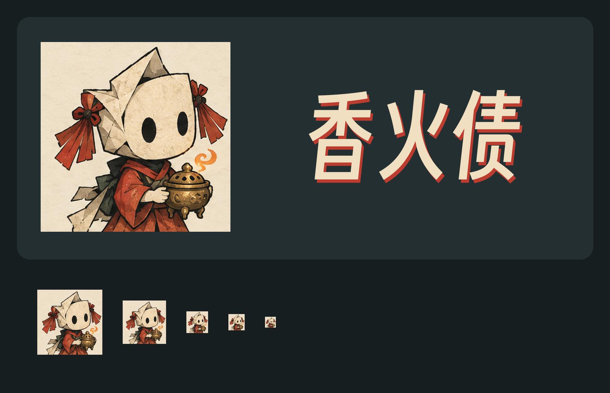

# 香火债 · 发布品牌选型

2026-10-08 的选型结果：继续使用当前游戏内的原始纸偶形象。

正式来源是 [`game/assets/ui/app-icon.png`](../../game/assets/ui/app-icon.png)。保留折纸脸、椭圆黑眼、朱红绳结、红衣与铜香炉，以及现有纸纹和木版轮廓。

当前 `v0.2.0-alpha.1` 已采用这套纸偶形象。发布图标沿用原始纸偶，导出为不透明 RGB 方图，并补齐多尺寸 PNG、Windows ICO 和合成完整背景的 Android 图标。透明前景层只用于工程内自适应图标，不能作为商店图标上传。

正式游戏 LOGO 独立于纸偶图标：只含“香火债”三个中文字，采用得意黑、米白／墨色字面与朱红偏移阴影，使用真正的 RGBA 透明背景。提供 1024×1024 正方画布及 2400×840 横向字标，均不含纸偶、英文、标语或其他文字。

完整规格与来源哈希见[素材说明](../../output/branding/incense-debt/current-paper-spirit/README.md)和[清单](../../output/branding/incense-debt/current-paper-spirit/manifest.json)。五个新设计保留为选型探索稿。

横版 Banner、竖版海报与发布文件已在[第 29 篇交付索引](29-release-promo-assets.md)中整理，宣传主角继续使用同源完整纸偶原图。封面与宣传图片仅含游戏名“香火债”；[纯发布图片包](../../output/publishing/incense-debt/store-kit-2026-10-08/IncenseDebt-publication-images-clean.zip)汇总当前可上传版本。

English: The selected mascot remains the original paper spirit. Application icons are opaque. The separate logo is a transparent PNG containing only 香火债. Covers, promotional artwork, banners and posters use the same title-only lettering rule. The five redesigns remain concept alternatives.
