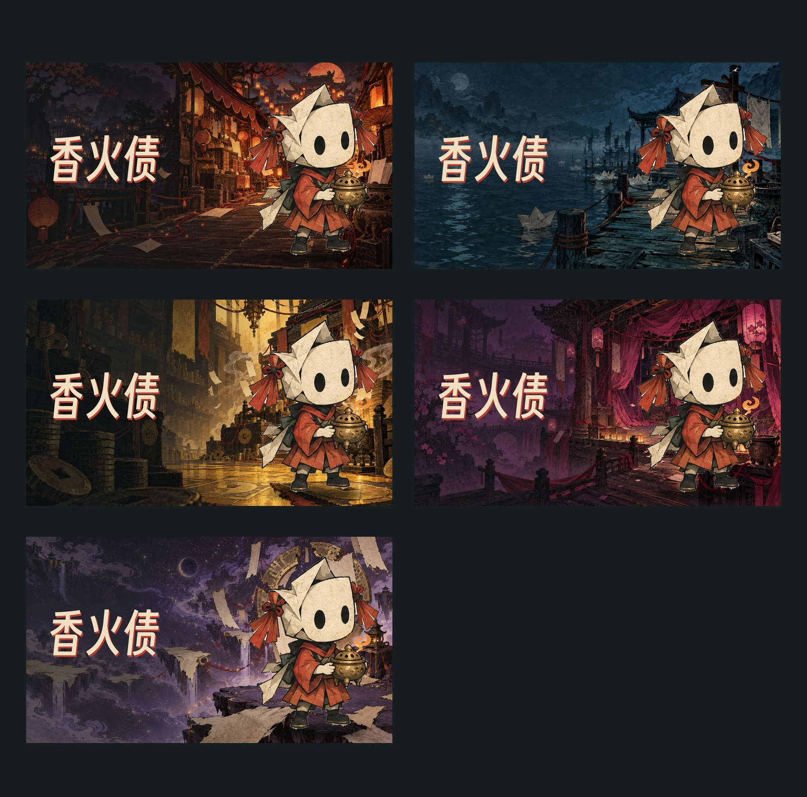
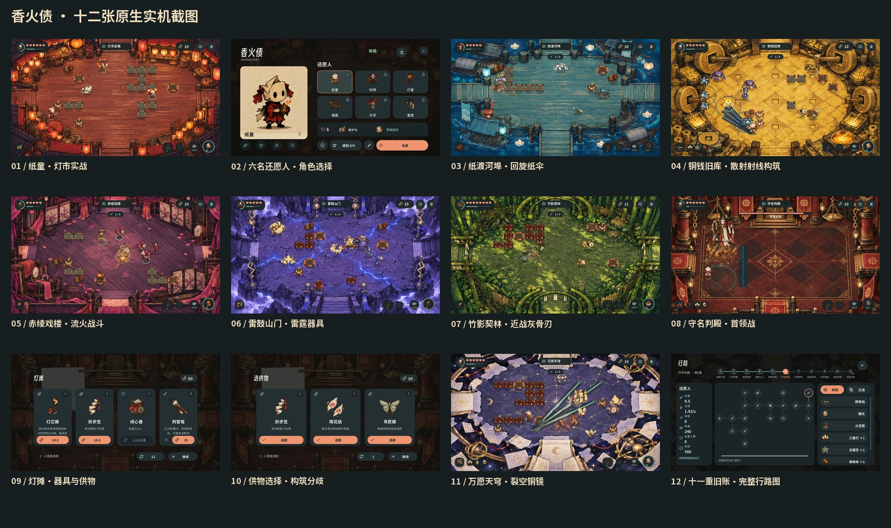
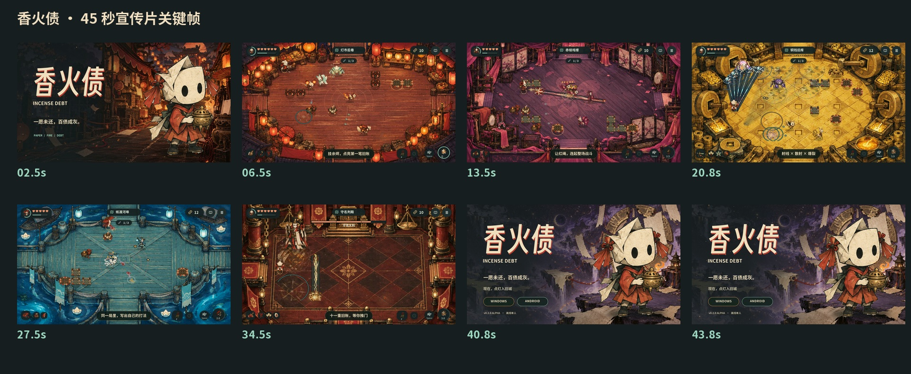

# 《香火债》产品发布文案与商店素材

制作日期：2026-10-08。沿用当前原始纸偶形象与纸墨民俗视觉，对应 v0.2.0-alpha.1 的十一层内容线。

[完整素材包说明](../../output/publishing/incense-debt/store-kit-2026-10-08/README.md) · [全部素材 ZIP](../../output/publishing/incense-debt/store-kit-2026-10-08/IncenseDebt-complete-store-kit.zip) · [文件清单与 SHA-256](../../output/publishing/incense-debt/store-kit-2026-10-08/manifest.json) · [验证结果](../../output/publishing/incense-debt/store-kit-2026-10-08/validation.json)

上传商店图片请使用本轮更新的[纯发布图片包](../../output/publishing/incense-debt/store-kit-2026-10-08/IncenseDebt-publication-images-clean.zip)：图标不透明，LOGO 透明且只含“香火债”，封面／宣传图／Banner／海报也只含游戏名。无 LOGO 图与壁纸无文字。具体文件选择见[图片使用说明](../../output/publishing/incense-debt/store-kit-2026-10-08/PUBLICATION-IMAGES.md)。

## 交付清单

| 项目 | 数量与规格 | 文件入口 |
| --- | --- | --- |
| 游戏简介 | 一句话、短版、详细版、英文短版 | [完整游戏简介](../../output/publishing/incense-debt/store-kit-2026-10-08/copy/game-introduction.txt) |
| 开发者的话 | 第一人称长文，可直接用于产品页 | [开发者的话](../../output/publishing/incense-debt/store-kit-2026-10-08/copy/developers-message.txt) |
| 首页推荐语 | 正式版、短标题、卡片说明与极短版 | [推荐语](../../output/publishing/incense-debt/store-kit-2026-10-08/copy/homepage-recommendation.txt) |
| 游戏截图 | 12 张原生 PNG，1920×1080，16:9 | [十二张截图 ZIP](../../output/publishing/incense-debt/store-kit-2026-10-08/IncenseDebt-screenshots-12.zip) |
| 游戏实机录屏 | 120.000 秒，1920×1080，30fps，H.264/AAC | [120 秒 MP4](../../output/publishing/incense-debt/store-kit-2026-10-08/videos/IncenseDebt-gameplay-120s.mp4) |
| 宣传片 | 45.000 秒，1920×1080，30fps，H.264/AAC | [45 秒 MP4](../../output/publishing/incense-debt/store-kit-2026-10-08/videos/IncenseDebt-trailer-45s.mp4) |
| 游戏图标 | 1024×1024，RGB，不透明背景；另有多尺寸 PNG／ICO | [游戏图标 PNG](../../output/publishing/incense-debt/store-kit-2026-10-08/branding/app-icon-1024.png) |
| 游戏 LOGO | 1024×1024，RGBA 透明，仅“香火债”；另有横向字标 | [透明 LOGO PNG](../../output/publishing/incense-debt/store-kit-2026-10-08/branding/logo-title-only-1024.png) |
| Banner | 2560×1080，仅游戏名文字，PNG/JPG/WebP | [Banner PNG](../../output/publishing/incense-debt/store-kit-2026-10-08/artwork/banner-2560x1080.png) |
| 海报 | 2160×3240，仅游戏名文字，PNG/JPG/WebP | [海报 PNG](../../output/publishing/incense-debt/store-kit-2026-10-08/artwork/poster-2160x3240.png) |
| 16:9 宣传图 | 5 张，1920×1080，每张 PNG/JPG/WebP | [五张宣传图 ZIP](../../output/publishing/incense-debt/store-kit-2026-10-08/IncenseDebt-promotional-images-5.zip) |
| 横版封面 | 1920×1080，PNG/JPG/WebP | [横版封面 PNG](../../output/publishing/incense-debt/store-kit-2026-10-08/artwork/cover-horizontal-1920x1080.png) |
| 竖版封面 | 1080×1920，PNG/JPG/WebP | [竖版封面 PNG](../../output/publishing/incense-debt/store-kit-2026-10-08/artwork/cover-vertical-1080x1920.png) |
| 游戏库背景壁纸 | 超宽横版，5120×1654，无 LOGO、无文字，PNG/JPG/WebP | [游戏库壁纸 PNG](../../output/publishing/incense-debt/store-kit-2026-10-08/artwork/library-wallpaper-no-logo-5120x1654.png) |
| 无 LOGO 宣传图 | 1920×1080，无标题、文案及 UI，PNG/JPG/WebP | [无 LOGO 图 PNG](../../output/publishing/incense-debt/store-kit-2026-10-08/artwork/promo-no-logo-1920x1080.png) |

包内共 25 张主要图片、2 部正式视频和 3 份发布文案；另外保留多尺寸图标、透明横向字标、三种格式的宣传图、原始纸偶透明层、生成场景、提示词、字体许可证、视频镜头表及捕获记录。源素材不占主要交付数量。

## 游戏简介与推荐语

《香火债》是一款以纸偶、民俗与未还之愿为主题的俯视角房间动作肉鸽。你将走入灯市、河埠、戏楼与万愿天穹，在六名还愿人之间选择，用器具、技能、供物和债约形成不同构筑。给敌人挂上余烬，让红绳连起旧债，再用焚债引发连锁爆发。清房后走向亮起的门，继续进入下一笔旧账。

首页推荐语：**纸偶提火，债绳连魂。走过十一重旧账，烧出自己的打法。**

短标题：**提灯入旧账，焚债成新局。**

完整简介进一步描述世界背景、“余烬—连债—焚债—收灰”的战斗循环、三十二件器具、十八种技能形态、十一层探索、六名角色、特殊房间、局内外成长、本地存档以及 PC/触控操作。发布信息明确 Windows x64、Android arm64 调试签名 APK 与当前 Alpha 身份。

开发者长文从反复试出新打法的初衷写起，说明纸偶与香火的视觉选择、门口探索与战斗反馈、键盘与存档打磨，以及 AI 工具的协作方式和后续打磨方向。文案采用发布者第一人称，不虚构开发年限、团队人数、获奖或玩家评价。

## 五种宣传图主题

| 宣传图 | 视觉身份 | 用途 |
| --- | --- | --- |
| 01 灯市后巷 | 暖木、灯笼、朱红债绳与火星 | 主推游戏核心循环 |
| 02 纸渡河埠 | 冷蓝水面、渡口、纸灯与倒影 | 展示地图气氛与探索 |
| 03 铜钱旧库 | 金黄铜钱、旧库与器具光效 | 展示攻击与构筑组合 |
| 04 赤绫戏楼 | 紫红戏台、幕布、民俗戏曲轮廓 | 展示不同场景身份 |
| 05 万愿天穹 | 深紫星空、漂浮愿纸、宇宙账页 | 展示十一层后段的空间感 |

五个环境通过指定的 sub2-image-gen / gpt-image-2.5 / high 生成，其中铜钱旧库已重新生成无铭文的钱币、空白愿纸与布幡。角色由当前原始纸偶肖像提取透明轮廓，保留全部源 RGB；应用图标保留原纸偶与不透明背景。LOGO 为独立的纯文字透明 PNG。五张宣传图仅印“香火债”，不叠加英文名、标语、玩法、平台或版本说明。生成环境的原始分辨率、成稿尺寸与来源分别记录。

横版与竖版封面分别构图和排版，文字都只保留“香火债”。游戏库壁纸采用右侧完整纸偶、左侧环境留白的超宽布局，没有片名、LOGO、文案或水印。壁纸由原始无字背景与纸偶合成，本地 Real-ESRGAN 四倍 AI 超分至 8000×2584，再降采样为 5120×1654；宽高均严格大于 3840×1240。来源、模型和文件哈希见 [壁纸超分记录](../../output/publishing/incense-debt/store-kit-2026-10-08/artwork/library-wallpaper-upscale.json)。无 LOGO 宣传图同样完全无字。发布图片中字标仅使用得意黑；许可证位于素材包 licenses/，推荐语等文案仅用于发布页文字栏。

## 十二张截图

依次覆盖纸童灯市战斗、角色选择、纸渡回旋纸伞、铜库散射射线构筑、戏楼流火、山门雷霆、竹林近战、判殿首领、灯摊商店、供物选择、天穹铜镜与十一层行路图。全部保存实际原生视口的 UI、角色、敌人、弹体和特效。

部分截图与宣传片战斗镜头采用引擎内预置构筑和进度，以展示当前已经实现的内容。每张的角色、环境、楼层与捕获方式见 [截图捕获记录](../../output/publishing/incense-debt/store-kit-2026-10-08/screenshots/capture-report.json)。这些实机画面与生成的宣传插画在目录和来源记录中分别标注。

## 视频内容与实机来源

120 秒录屏从正常初始纸童开始，保留初始 6 点生命、40 点香火、原始器具与技能，由自动操作驱动真实游戏世界。过程包括战斗、清房、亲自走入门口、供物选择与商店交互。正式视频共 3600 帧，启动和退出缓冲已裁去，采用游戏自身 BGM、攻击、命中与 UI 音效。

45 秒宣传片由动态纸偶开场、五段不同构筑的原生战斗和品牌收尾组成，共 1350 帧；六处转场各 0.3 秒。战斗镜头展示连债焚债、戏楼铃师、铜库散射射线、回旋纸伞和首领遭遇。片内胶囊字幕避开 HUD，收尾显示游戏名和 Windows / Android / Alpha 信息。详细镜头安排见 [宣传片脚本](../../output/publishing/incense-debt/store-kit-2026-10-08/copy/trailer-script.md)。

原生游戏世界、UI、声音和素材由已发布 Windows EXE 的资源包加载；资源包 SHA-256 为 `51b896b4c3deb5a0bb197c44210f5bdd72e95cc216a4dd0961fedd4edee364d9`。采集时发现敌人移除后债链绘制可能引用空端点，已修复当前源码中的 game_renderer.gd，并重录完整视频。捕获使用这个当前渲染源码，保留真实游戏数值、掉落与随机序列。已发布 EXE/APK 未在这次素材制作中重建；捕获记录同时绑定资源包与渲染源码哈希。

采集由原生 Godot MovieWriter 输出，在 1280×720 逻辑坐标下直接渲染为 1920×1080；未将 720p 截图放大充作原生 1080p。游戏模拟 60Hz，视频输出 30fps。自动操作实机采集不作为真人操作记录或设备性能实测。全过程使用本地原生工具，结束后采集进程退出。

## 检查与再制作入口

素材验证包括数量与尺寸、PNG 解码、全部图标及 ICO 帧不透明、LOGO 真实 Alpha 透明及字标像素、发布图片视觉复查哈希、原始纸偶 RGB 保留、视频时长与帧数、音轨、捕获错误、文件 SHA-256 与文档链接。视频内容未改变，完整音视频解码结论按相同文件哈希复用既有成功验证。四个 ZIP 均做完整 CRC 检查，工程来源中旧版带铭文的铜钱背景已移出当前发布包。

原生视频音轨检测：120 秒录屏平均 -30.0dB、峰值 -0.4dB；45 秒宣传片平均 -29.2dB、峰值 -3.0dB。保留安静的场景底乐与明显的打击峰值。[音轨测量](../../output/publishing/incense-debt/store-kit-2026-10-08/videos/audio-quality.json)绑定最终文件哈希。

| 工具 | 职责 |
| --- | --- |
| tools/documentation/create_store_artwork.py | 五个环境生成、原始纸偶合成与九项美术成稿 |
| tools/documentation/create_library_wallpaper.py | 超宽无字壁纸重排、本地 AI 超分与来源哈希 |
| tools/documentation/capture_store_media.gd | 原生游戏、隔离存档、自动操作与展示场景 |
| tools/documentation/record_store_media.py | 截图、120 秒录屏、40 秒未剪辑战斗源视频 |
| tools/documentation/create_store_trailer.py | 动态开收场、原生镜头剪辑、字幕、配乐与转场 |
| tools/documentation/package_store_kit.py | 目录、验证、CSV/SHA-256 清单和 ZIP |
| tools/documentation/publication_brand.py | 仅“香火债”的透明字标与统一标题排版 |
