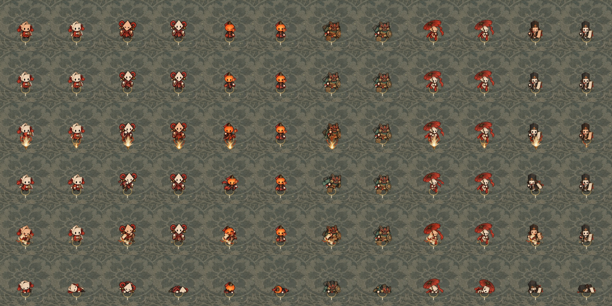
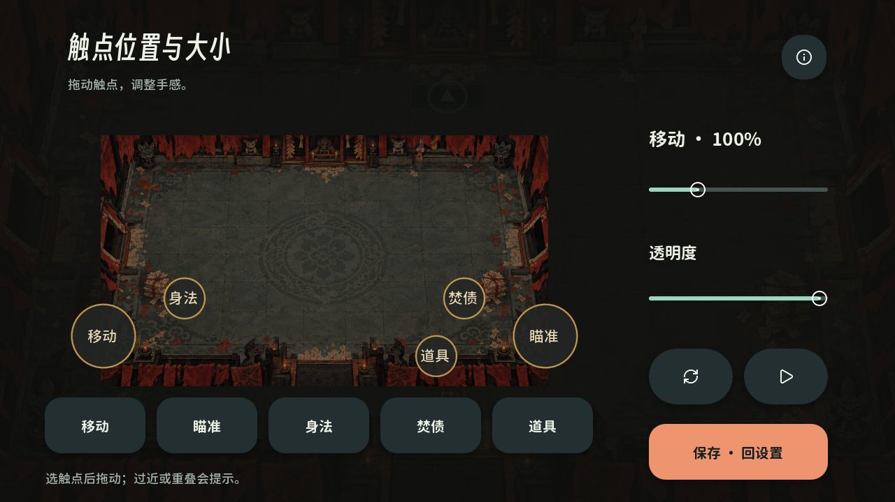
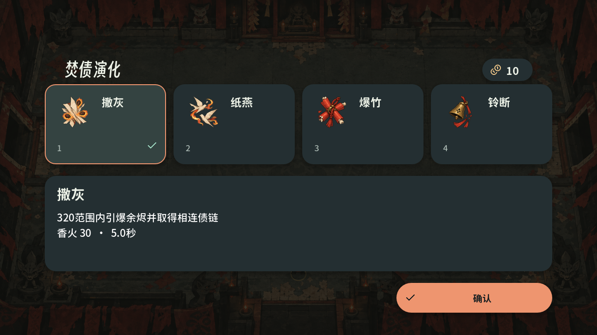
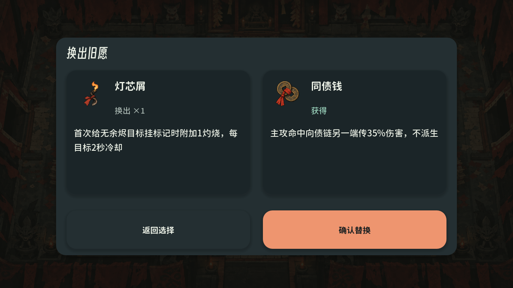

# 0.2.1：独立角色动作、移动操作、随机曲库与隐私主体修订

日期：2026-10-09。当前源码及本机 Windows / Android 交付修订为 0.2.1。GitHub 已公开的 `v0.2.0-alpha.1` 是上一版发布，不代表本篇的新安装包。

2026-10-10 补充：[第 35 篇全量怪物动作交付](35-creature-action-completion.md)已完成所有 402 个怪物身份的四向攻击／受击重绘，并重建、核验 Windows 与 APK。本篇保留主角与移动操作修订记录；最新怪物范围、资源数量及包体哈希以第 35 篇和当前交付清单为准。

本轮落实用户追加的四项要求：参考动作示例重做角色帧；按第 32 篇审查优化移动交互并允许每个触点单独调节；修订隐私主体信息；使用用户指定的 Yourset 本地曲库随机播放。按用户后续明确提供的资料页主体，隐私政策已再次更正为 `吴国黎`，当前为 v1.3。原问题及复现证据见 [32 安卓操作审查](32-android-controls-audit.md)。

## 交付入口

| 内容 | 文件或地址 | 验证范围 |
| --- | --- | --- |
| Windows | [IncenseDebt.exe](../../build/windows/IncenseDebt.exe) | 原生导出程序键盘闭环、导出资源与编译代码核对 |
| Android | [IncenseDebt.apk](../../build/android/IncenseDebt.apk) | arm64 调试签名 APK；结构、签名、权限、全部运行资源检查 |
| 移动适配证据 | [mobile-matrix.json](reports/action-mobile-2026-10-09/mobile-matrix.json) | 原生 Godot、四种窗口／密度配置、合成多指、真实应用分发及设置 |
| 导出内容一致性 | [packaged-parity.json](reports/action-mobile-2026-10-09/packaged-parity.json) | 实际 Windows 内嵌 PCK、Android 编译脚本与四份当前数据；不以源码通过代替包体验证 |
| 独立动作 | [原生动作 GIF](reports/action-mobile-2026-10-09/native-actions.gif)、[帧处理记录](reports/action-mobile-2026-10-09/action-processing.json) | 实际游戏渲染器；六名角色、六种状态、四个朝向 |
| 随机曲库 | [曲库原生测试](reports/action-mobile-2026-10-09/playlist-tests.json)、[转换来源](reports/runtime/yourset-import.json) | 200 次打乱选曲、实际 OGG 解码／播放、淡入淡出与生命周期 |
| 隐私政策 | [公开 HTTPS 政策](https://xhz.sidcloud.cn/privacy-policy)、[正式 Word](../../output/legal/incense-debt-privacy-policy-2026-10-09.docx) | 当前 v1.3、主体 吴国黎；现行与历史 Word 共二十四页逐页审阅，九项公开 HTTPS 核验均为 200 |

## 动作为什么要重做

旧主角动画主要通过同一张人物图的局部扭曲、拉伸、倾斜与色彩变化表达状态。它会改变角色比例，却缺少迈步、挥臂、重心转移、护身和倒地等明确动作。武器动画与身体动作的手部位置还可能分离，造成攻击有闪光、角色却没有发力过程。

本轮参考附件的逐帧方式，让每个状态具有准备、动作峰值、收势等独立绘制姿势；动作通过换帧形成，角色整体比例保持稳定。武器仍独立组合，以保留三十二件器具的持械位置、后坐、蓄力与方向变化。

| 项目 | 已实现 |
| --- | --- |
| 角色 | 纸童、铃师、灯客、傩面、伞灵、墨吏，共六名 |
| 状态 | 待机 `idle`、行走 `run`、攻击 `cast`、身法 `dash`、受击 `hurt`、死亡 `death` |
| 朝向 | 下、左、右、上，使用不同原画；后背不显示正面五官 |
| 帧数 | 每状态每朝向六帧，共 **864 个独立主角姿势** |
| 持械分层 | 身体、实际手部图层和兼容角色图；共 108 条 576×384 图集，统一 96×96 单元和脚底基线 |
| 播放节奏 | 待机 6fps、行走 12fps、攻击 18fps、身法 30fps、受击 18fps、死亡 10fps；攻击阶段跟随实际武器间隔 |
| 新绘制特效 | 枪口、近战弧、命中碎纸、受击裂纸四条六帧特效，共 24 帧；按真实战斗事件触发 |
| 旧工具保护 | 两个旧变形编译器检测到新动作方法时停止覆盖，避免维护时退回旧角色帧 |

素材实际通过指定 [sub2-image-gen 技能](C:/Users/carzy/.codex/skills/sub2-image-gen/SKILL.md) 的 `gpt-image-2.5` 参考图编辑生成，保留原始纸偶身份与纸、墨、朱红、铜器风格。模型输出、参考、提示词、处理清单和来源哈希保存在 `output/imagegen/action-revision/`。处理只做透明片切割、统一尺度、锚点校准和手部拆分，不通过逐帧形变制造这些动作。

上图每行依次为待机、行走、攻击、身法、受击、死亡；每名角色展示中段与末段。原生 GIF 是供审查的定时帧对照，使用同一游戏渲染器与持械系统，播放时间不等同于正常战斗帧率。四方向原画另见 `directions-cast.png`、`directions-hurt.png`、`directions-death.png`。

本轮重绘对象是六名可玩主角。既有敌人／Boss 动作图集仍保留原方法；新的命中和受击反馈已进入共用战斗呈现，不把这次工作描述成全部怪物动作已逐帧重绘。

## 移动端问题与闭环修复

| 原编号 | 原设计为什么不合理 | 0.2.1 行为 |
| --- | --- | --- |
| M01 | 右拇指同时负责射击和全部动作，切身法会丢射击意图和移动方向 | 身法默认放左杆内上侧；使用最近 250ms 的移动意图。技能／道具切换有一次性、至多 150ms 的确认蓄力接续窗口；普通松手立即停火，不自动补发 |
| M02 | 编辑器可把杆放到另一半屏，捕获仍按固定左右半屏划分 | 绘制、捕获、编辑预览、镜像共用同一套位置和尺寸；跨半屏瞄准布局按实际可见杆识别 |
| M03 | 开火阈值低于瞄准死区，可能沿旧方向射击 | 先有有效方向再开火；启动阈值随死区变化，并有停止滞回，回到死区立即停止 |
| M04 | 在场景任意半屏点下也会捕获，固定杆与可见热区不符 | 固定模式仅在杆盘附近开始捕获；浮动模式限定下方区域与杆附近。已捕获手指拖出区域仍跟踪，释放／取消即结束 |
| M05 | 清房收起按钮，热区却仍工作 | 每阶段统一可见和可用态；清房显示移动、身法及已装备道具，停用瞄准、技能；菜单不保留战斗捕获 |
| M06 | 混用 48、50、58 等逻辑像素，统一换算还受 90 上限限制 | 共用按钮至少 48dp；杆盘／动作键有独立最小热区和 8dp 间隔，取消旧上限；高密度时重排地图侧栏、设置、粘贴与确认页 |
| M07 | 战斗中手机地图图标不能点击，缺少 PC Tab 对应入口 | 顶部真实地图按钮在战斗中可打开并暂停，只读地图保持实际走门切房 |
| M08 | 浮动杆起点能与技能按钮叠盖，拖过按钮看似操作失败 | 浮动原点避开动作热区；保持每根手指的归属，不把拖过按钮当成施法 |
| M09 | 两杆被限制在 16:9 画布内，宽屏右杆离屏边过远 | HUD／触控使用全安全区；战场单独等比例居中；20:9 与 4:3 不拉宽角色、地图或碰撞 |
| M10 | 技能亮环只看冷却，能量／目标不足也显示可用；空道具占圈 | 可用态结合真实冷却、香火和标记目标；无道具隐藏并停用热区，充能不足给出反馈 |
| M11 | 自动瞄准会抢走手动方向，所有武器用同一策略 | 手动杆优先；后方目标不会强行改向，射线降低修正，可控弹关闭抢目标 |
| M12 | 单卡翻页不利比较，成本藏在说明里；满槽点错立即换装 | 3／4 候选同屏，点击只预览，单一确认提交；重掷／心火成本直接显示；满槽先并排看旧、新效果，再确认替换，可返回取消 |
| M13 | 手机教学和暂停仍提示鼠标、空格等桌面操作 | 教学、暂停与布局提示按移动操作呈现；保留已连接外设的映射入口 |
| M14 | 手机首先进入鼠键设置，布局调整后不能立即试手感 | 手机设置直接进入触点编辑和纯操作试演；固定／浮动、左右手、辅助、透明度与外设映射可达 |

额外复查修复了触摸兼容鼠标事件的设备误判：这类事件保留给原生 GUI 点击，战斗映射忽略它们，移动触摸不会变成鼠键攻击或改变身法／蓄力的设备归属；取消事件在 GUI 之前完整交给输入适配器，避免取消被误当成可接续的普通松手。

### 玩家如何调整

从暂停或主菜单进入 **设置 → 触控**。选中移动、瞄准、身法、焚债、道具中的任意一项，拖动预览图中的触点，再调整该项大小。五项大小分别保存，范围 75%～175%；实际热区保留物理最小尺寸，重叠或超出安全区的配置会被拒绝。位置限定在下方操作区，以避开 HUD。左右镜像会同时镜像位置和动作归属。

透明度单独调整；重置根据手机／平板选取预设。**保存·试操作**进入全安全区试演，验证移动、方向、身法和施术；点击完成或系统返回回到编辑页。试演不创建正式局，不改变奖励随机流、角色成长或进行中的存档。

种子输入使用数字软键盘；原生键盘弹出时把聚焦输入框上移，并提供收起入口。系统返回先收起软键盘，再按菜单层级返回。取消触点、暂停、切房、进入菜单、前后台切换都清理持有输入和临时蓄力。输入法高度由原生 API 获取；桌面合成遮挡检查只证明布局逻辑，真机输入法表现仍待验收。

## 随机 BGM

来源目录为用户指定的 `C:/Users/carzy/Downloads/yourset-old`。四首 MP3 已转换为随包 OGG，安装后不依赖该目录或网络。

| 曲目 | 长度 | 包内资源 |
| --- | --- | --- |
| Be A Single Dog Again | 173.6 秒 | `assets/audio/yourset/track-01.ogg` |
| Loth | 106.1 秒 | `assets/audio/yourset/track-02.ogg` |
| Sirirankok 修复版 | 136.2 秒 | `assets/audio/yourset/track-03.ogg` |
| 黑历史 Infetar A1 | 140.1 秒 | `assets/audio/yourset/track-04.ogg` |

默认曲库随机：每轮打乱全部曲目，每首播放一次再开启下一轮，轮次交界不紧邻重复。歌曲接近结束时进行 1.2 秒交叉淡化；切房和地图主题变化不打断当前歌曲。选曲使用独立随机源，不改变地图、怪物、奖励和种子结果。音频保留完整长度，统一 48kHz 双声道与响度目标。

声音设置可以切回原主题音乐，分别调整总音量、配乐、音效。静音、暂停、后台挂起、恢复和跨歌曲结束事件已检查。原主题的探索／战斗／首领分层机制仍用于原主题模式。

## 隐私主体

运营主体准确名称 **`吴国黎`**，与应用资料页主体一致；邮箱 **`carzyg@outlook.com`**。政策 v1.3 的更新、生效日期为 2026-10-09；主体配置、正文源、网页、Word 及下载同步修正。已正式生产部署：[https://xhz.sidcloud.cn/privacy-policy](https://xhz.sidcloud.cn/privacy-policy)。当前版本与历史版本有独立路径，两者的公开正文及下载文件均已更正旧署名，历史版本附有主体勘误说明。

现行与历史 Word 以原生 Microsoft Word / Poppler 渲染，各十二页、共二十四页，均已逐页阅读；网络检查启用 TLS 校验、无认证访问，九个公开入口及资源均返回 200，下载内容哈希与审核文件相同。最新核验时间为 2026-10-09 15:51:09（Asia/Taipei）。维护记录见 [隐私实现核对](../legal/privacy-implementation-audit.md)。

## 验证边界

四种原生配置：1280×720 的 16:9、2400×1080 的 20:9、1024×768 的 4:3、1280×720 配合 320 逻辑密度模拟。每组 **85 项检查、20 张截图**，合计 **340 项、80 张截图**。覆盖三指、跨半屏、死区、取消、UI 上释放、阶段热区、独立大小存储、地图、四候选、必选技能、献灯代价、满槽预览／取消／确认、布局试演、软键盘遮挡、粘贴、声音、暂停、历史记录和高密度容器排布。

安装包使用独立核验：Android 检查版本、arm64、签名、权限、3789 项资源和所需编译脚本；匹配 Godot 原生测试运行器读取 Windows EXE 的实际内嵌 PCK，再核对其编译脚本与 Android 一致，实际载入 864 个主角帧、24 个 FX 帧和四首曲目。Windows 导出程序另行完成 107 项键盘闭环检查。不能把编辑器源码运行与导出程序运行混为同一种证据。

动作／持械、输入、组合装备、攻击与恢复、音频、存档迁移和房门导航回归按相关改动重跑。自动走位机器人六角色均到达真实失败终局，证明终局状态和输入闭环，不声称证明通关平衡。

**Android 真机仍未连接。** 尚需实际双拇指手感、屏幕手势边缘、原生输入法、文件选择器、剪贴板、触觉、声音延迟及长局温控验收。APK 为调试签名试玩包。本轮没有生成新的 iOS 签名包；旧 iOS 源码交接和旧三平台全树报告属于 0.2.0 历史证据。全部工作在原生 Windows 环境完成，未使用 Docker、WSL、模拟器或浏览器。
