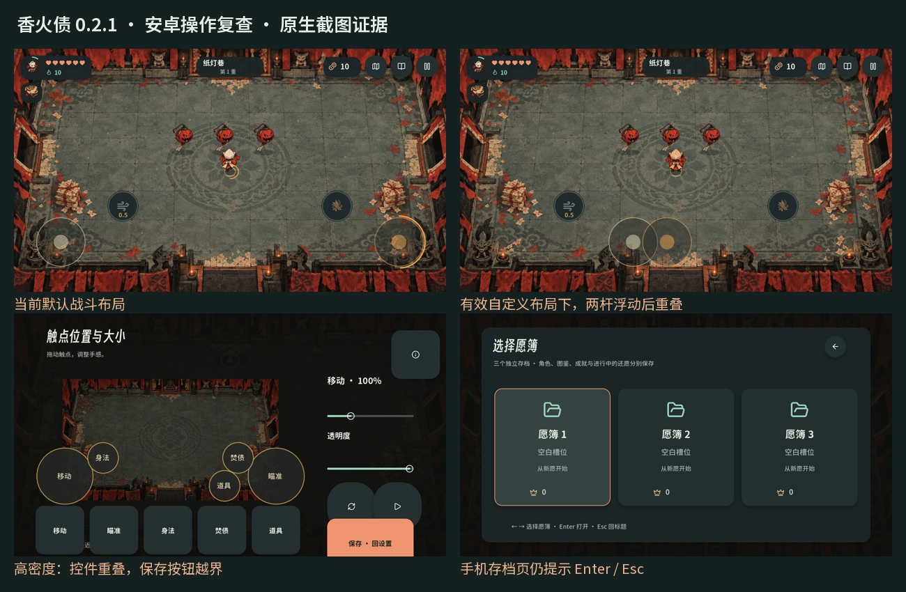

# 香火债 0.2.1：安卓键位与移动端适配复查

2026-10-09。审查对象为当前源码和本机 0.2.1 APK。此次交付问题分析、原生复现证据和优化构思。

当前主要问题是双拇指的动作争用、短时间窗口导致操作意图改变、浮动摇杆与编辑预览的不一致，以及高密度时按钮、文字和容器没有共同适配。双摇杆、多指捕获、房门切换、暂停清理等基础机制已经存在，不能用“缺少移动端操作”来概括现在的情况。

此前第 32 篇针对 0.2.0；第 33 篇记录 0.2.1 修订。本篇重新读取当前实现、重新运行当前测试，不把旧缺陷全部列作仍未修复。半屏分配错误、死区内沿旧方向开火、清房隐形攻击热区、战斗地图缺少触屏入口、触摸兼容鼠标干扰等旧问题，在此次相关复查中通过。

审查证据保存在 [review.json](reports/android-controls-current-2026-10-09/review.json)、[六组适配记录](reports/android-controls-current-2026-10-09/matrix.json) 和 [20 组交互观察](reports/android-controls-current-2026-10-09/interaction-probes/observations.json)。记录中的观察说明现有行为，不代表问题已修复。复现工具为 [review_android_controls.py](../../tools/runtime/review_android_controls.py) 和 [review_android_controls.gd](../../tools/runtime/review_android_controls.gd)。

**实际检查范围与结果**

以原生 Windows Godot 运行当前游戏；使用真实渲染器、应用 GUI 分发及合成触摸事件。六组均运行相同的 85 项检查，共 510 项，487 项通过、23 项失败；常规四组共 340 项全部通过。两组高密度条件复现了适配问题。

| 配置 | 输入窗口／密度参数 | 结果 | 说明 |
| --- | --- | --- | --- |
| 横屏 16:9 | 1280×720／桌面 DPI 按现有代码下限 160 换算 | 85／85 | 基础布局与流程通过 |
| 横屏 20:9 | 2400×1080／480 | 85／85 | 宽屏布局通过 |
| 平板 4:3 | 1024×768／桌面 DPI 下限 | 85／85 | 当前测试覆盖范围内通过 |
| 密度 320 | 1280×720／320 | 85／85 | 基础高密度配置通过 |
| 小窗口、高密度 | 1280×720／480 | 72／85 | 13 项失败；默认触点间距、菜单越界／重叠、大小保存失败 |
| Full HD、高密度 | 1920×1080／640 | 75／85 | 10 项失败；选卡、献祭、替换、暂停、辅助、设置等越界／重叠 |

这些是可重复的尺寸与密度组合，不声称代表已经测试的某个手机型号。六组保留 120 张原生截图；另外保留交互观察截图。几何检查主要针对可见按钮和范围控件的边界与重叠，不能代替字体可读性、手指遮挡、拖动舒适度和长局体验检查。

本轮 ADB 查询没有连接设备，随后关闭本轮启动的空闲服务。当前 APK SHA-256 为 `8e99ffebf6c5b5dbae175d26016d561ed55418e512148bd00f816f9dec838216`。现有 Android 真机验收记录仍为 `pending`，并引用更早的包哈希；它不构成此包的真机通过证明。此次没有使用 Docker、WSL、模拟器或交互浏览器。

**为什么现有键位仍不合理**

P1 表示优先解决的操作可靠性或流程可达性问题；P2 表示影响学习、理解、调整和体验的问题。以下依据分别注明复现、源码或设计判断。

| 编号 | 优先级／依据 | 当前问题与原因 | 建议 |
| --- | --- | --- | --- |
| A01 | P1 · 合成双拇指复现 | 左拇指离开移动杆点身法，移动输入变为零；右拇指离开攻击杆点焚债或道具，开火变 false。默认移动到身法、攻击到技能中心均约 215 个逻辑单位，道具约 256。位置调整减轻了右手负担，但同时移动、瞄准和施术仍依赖第三指或明确接续机制。 | 双拇指作为首要验收条件；动作键围绕拇指可达区域排列，增加受控的动作接续。高级手势与三指布局作为可选预设。 |
| A02 | P1 · 输入＋真实 World 复现 | 最近移动方向仅保存 250ms。向右移动、向上射击，松开移动杆超过 250ms 后点身法，真实冲刺变为向上。躲避方向由时间窗到期而改变，玩家没有提示。 | 明确“沿移动方向”或“沿瞄准方向”的规则；沿移动方向时保存最后有效意图，换房、暂停和菜单清理。若改用瞄准方向，先给方向提示。 |
| A03 | P1 · 蓄力复现 | 焚债／道具切换只保留 150ms 接续。长愿卷已有 0.4s 蓄力，切换 160ms 后回杆仅剩 0.02s，从头开始。蓄满会自动发射，松手会取消，并非松手发射。 | 区分普通松手、已确认技能切换和主动取消。技能接续可从 250～300ms 候选值试起，设置明确上限；武器提供蓄力环、蓄满与取消反馈。身法本来就会取消蓄力，按武器规则保留这个含义。 |
| A04 | P2 · 复现／设置源码 | “按一下切换攻击”仅作用于鼠键／手柄。触屏开启该选项后松开攻击杆仍停火。设置说明写了限制，但手机没有对应的减轻持续按压模式。 | 手机显示适用的攻击预设；需要保留外设选项时标明设备。提供可选辅助攻击模式，不用一个布尔设置承载不同设备的意图。 |
| A05 | P1 · 两层复现 | 自定义两杆静态间距通过校验，浮动起点仍可相互靠近。组件记录实际起点相距 102，而所需间距为 152；应用中也复现约 100.2 的间距。`floating_origin` 只避让动作键，没有避让另一根已捕获的杆。 | 校验静态热区和整个浮动范围；浮动起点避让另一杆及其手指占用区，限制合理活动范围，持续保持各手指归属。 |
| A06 | P1 · 六配置复现 | 放大最低触点尺寸后，菜单仍使用固定 y 坐标与高度。高密度下选卡确认、满槽替换、暂停、设置、音量与编辑页越界或相互遮挡；Full HD／640 也失败。 | 按可用 dp 高度布局，固定底部确认栏，上部内容可滚动；候选卡、菜单和编辑页使用容器重新分配空间。不能只扩大按钮矩形。 |
| A07 | P1 · 复现 | 安全区重算发现布局无效，就直接 `reset_layout`；用户的位置与大小被丢弃。在密度 480 复现中，重置后的默认布局仍然无效。 | 用户配置作为稳定原稿保存；适配时求解临时显示位置，保留原稿并提示调整。默认预设也必须通过最终安全区和密度校验。 |
| A08 | P2 · 数值与画面 | 编辑预览为 800×360，而安全区比例不同。横向缩放约 0.631，纵向约 0.508，相差约 24%。圆盘半径按横向缩放，中心分别按两轴缩放，预览中距离与实战比例不一致。 | 用一次等比例变换统一映射画面、圆盘、中心和拖动；剩余区域留空，显示真实安全区与战场范围。 |
| A09 | P2 · 真实编辑器复现 | 编辑器寻找触点固定用 52 半径。将瞄准杆放大到 175% 后，预览圆盘半径约 79.5；点距中心 65 的可见外圈却无法选中拖动。 | 选择范围随当前预览半径变化，另保留最小触点尺寸；被选控件显示明确选中态。 |
| A10 | P2 · 试操作复现／源码 | “试手感”更新 `last_action` 标签和位置，身法不产生真实冲刺，攻击不发弹，蓄力、冷却、技能和命中也没有真实反馈。它只能验证输入识别。 | 使用独立训练 World、真实角色和当前武器；验证身法距离、充能、施术、受击与输入接续。隔离正式存档、成长和奖励随机源。 |
| A11 | P2 · 源码与尺寸换算 | 最小按钮使用密度换算，字体、内部图标及很多间距仍为固定逻辑单位。示例中 20 单位文字在 1280×720／480 条件下约 6.7dp；1920×1080／640 约 7.5dp，均未计用户字体倍率。放大按钮无法改善内部内容可读性。 | 操作热区、图标、字和间距分别建立尺寸规则。建议正文 16～18sp、紧凑关键数字至少 14sp，并支持界面字体放大；容器跟随重排。保留当前圆角字与中文 NotoSansSC 回退，不需要先换美术风格。 |
| A12 | P2 · 源码分支＋组件复现 | 手机设为“自动锁定”，持杆手动开火时主循环又改成轻度吸附。30°目标在直接自动模式会被锁定，在实际手动分支保持 0°。界面选项与玩家正在使用的行为不对应。 | 将“轻度辅助瞄准”“辅助攻击”“手动瞄准”拆成清晰预设，显示目标反馈，并保留手动优先。 |
| A13 | P2 · 组件复现 | 只有字符串 `ray` 采用 10%方向修正，束线、弧光、棱镜、引导符群仍用 25%；可控纸蝶关闭辅助。面对同一 10°目标，照骨线修正约 1°，其他这些模式约 2.5°。当前部分武器已区分，但策略还未覆盖全部体系。 | 用武器能力分类辅助：精准射线低吸附、散射允许较宽扇区、近战按近距扇区选目标，可控／引导武器避免抢方向。 |
| A14 | P2 · 源码 | 手绘动作圆盘没有统一读取按下状态；身法冷却未完成时点按主要进入 80ms 缓冲，没有专门解释。技能失败有文字通知，但“冷却／能量／无标记”在图标上主要都变暗。 | 每次按下都有短促视觉反馈；冷却环、能量缺口、无目标状态分别表达。失败提示靠近动作键，必要时用轻触觉，不靠一条远处文字通知。 |
| A15 | P2 · 原生存档页截图 | 存档页仍显示“← →、Enter、Esc”，触屏玩家的教学提示没有完全覆盖整个流程。手机已经可以点卡片，这个问题是说明错误，不能声称存档页无法触屏操作。 | 按实际输入设备显示“点选愿簿／返回”，外设连接后再展示其提示。继续检查还愿庭、图鉴和分支训练提示。 |
| A16 | P2 · 保存复现 | 编辑器提供“保存·回设置”，但系统返回也会直接保存修改，没有恢复进入前布局的入口。试操作完成同样会保存。玩家调坏后返回，改动仍写入设置。 | 编辑页使用临时草稿；“应用”“取消”语义明确，试操作返回继续编辑，恢复默认单独提供。自动保存模式则应明确提示并提供撤销。 |

A01 的瞬间移动变零不等于整个身法失效，正常冲刺仍可执行；问题在于转移手指前后持续移动的连续性。A03 的候选时间值是设计起点，需双拇指真机验证，不能把桌面合成输入当作手速测量。A12 保留手动优先是合理原则，问题在于设置名称、目标反馈和实际模式的关系不清楚。

**建议的操作构思**

保留双摇杆作为标准模式：左杆持续移动，右杆负责方向与攻击。下方只放身法、焚债和已装备道具；地图、愿簿、暂停保留在上方。控件采用圆角和统一功能图标，技能插画作为内部识别图，危险弹幕与攻击范围始终优先清晰呈现。普通房间仍须走入门口，地图只负责查看。

| 模式 | 双手职责 | 适合情况 | 必须约束 |
| --- | --- | --- | --- |
| 标准双拇指，建议默认 | 左杆移动；右杆瞄准并攻击；独立动作键有明确接续 | 通用肉鸽游玩 | 普通松手立刻停火；仅确认动作切换才暂存瞄准／蓄力；身法方向可预测 |
| 辅助操作，可选 | 左杆移动；自动选择可见目标或保持攻击；右手处理施术和躲避 | 休闲、长时间游玩及较难持续按压的玩家 | 手动方向优先、遮挡检查、暂停立刻停火；敌人消失停止；精准和可控武器可强制手动 |
| 三指／四指，可选 | 保留两杆，额外手指分别处理动作键 | 高手、自定义平板布局 | 默认双拇指体验不能依赖这套预设；布局按设备保存 |

标准模式优先处理动作接续与摆位，再评估可选“左杆回中后再次外推触发身法”等快捷手势。快捷手势必须有明确准备反馈、位移门槛和取消条件，普通持续外推移动不能误触身法。技能可提供可选快捷区，但普通瞄准拖过一个圆盘不能自动施放。

摆位从屏幕百分比改为相对主杆的 dp 偏移。例如主杆半径 44dp、动作键半径 28dp、间隔 8dp 时，中心至少需相距 80dp；身法可从移动杆向内 52dp、向上 64dp 的位置试起，焚债在右杆对称位置。道具再放到右杆内侧约 94dp、上方 12dp。以上是初始布局候选，需全体热区和安全区求解后采用，不能作为任意屏幕的固定坐标。左右镜像同时变换整组控件，宽屏增加宽度不会不断拉大动作键与主杆的距离。

攻击按武器表达：连续射击推动即射、回中即停；近战显示实际攻击扇区；蓄力武器明确“满蓄自动发射”或可选“松手释放”的规则，取消区清楚可见；射线显示即时方向；可控弹提供引导状态，释放后是停止引导还是沿最后方向飞行必须一致。改变操作规则需要核对技能组合、冷却和战斗平衡，不只更换图标。

尺寸使用统一换算，但不把所有内容同步放大为大按钮：热区至少 48dp，常用动作可从 56～64dp 试起，主杆视觉直径可从 80～96dp 试起；相邻热区尽量留 8dp。图标、可读字号、透明度与热区分别调节。小窗口时用滚动、固定确认栏和折叠非关键 HUD 释放空间。Android 官方建议触控目标至少 48×48dp，允许图形小于其热区。[Android 官方说明](https://developer.android.com/guide/topics/ui/accessibility/apps)，[Google 触控尺寸说明](https://support.google.com/accessibility/android/answer/7101858?hl=en)。

字体保留现有 `IncenseRounded`、`NotoSansSC` 回退和标题 `SmileySans`；首先解决字号、字重、数字、内边距和界面缩放。当前战斗弹字／愿页字体选项不等于全界面字体缩放。密度读取还需与原生实际设备核对；Godot 文档说明 Android 密度分组及安全区 API，但桌面截图不验证系统手势边缘和真实刘海。[Godot DisplayServer](https://docs.godotengine.org/en/stable/classes/class_displayserver.html)。

布局编辑采用全尺寸同等比例预览、可见热区和安全边界，显示重叠原因；位置、大小、透明度各自有草稿和撤销。试操作进入真实的独立训练场，退出仍回编辑器，并且不保存未确认修改。保存后按手机／平板、左右手和固定／浮动模式记住预设；窗口改变只调整显示结果，不清空原配置。

**整条游玩流程的复查结论**

| 流程 | 当前检查结果 | 后续重点 |
| --- | --- | --- |
| 标题 → 存档 → 主菜单 → 选角 | 当前源码与原生截图可见触屏入口；存档提示仍是桌面文字 | 统一设备提示，核对长中文名字及放大字体 |
| 进入游戏与教学 | 0.2.1 手机教学已提示左右杆、身法和地图 | 增加真实手指示范，明确蓄力／取消规则 |
| 移动、攻击、技能、道具、身法 | 基础多指通过，双拇指与窗口问题见 A01～A05 | 同时走位射击，连续切动作，冷却失败与方向切换 |
| 战斗地图 → 返回、暂停 → 返回 | 专用地图入口、真实返回与输入清理已覆盖 | 高密度菜单底栏与系统返回实测 |
| 3／4 技能、献祭、购买 | 同屏候选、预览后确认、费用显示已覆盖 | 密度 480／640 越界，字号和比较可读性 |
| 满槽替换 | 旧新并排预览、取消、明确确认已覆盖 | 高密度重叠／越界；列表可滚动、底栏固定 |
| 走门切房、清房动作 | 按阶段同步触点，旧隐形攻击问题未复现 | 持杆走门不漏输入，边缘手势与触点遮挡 |
| 种子输入、粘贴、存档传递 | 软键盘遮挡与返回逻辑有原生桌面模拟覆盖 | Android 原生输入法、文件选择器、剪贴板真机 |
| 编辑、试操作、返回、保存 | 已复现 A08～A10、A16 | 原稿／草稿分离，真实训练，改坏后能撤销 |
| 还愿庭、图鉴、结果、成长 | 源码入口与部分原生画面审查 | 全部详情页的高密度重排、长文本与放大字体 |
| 前后台、旋转、系统返回 | 源码已有保存、暂停、清理及横屏保护；桌面基础回归通过 | Android 通知遮挡、来电／锁屏、旋转、音频恢复及手指取消 |

执行顺序建议：先修 A02、A03、A05～A07 的确定性问题，再把菜单、字号、图标和间距纳入同一适配规则；随后完善编辑器与真实训练场；最后验证标准、辅助和高手预设。验收应增加双拇指自动化序列、全部密度组合、左右镜像、最大触点、真实安全区与放大界面字体。当前 510 项中遗漏了若干编辑器和人体操作检查，不能仅凭已有绿色测试宣布移动适配完成。

上线前还需要真实 Android 双拇指、手势导航、刘海、系统输入法、触觉、音效延迟和长局温度记录。它们属于尚未验证的范围，此次没有把这些项目写成已经发生的故障。

**关键源码证据**

| 文件／位置 | 对应逻辑 |
| --- | --- |
| [input_adapter.gd](../../game/scripts/ui/input_adapter.gd#L193) | 动作捕获、固定／浮动杆、单指归属 |
| [input_adapter.gd](../../game/scripts/ui/input_adapter.gd#L247) | 浮动起点只避让动作键 |
| [input_adapter.gd](../../game/scripts/ui/input_adapter.gd#L308) | 触控排除攻击切换；250ms 方向、150ms 蓄力窗口 |
| [world.gd](../../game/scripts/combat/world.gd#L703) | 身法方向回退、80ms 缓冲 |
| [world.gd](../../game/scripts/combat/world.gd#L765) | 蓄力接续、取消与满蓄自动发射 |
| [main.gd](../../game/scripts/main.gd#L244) | 安全区、密度换算及无效布局重置 |
| [main.gd](../../game/scripts/main.gd#L381) | 最小按钮放大，不移动固定坐标 |
| [main.gd](../../game/scripts/main.gd#L704) | 手动触屏将自动瞄准改为轻度 |
| [control_settings.gd](../../game/scripts/ui/control_settings.gd#L119) | 预览尺寸、大小滑杆、试操作入口 |
| [touch_layout_editor.gd](../../game/scripts/ui/touch_layout_editor.gd#L17) | 绘制缩放和固定 52 选择半径 |
| [touch_tryout.gd](../../game/scripts/ui/touch_tryout.gd#L45) | 试操作只移动纸偶与更新动作名称 |
| [aim_assist.gd](../../game/scripts/ui/aim_assist.gd#L42) | 仅 `ray` 的轻度修正较低 |
| [menu_flow.gd](../../game/scripts/ui/menu_flow.gd#L55) | 手机存档页的桌面提示 |

源码锚点便于仓库阅读；本轮哈希绑定记录见 `review.json`。复现命令：`python tools/runtime/review_android_controls.py`；已有矩阵上仅补观察可用 `--probes-only`。执行中会短暂运行隐藏的原生 Godot 窗口，结束后关闭；不运行 Android 模拟环境。
