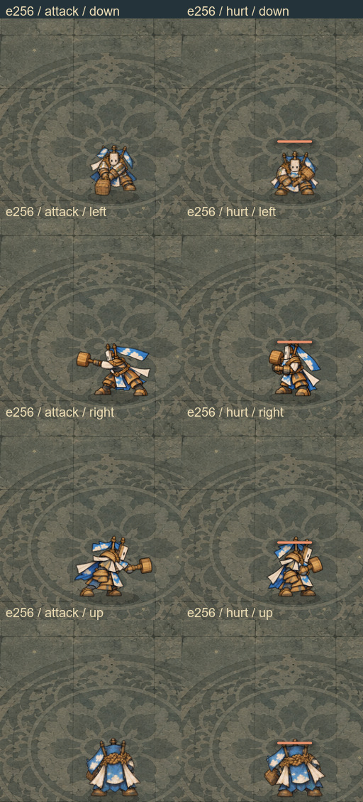
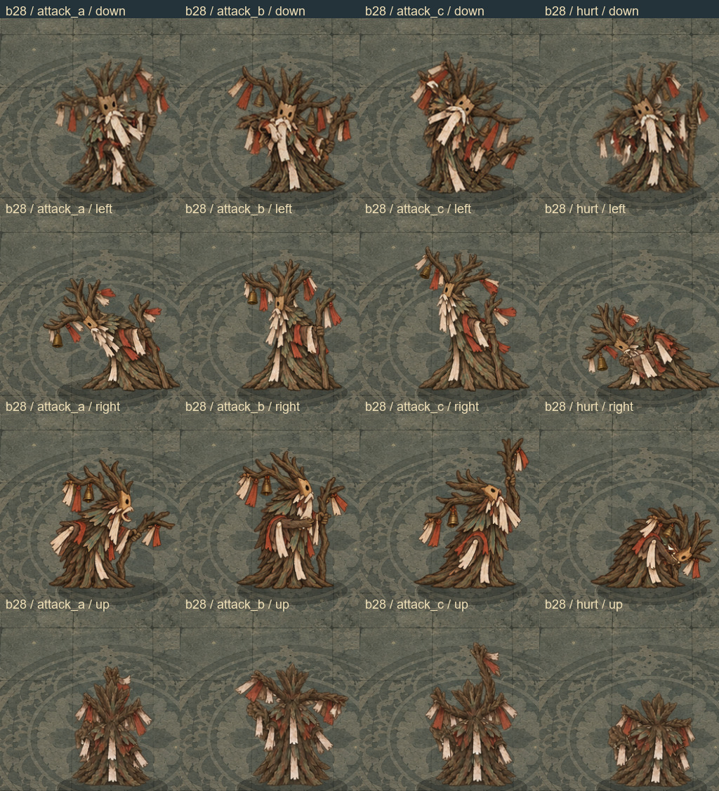
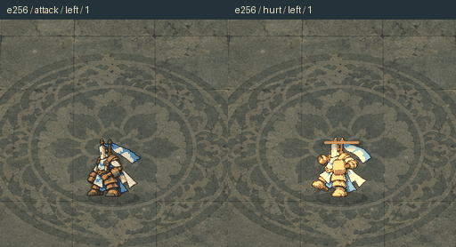
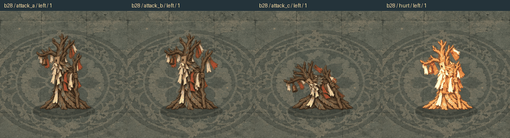
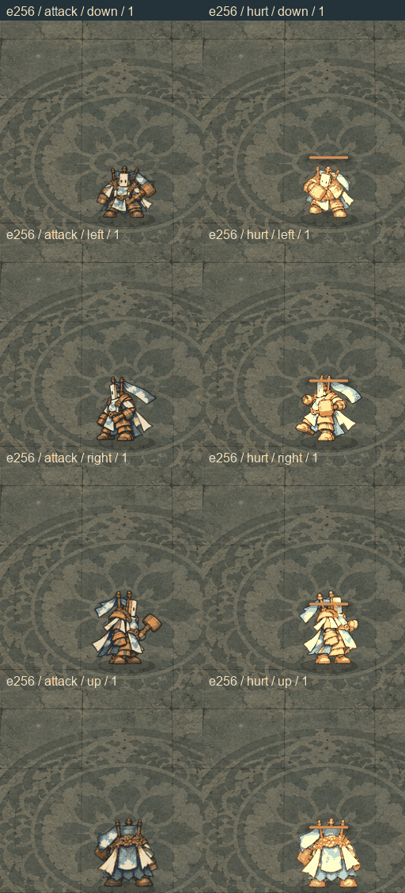
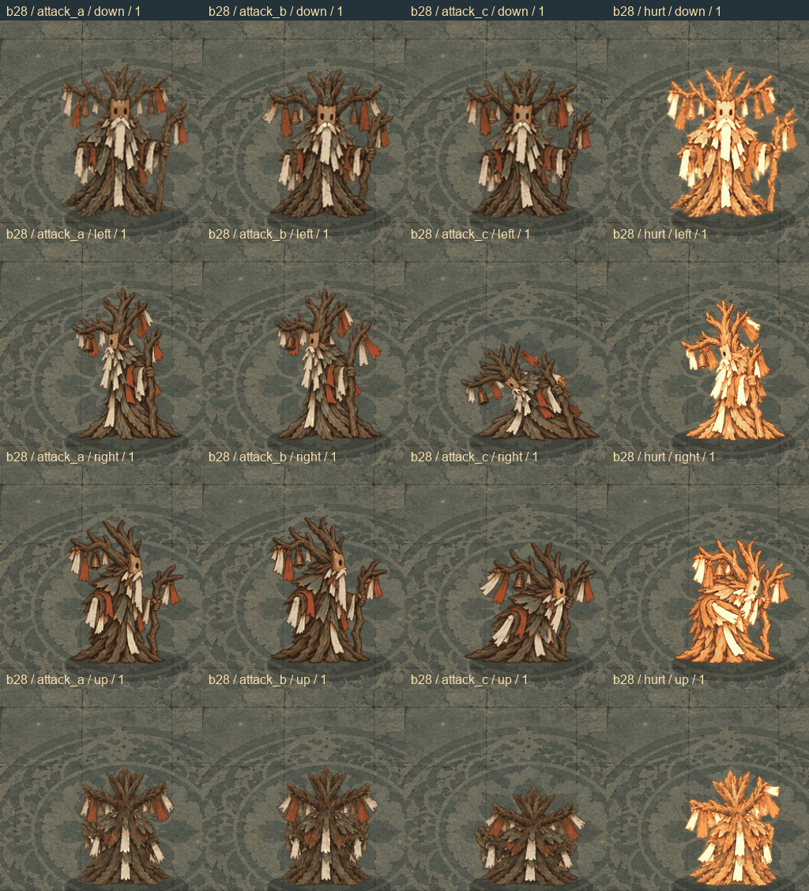

# 35 全量怪物攻击、受击动画交付 / Complete creature action delivery

2026-10-10，本机 0.2.1 的怪物动作修订完成 **402 / 402 个身份、24,048 / 24,048 个独立绘制姿势、1,002 张动作图集**。范围包括目录中的全部通用、主题、兼容小怪与 Boss，以及精英和召唤符。所有这些身份的攻击、受击均有正面、左侧、右侧、背面四个真实视角，每状态六帧。

## 覆盖范围

| 类型 | 身份数 | 每身份状态 | 每状态朝向 × 帧 | 总帧数 |
| --- | ---: | --- | ---: | ---: |
| 小怪 | 296 | 攻击、受击 | 4 × 6 | 14,208 |
| Boss | 99 | 主攻击 A、次攻击 B、组合攻击 C、受击 | 4 × 6 | 9,504 |
| 精英变体 | 6 | 攻击、受击 | 4 × 6 | 288 |
| 召唤符 | 1 | 攻击、受击 | 4 × 6 | 48 |
| **合计** | **402** | **1,002 个状态图集** | | **24,048** |

六名主角另有 864 个独立姿势，计数与上述怪物帧分开。怪物的待机、移动、死亡和阶段转换保留各自现有素材方法；本次全量完成的状态是攻击与受击。

覆盖身份、每帧纹理哈希及加载路径以 [creature-actions.json](../../game/assets/creature-actions.json) 为准。逐状态的模型、源图、提示词与参考图指纹、选用行及视觉审查记录保存在 [animation-manifest.json](../../game/assets/animation-manifest.json)。当前编译图集使用 **1,047 张通过审查的生成源页**。

## 画面与造型要求

使用指定的 **sub2-image-gen / gpt-image-2.5** 逐姿势生成，保持原有剪纸、纸面具、铜器、绳结与符纸的材质和配色。每张选用源页均做视觉审查与完整性检查；完成姿势只做背景裁取、等比缩放和脚底锚点统一。

四个朝向按完整身体的视角绘制：正面保留原有成对眼位；侧面以真实遮挡呈现近侧眼位、身体厚度与远侧肢体；背面呈现原有后背结构。原本的孔洞、鼻孔、头部数量、肢体数量及永久道具均作为身份特征保留。左右方向的最终姿势独立绘制。

有缺帧、身体贴边、跨格连体、方向回转、道具增减或背景不透明的页会退出编译队列，保留失败记录并重绘。最后的修复包括蛇形角色下边缘余量、鸟类透明背景、守卫木面具侧向厚度及蜘蛛大眼位的真实遮挡。

下面的对照直接拼接原生引擎截图，完整保留每张捕获画面。各行依次为正面、左侧、右侧、背面。

## 战斗中的播放

准备和蓄势使用攻击帧 0、1；真实攻击释放进入帧 2，随后播放跟随及恢复帧。方向在准备／释放事件中锁定，角色不会在同一攻击中突然转成另一个视角。Boss 按真实阶段和攻击序号使用 A、B、C 图集。

近战冲刺在实际冲刺期间保持击发姿势，冲刺结束再播放恢复。延时扇形弹在实际发弹时重新进入击发帧。普通受击保留可读的发弹关键帧，随后显示受击；真实眩晕则按照战斗逻辑中断。受击序列包含六帧，方向沿用该次动作的朝向。

播放与模拟时间同步：奖励选择和暂停冻结动作进度；存档继续保留当前状态、帧和朝向。旧 schema 2 存档可以依据已完成攻击序号推断缺少的 Boss 动作字段；无效方向和非有限时间值会在恢复前被拒绝。绘制采样不会推进世界或消耗战斗随机流。

这些 GIF 使用固定 140 毫秒审查节奏、没有声音；实战播放采用上面的事件时序。

README 还直接展示四个朝向同时播放的对照，使用同一份逐帧原生证据生成。两列小怪图为攻击／受击；四列 Boss 图为 A／B／C／受击。生成工具见 [create_creature_action_showcase.py](../../tools/documentation/create_creature_action_showcase.py)。

## 全量验收证据

| 检查 | 本次实际结果 | 记录 |
| --- | --- | --- |
| 完整目录与源图检查 | 402 身份、24,048 帧；无缺失身份；模型、审查、源图、透明度、切片与逐帧哈希通过 | [source-validation.json](reports/creature-actions-2026-10-10/source-validation.json) |
| 全量原生帧证据 | 402 身份、24,048 帧；每身份绑定当前动作资产，逐张截图 SHA-256 与成功捕获记录一致 | [native-coverage.json](reports/creature-actions-2026-10-10/native-coverage.json) |
| 原生战斗状态测试 | 17 项通过、0 失败；1,184 次小怪实际攻击、1,980 次 Boss 实际攻击；载入全部 24,048 个原生动作纹理区域 | [native-suite.json](reports/creature-actions-2026-10-10/native-suite.json) |
| Windows / Android 当轮包体一致性 | 2,096 项通过；73 份编译脚本一致；全部 1,002 张图集的运行映射和编译纹理一致；载入 864 主角帧与 24,048 怪物帧 | [历史 packaged-parity.json](reports/consumables-2026-10-11/prior-package-receipts/docs/incense-debt/reports/action-mobile-2026-10-09/packaged-parity.json) |
| Windows 当轮导出程序 | 107 项纯键盘流程通过、0 失败 | [历史 keyboard-flow.json](reports/consumables-2026-10-11/prior-package-receipts/docs/incense-debt/reports/platforms/windows/keyboard/keyboard-flow.json) |
| Android 当轮 APK | 签名、版本、权限、arm64 及全部 3,791 项运行资源通过 | [历史 android-verification.json](reports/consumables-2026-10-11/prior-package-receipts/docs/incense-debt/reports/platforms/android-verification.json) |

原生状态检查还覆盖六种精英、Boss 外观分身、召唤符、四向受击、暂停冻结、保存继续、旧存档推断、冲刺收招、受击与发弹优先级和延时攻击。捕获证据按当前身份资产匹配，已有 PNG 文件本身不作为通过依据。完整验收默认要求全部 402 个身份，构建门禁拒绝不完整动作版本。

Godot 导出时移除编辑器专用导入参数；包体核对比较完整的运行时映射，再比较实际编译纹理字节。导出的 Windows 内嵌 PCK 由匹配版本的原生 Godot 运行器打开，其资源和编译脚本与 APK 逐项核对。

## 当轮产物记录 · 2026-10-10

| 平台 | 文件 | 大小 | 构建 |
| --- | --- | ---: | --- |
| Windows | [当轮 Windows 构建记录](reports/consumables-2026-10-11/prior-package-receipts/docs/incense-debt/reports/platforms/windows-build.json) | 1,056.8 MiB | 原生 release 导出，实际程序键盘流程已验收 |
| Android | [当轮 Android 构建记录](reports/consumables-2026-10-11/prior-package-receipts/docs/incense-debt/reports/platforms/android-build.json) | 977.3 MiB | 原生 debug 签名，已检查包体；未做真机安装验收 |

Windows SHA-256：`654e3e3c60f0e46c1faf7ae94ab8ed7834a699f11d23746ea076587505cacead`。

Android SHA-256：`bfc6280672c0e69069d674f59e7bc57d939f3bd226eae4bd34c5eef26a5ec50b`。

以上哈希属于怪物动作完成时的 2026-10-10 构建；2026-10-11 的消耗品修订已更新安装包，见[消耗品交付](36-consumable-art-update.md)、[当前交付清单](../../build/delivery-manifest.json)与[当前状态](reports/current-product-status.json)。动作素材和逐帧来源证据保持。更早包体回执保存在 [prior-package-receipts](reports/creature-actions-2026-10-10/prior-package-receipts)，GitHub 公开发布仍为 `v0.2.0-alpha.1`。本次工作全部在原生 Windows 环境进行。

## English delivery record

All **402 creature identities** now have independently drawn attack and hurt animations in four genuine facings, six frames per state. This covers **296 enemies, 99 bosses, six elite variants, and the summon sigil**, totaling **1,002 atlases and 24,048 poses**. Bosses have three attack banks plus hurt. Original anatomy, masks and permanent props are preserved. The finished poses are independently generated through the requested Sub2 pipeline, then sliced, uniformly scaled and aligned at their foot anchors.

Real combat events drive anticipation, release, lunge holds, delayed projectiles and damage recoil. Pause freezes the simulation clock; saved runs restore the in-flight bank, frame and facing. Existing schema 2 saves remain compatible. Idle, movement, death and phase-transition assets retain their existing methods.

The complete source gate passed. All 24,048 poses have matching native-render capture evidence, and the 17 native combat checks passed. The 2026-10-10 Windows pack passed 2,096 checks; all 1,002 creature atlases and 73 compiled scripts matched Android. That executable passed 107 keyboard-flow checks, and its APK signature and 3,791 resources were verified. Those package receipts are archived above; the [2026-10-11 pickup revision](36-consumable-art-update.md) supplies the current packages while retaining the creature drawings and frame evidence. Android hardware testing remains outstanding. Comparison GIFs use fixed 140 ms frame timing, separately from combat timing.
