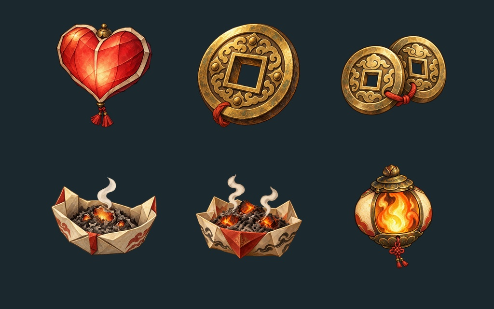
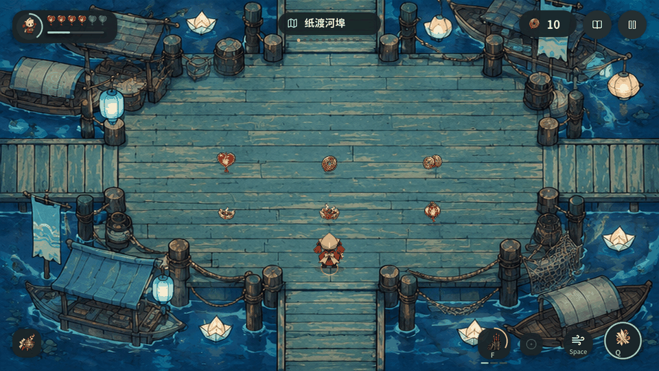
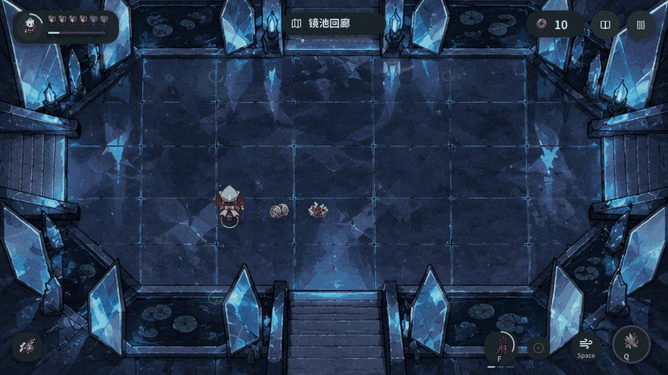
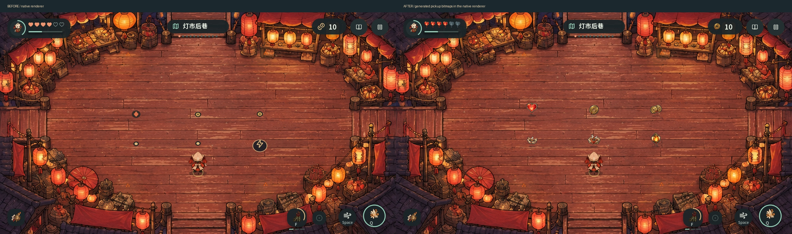
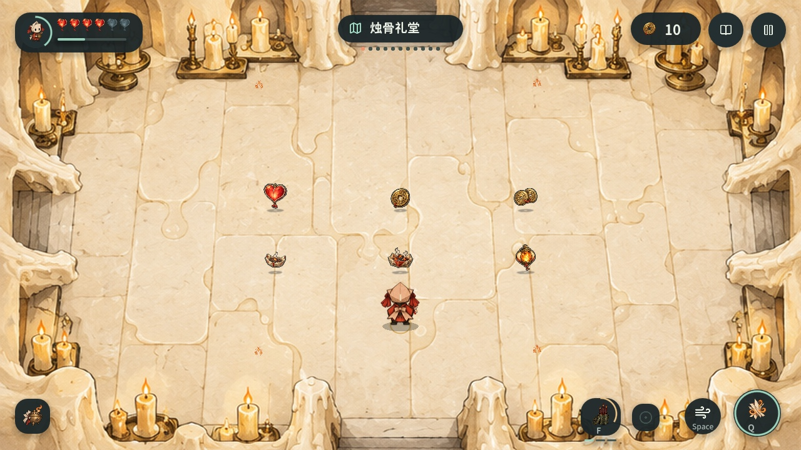
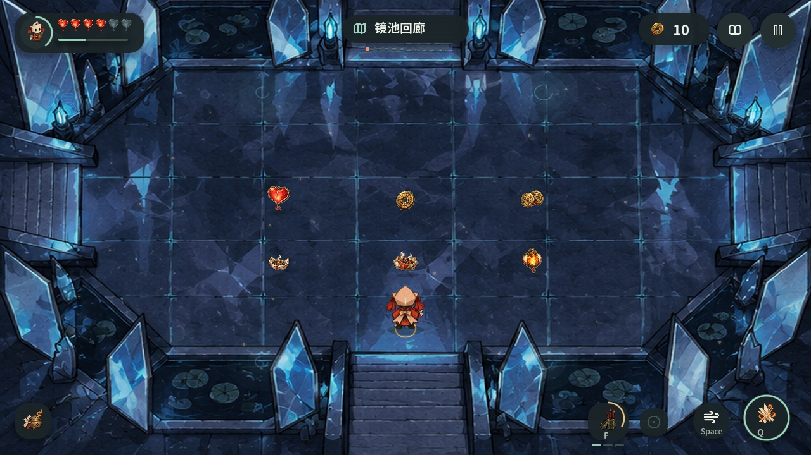
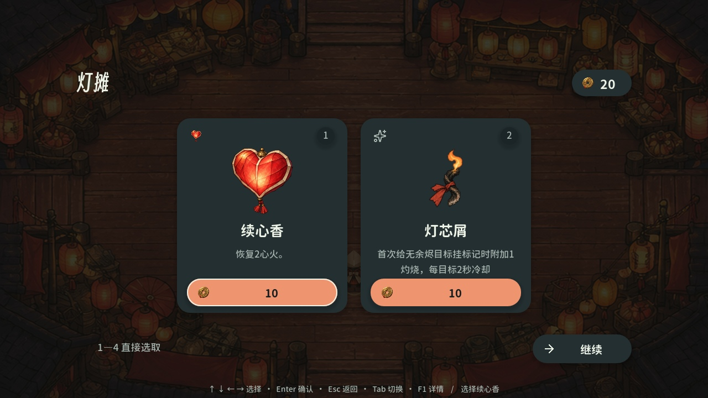
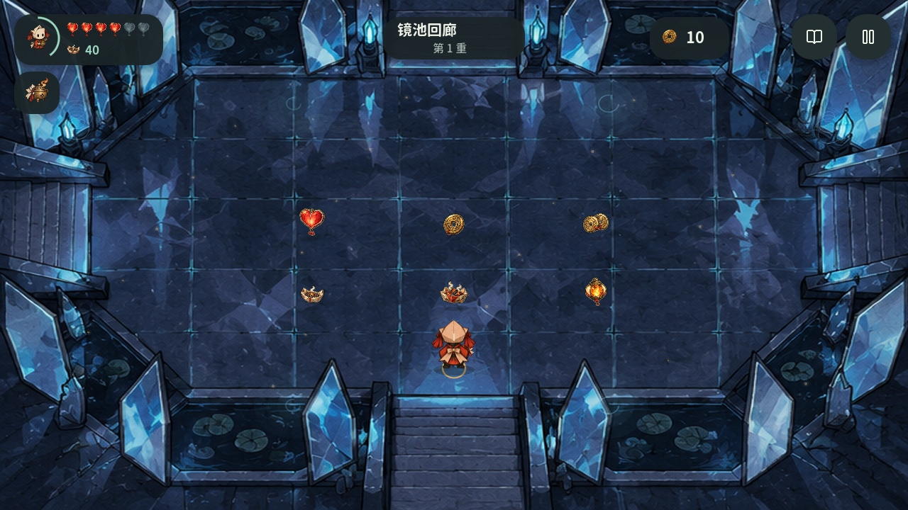

# 掉落消耗品美术复查与修订 · 2026-10-11

本轮将《香火债》的四类消耗品统一成可辨识的纸、铜、火物件。使用用户指定的 **sub2-image-gen / gpt-image-2.5** 生成六张独立原画，交付透明 PNG，并接入原生游戏渲染器、HUD、商品卡片和拾取提示。

本篇图像、GIF 与运行记录来自 **0.2.1** 消耗品修订；当前 **0.2.3** 的默认触控与安装包验收见 [第 38 篇](38-right-hand-touch-layout.md)。美术素材仍由两端使用，历史截图不作为最新包或 Android 真机证据。

## 复查结果与处理

| 内容 | 原实现的问题 | 当前样式与关联界面 |
| --- | --- | --- |
| 心火恢复 `heal` | 黑圆底加橙色菱形，轮廓不像红心；商店用香灰供物 r17 的图片代替回血商品 | 双瓣红心纸灯：朱红纸面、折痕、米白纸边、铜帽和短灯穗；地面、血条、角色血量图标和回血商品使用同源图片 |
| 纸钱 `coin` | 两个圆加方形孔；单枚、双枚数量完全同形，钱包和价格使用另一套线条图标 | 方孔旧铜钱；价值 2 的掉落用独立生成的双钱红绳版；钱包、商店价格和资源标记使用单钱原画的缩小版 |
| 香灰 `ash` | 几个圆点加短横线，看不出香灰、余火或纸质容器；高额掉落与普通掉落相同 | 米白折纸灰包，炭灰与橙色余烬；值 16 以上使用三枚余烬的大灰包；移动资源栏使用同源灰包图标 |
| 火芯 `battery` | 用 SVG 闪电符号放在圆底座上，与游戏中的纸器、铜器不一致；拾取提示也使用闪电 | 橙金火焰、旧铜底座与纸灯侧壁组成的充能火芯；地面和 E / 触屏拾取提示使用真实火芯图片 |
| 主动道具、饰品、修饰供物 | 已有独立生成的纸铜物件素材 | 保留对应物件；不把它们替换成资源图标 |



## 风格与实际尺寸

六件物品保持同一套手绘纸纤维、墨色轮廓、暖光和旧铜材质。不同资源同时用颜色和外形区分：红心、圆钱、横向纸灰包、圆形火灯。不要只靠背景色或文字判断资源。

地面纹理以 256 × 256 RGBA 存储，图案统一裁边、等比缩放和居中；实际绘制宽度为红心 44、单钱 34、双钱 40、小灰包 36、大灰包 44、火芯 46 个基准像素。纸偶仍比掉落物大。视口等比缩放时，两者一同缩放。

物件边线来自生成原画的透明轮廓膨胀，地面阴影来自生成铜钱的透明轮廓压扁与模糊，均是位图衍生处理。掉落主体、HUD 心形与铜钱、回血商品、火芯提示不再由代码绘制圆形、菱形、方孔或 SVG 闪电。圆角面板、功能导航符号、条形进度和其他战斗 FX 按各自用途继续工作。

空血量使用同一张红心纸灯的冷灰状态；保留完整轮廓，和红色实心心火区分。界面加载资源素材时保留原画颜色，不再将彩色图片乘上原单色图标的颜色。

## 动效、规则与保存

掉落物有轻微上下浮动和小角度摆动，贴着地面的位图阴影保持稳定。拾取时短暂显示同源资源图片向上淡出。开启「减少动态」时停止待机浮动、摆动和拾取上移，只保留静态辨识与淡出。所有位图绘制沿用房间内墙裁切。





本轮是美术与呈现修订。回血仍恢复 2 心火；原有满血拾取转 3 纸钱行为保持。金币按原始 `value` 结算，香灰按原值及已有构筑加成结算；双钱与大灰包不会额外发放资源。吸附继续使用原地面坐标，回血保持 24 像素触发范围。火芯仍需靠近按 E 或使用对应触屏拾取按钮；充能已满时留在地面。

掉落数量、延迟、吸附状态和装备充能继续进入 schema 2 存档。美术种类根据现有 `kind` 和 `value` 选择，不写入新的玩法随机流，也不需要对旧存档迁移。

## 原生画面与验证











每套 20 种主题的 A / B 背景都用原生 1280 × 720 渲染了全部六种地面外形，共 40 张地图画面。审查合集直接裁取真实画面中的物品区，没有后期把美术贴进地图。

- [20 套主题 A 的实际尺寸对照](reports/consumables-2026-10-11/twenty-themes-a.jpg)
- [20 套主题 B 的实际尺寸对照](reports/consumables-2026-10-11/twenty-themes-b.jpg)
- [六件原画、19 份运行位图与来源 SHA-256](../../game/assets/pickups/manifest.json)
- [20 项美术完整性检查](reports/consumables-2026-10-11/art-validation.json)
- [105 项原生检查、91 张捕获记录](reports/consumables-2026-10-11/native/native.json)
- [实际 Windows 导出程序的重复检查](reports/consumables-2026-10-11/windows/native.json)
- [本轮 0.2.1 的 Windows / Android 编译纹理核对](reports/widescreen-2026-10-11/prior-package-receipts/docs/incense-debt/reports/action-mobile-2026-10-09/packaged-parity.json)
- [当前安装包和验证记录](reports/current-product-status.json)

91 张捕获含 40 张场景、回血商店、火芯键盘提示、移动 HUD，以及待机 / 拾取各 24 帧。检查还覆盖实际回血、满血转换、两档金币、两档香灰、回血吸附边界、清房保留回血、充能拾取、防止满充能误消耗、九个地面掉落及完整世界的保存恢复、表现层不改变模拟或 RNG。

源码与导出程序均使用原生 Windows / Godot，未调度 Docker、WSL、虚拟机或浏览器。Android 验证范围是 APK 签名、版本、资源完整性，以及和 Windows 相同的脚本和编译纹理；移动 HUD 捕获来自 Windows 上的原生移动布局，不代替 Android 真机触屏与温控验收。

## 可复现生产入口

```powershell
python tools/runtime/build_consumable_art.py prepare
python tools/runtime/build_consumable_art.py generate
python tools/runtime/build_consumable_art.py compile
python tools/runtime/build_native.py windows
python tools/runtime/build_native.py android
python tools/runtime/run_consumable_qa.py
python tools/runtime/run_consumable_qa.py --packaged
python tools/runtime/audit_consumable_art.py
python tools/runtime/verify_android.py
python tools/runtime/verify_packaged_revision.py
```

生成工具只调用本机安装的 Sub2 skill 脚本。默认请求保留 `gpt-image-2.5`、高质量、1024 × 1024 和透明 PNG；网关实际返回 1254 × 1254，原尺寸与裁切范围均记录在清单中。首版火芯顶部裁切不合格，已重生成完整外形；失败稿只在本地保留，不用于游戏。原画和提示词保存于 `output/imagegen/consumables-2026-10-11/`，无需在线接口即可运行已打包游戏。

## English

This revision replaces all four ground consumable types with six independently generated, transparent raster objects from **sub2-image-gen / gpt-image-2.5**: a red paper heart lantern, single and paired brass cash coins, small and rich incense-ash paper packets, and a rechargeable fire-core charm. The HUD, healing offer, resource prices, and fire-core prompt use the same object drawings. Empty health uses a cool-grey state of the same heart.

Bitmap-derived silhouettes and floor shadows make the objects readable across all 20 themes and 40 backgrounds. Idle bobbing and a brief collected-object fade use presentation clocks only; reduced-motion settings disable positional animation. Ground values, magnet radii, manual fire-core collection, seed streams, and schema 2 saves retain their existing behavior.

Native verification renders 91 frames and screenshots and performs 105 checks per run, including actual keyboard interaction and complete native save round trips. Asset validation checks all 19 runtime bitmaps and six independent source drawings. The exported Windows program is checked again, and APK scripts/imported textures are compared against the source and Windows pack. Android device testing remains separate from these desktop and package checks.
