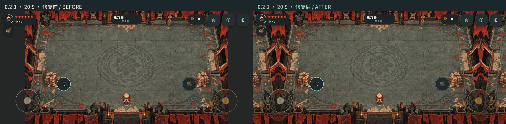
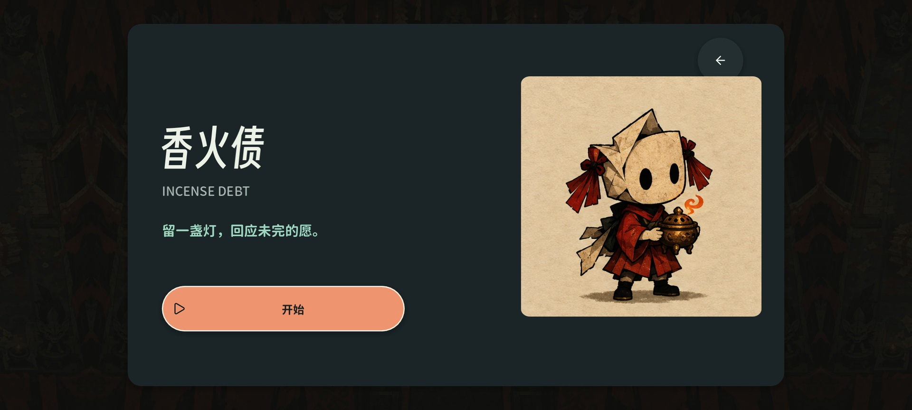
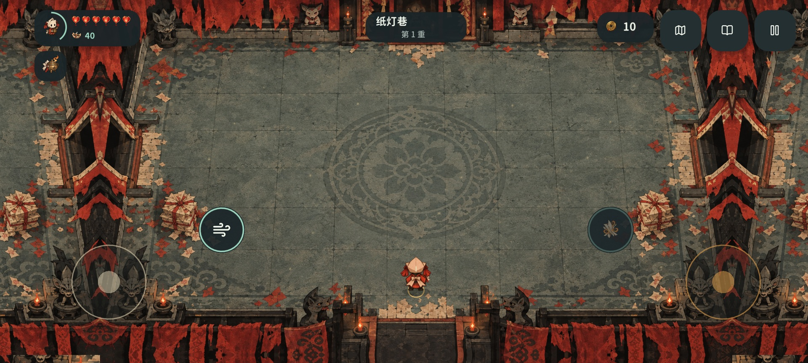
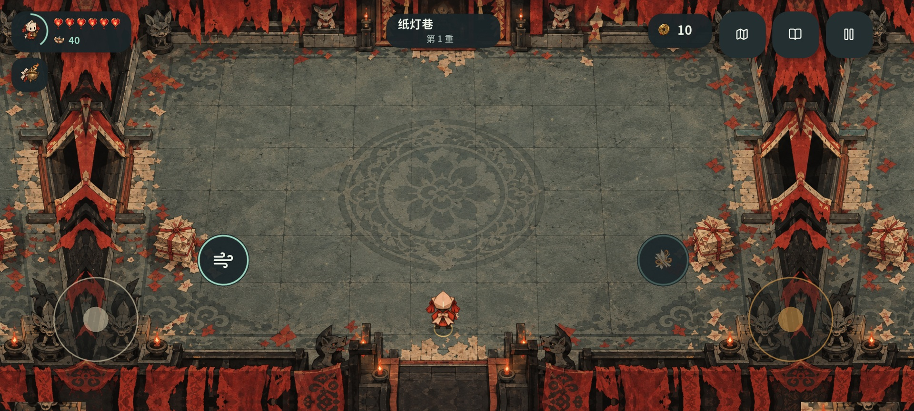

# 手机长屏黑边复查与修复 · 0.2.2

本篇保留 0.2.2 的黑边修复与原生图像。当前 0.2.3 同时包含本篇修复和[右手默认触控修订](38-right-hand-touch-layout.md)；最新包体与验收见[当前交付](reports/current-product-status.md)。

本轮针对摩托罗拉 X30 上报告的横屏左右黑边，复现并修复游戏自身的背景留边与 Android 导出设置。验证使用 Windows 上的原生 Godot 图形窗口、实际触摸事件分发和真实导出包；没有使用 Docker、WSL、虚拟机、模拟器或浏览器。当前未连接 X30，设备上的系统全屏策略仍需安装新版后确认。

## 原因与复现

旧版本已在运行时把移动视口设成 `expand`，HUD 和双摇杆也已占用扩展宽度。然而 `game_renderer.gd` 仍把完整房间按 1280 × 720 等比居中绘制，先用纯深色清空整张视口；扩展区域没有场景纹理。只改视口比例无法修复这个背景层的问题。

以本轮实际运行的 2400 × 1080、20:9 窗口为例，逻辑视口是 1600 × 720。完整 16:9 房间仍为 1280 × 720，每侧空出 160 个逻辑像素，即 240 个物理像素，左右各约占屏幕宽度的 10%。旧包的原生画面确实呈现这两块纯深色区域，不是后期添加的示意图。

此外，旧 Android 导出为 `screen/immersive_mode=true`、`screen/edge_to_edge=false`：隐藏系统栏和允许内容绘制到边缘是两个设置。前摄与系统栏可能形成另一层系统留边；这部分不能用 Windows 窗口代替真机确认。旧 APK 的 Activity 已允许调整大小，未设置最大宽高比，因此没有证据把本次问题归因于 Manifest 的 16:9 上限。

## 实际修复

| 层 | 0.2.2 实现 | 玩家看到的结果 |
| --- | --- | --- |
| 启动窗口 | 项目增加 `window/stretch/aspect.mobile="expand"`；保留运行时扩展设置；横屏使用传感器方向，Android 包对应 `userLandscape` | 移动端从启动配置就支持长屏；自动横屏翻转遵从系统旋转设置 |
| Android 系统窗口 | 导出开启边到边显示，同时保留沉浸模式 | 允许背景延伸至屏幕边缘；交互内容另行避让前摄与系统区域 |
| 场景 | 使用当前房间已有的生成背景延展外墙边缘，接缝对应原图边缘；极端角落由同一背景覆盖 | 全屏有当前主题美术，额外区域可承载 HUD 与触控，消除纯色空栏 |
| 房间与碰撞 | 完整房间以同一比例放入安全区，人物、敌人、掉落、内墙与四向出口沿用既有世界坐标 | 保留整间房视野和出口；场景外延是装饰，不扩大可行走区域 |
| HUD 与输入 | HUD、摇杆与按钮使用完整安全区；保留物理密度计算和 48dp 导航触点 | 资源与操作充分使用宽屏，瞄准坐标和点击位置一致 |
| 安全区 | 同时处理系统安全矩形和前摄切口；独立打孔即使未体现在安全矩形中，也按最近边缘避让 | 左右摄像头、底部系统区域均留出合理操作空间 |
| 横屏翻转 | 每 250ms 检查系统安全区是否变化；仅变化时重排并释放已有触点 | 180° 翻转无需依赖尺寸变化事件，避免旧摇杆继续持有输入 |
| 菜单 | 暂停、选技能、存档、标题页的遮罩覆盖整张视口，内容保留居中可读宽度 | 菜单两侧与中部呈现一致；弹层阻挡覆盖到屏幕边缘 |

房间主体保留等比缩放，外延直接使用既有生成位图，没有新增占用大量显存的地图纹理，也没有改变战斗、存档 schema 2 或随机流。本轮未采用放大后裁掉上下房间边缘的方式：那会让门和危险区域离开视野；也没有把人物、弹道与地图横向拉伸。









以上均为原生渲染捕获，未把游戏素材后期贴进界面。前摄位置与设备密度为测试注入值，并非 X30 真机截图。

## 验证范围

| 配置 | 原生窗口 | 密度 | 内容 |
| --- | --- | --- | --- |
| 标准手机 | 1280 × 720 / 16:9 | 160 dpi | 完整房间、菜单、触摸和导航触点 |
| 长屏手机 | 2400 × 1080 / 20:9 | 400 dpi | 与旧包直接对照，检查两侧实际纹理 |
| 左前摄 | 2400 × 1080 | 400 dpi | 左侧 72px 与底部 24px 安全区，横屏翻转 |
| 右前摄 | 2400 × 1080 | 400 dpi | 右侧 72px 与底部 24px 安全区，横屏翻转 |
| 独立打孔 | 2400 × 1080 | 400 dpi | 系统安全矩形仍为整屏，额外切口仍被避让 |
| 19.5:9 手机 | 2340 × 1080 | 400 dpi | 长屏背景、完整菜单与操作 |
| 21:9 手机 | 2520 × 1080 | 480 dpi | 更长屏幕和更高密度 |
| 平板 | 1024 × 768 / 4:3 | 160 dpi | 上下扩展、完整房间与菜单 |

源码层八组共 **274 项检查、51 张原生捕获**通过。检查包含场景边缘实际像素、等比投影、房间包含关系、五个触控区与三颗导航按钮、安全区内的暂停／标题／存档／四选一按钮、48dp 导航目标、真实双触点及松开，以及翻转时不改变局内状态和自定义布局。

另运行现有移动端全流程的四组回归，**340 项检查、80 张捕获**通过，包括三指输入、身法与瞄准分离、蓄力与停火、商店与三种特殊房间、装备替换确认、地图、成长记录、虚拟键盘避让、触控编辑器、试手场和方向保护。当前导出包的复查、签名、脚本与纹理一致性以以下记录为准：

- [修订前 0.2.1 实际 Windows 包](reports/widescreen-2026-10-11/before/phone-20x9/native.json)
- [0.2.2 源码屏幕与切口矩阵](reports/widescreen-2026-10-11/native-matrix.json)
- [0.2.2 实际 Windows 包的同组复查](reports/widescreen-2026-10-11/windows-matrix.json)
- [完整移动流程回归](reports/widescreen-2026-10-11/mobile-regression/mobile-matrix.json)
- [当前安装包与实际验收](reports/current-product-status.md)
- [APK 签名、方向与资源检查](reports/platforms/android-verification.json)
- [Windows / Android 编译脚本与纹理核对](reports/action-mobile-2026-10-09/packaged-parity.json)
- [当轮交付绑定](reports/widescreen-2026-10-11/delivery.json)

0.2.1 的构建收据与包体核对已原样保存到 `reports/widescreen-2026-10-11/prior-package-receipts/`。原消耗品 GIF、原怪物逐帧审查和旧 Release 仍属于各自的历史版本，不作为 X30 真机已验收的证明。

## 安装与重现

新包为 [IncenseDebt.apk](../../build/android/IncenseDebt.apk)，版本 **0.2.2 / versionCode 4**。包名仍为 `org.incensedebt.game`，沿用本机调试签名与 schema 2 存档。对之前同签名的本地 APK 使用覆盖升级即可；保留应用数据，不需要清空存档。公开 GitHub Release 仍是 `v0.2.0-alpha.1`；该旧 APK 不包含此修复。

在本机 Python 与 Godot 环境中：

```powershell
python tools/runtime/verify_widescreen.py
python tools/runtime/verify_widescreen.py --packaged
python tools/runtime/verify_mobile_revision.py --report-dir docs/incense-debt/reports/widescreen-2026-10-11/mobile-regression
python tools/runtime/build_native.py android
python tools/runtime/verify_android.py
python tools/runtime/create_widescreen_media.py
python tools/runtime/record_widescreen_delivery.py
```

保留了本机旧版 `build/windows/IncenseDebt-previous.exe` 时，`python tools/runtime/verify_widescreen.py --baseline` 可重新捕获旧包；基线模式明确加载该文件，不把当前新包冒充修复前的画面。

X30 的最后验收范围是新版冷启动、左右横屏、战斗四门可见、同时移动／射击、打开地图／暂停／四选一，以及系统返回手势。若新版仍由手机系统留出纯黑区域，需要区分系统窗口没有延展和游戏内部背景问题，并核对手机系统的应用全屏兼容设置；目前没有设备证据断定具体系统选项或路径。

## 技术参考

- [Godot：多分辨率与 Expand](https://docs.godotengine.org/en/stable/tutorials/rendering/multiple_resolutions.html)
- [Godot：Android 边到边导出](https://docs.godotengine.org/en/stable/classes/class_editorexportplatformandroid.html#class-editorexportplatformandroid-property-screen-edge-to-edge)
- [Godot：物理屏幕安全区与切口](https://docs.godotengine.org/en/stable/classes/class_displayserver.html#class-displayserver-method-get-display-safe-area)
- [Android：显示切口与交互避让](https://developer.android.com/develop/ui/views/layout/display-cutout)

## English

Version 0.2.2 fixes an independently reproduced mobile pillarboxing bug. The mobile viewport already expanded, but the renderer painted only a centered 16:9 room, leaving unpainted side bands. At 2400 × 1080, each band occupied 240 physical pixels. Android export also disabled edge-to-edge display.

The current generated room artwork now covers the entire surface, with exterior strips reflected at their original seams. The complete authored room, walls, actors, pickups and exits retain their proportional projection and existing collision geometry. HUD and touch targets use the full unobscured area; display cutouts, gesture insets and 180-degree landscape rotations are handled separately. Modal scrims also cover the full viewport.

Eight native desktop configurations pass 274 checks and produce 51 captures, with 340 additional existing mobile-flow checks. The same screen matrix is repeated against the exported Windows pack, and Android resources/scripts are compared with it. No emulator or physical X30 test is claimed. Install the new versionCode 4 APK as an update over the earlier locally signed build, preserving application data. The public 0.2.0 release is historical and does not contain this fix.
