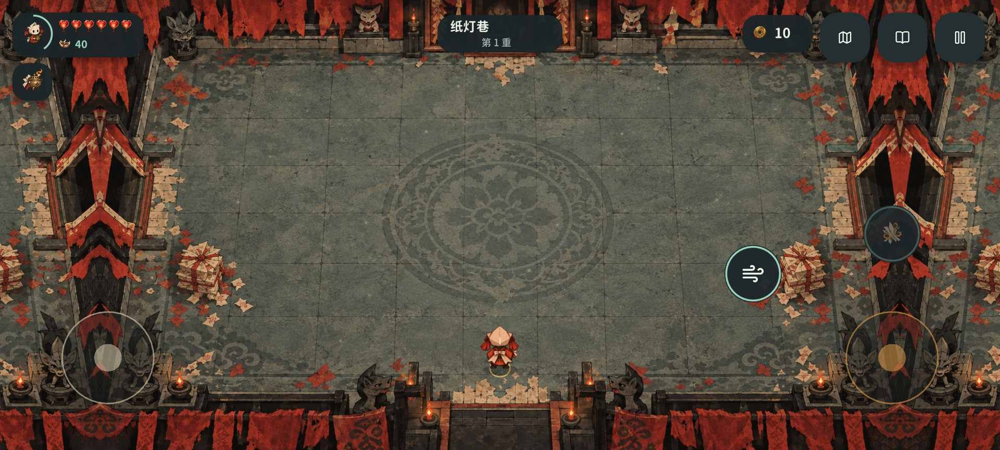
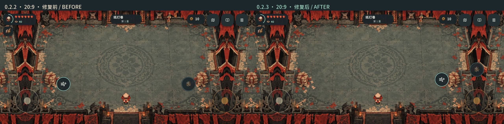

# 默认触控改为左手移动、右手战斗 · 0.2.3

本轮按用户要求调整默认键位：左侧操作区只保留移动摇杆，身法位移与焚债／爆炸技能放到右手。手机和平板预设均更新，保留既有摇杆、图标、技能规则和长屏适配。

## 默认布局

| 操作 | 新默认位置 | 行为 |
| --- | --- | --- |
| 移动摇杆 | 左下 | 左拇指持续移动，无需移开去点击身法 |
| 瞄准／射击摇杆 | 右下 | 拖动瞄准和射击 |
| 身法位移 | 右摇杆左上 | 沿最近移动意图位移；不沿另一拇指的瞄准方向误冲 |
| 焚债／爆炸技能 | 右摇杆上方 | 沿用角色技能条件与冷却，和位移分别触发 |
| 主动道具 | 右侧内下方 | 装备后显示；未装备时不保留隐形点击热区 |

布局在安全区内按比例定位，实际触控半径仍遵从设备密度和既有最小目标尺寸。三颗动作按钮与瞄准杆保持间隔；浮动摇杆继续避让动作热区。左右镜像仍是玩家可选择的设置，默认不镜像。





图像来自实际 Windows 导出包在原生 Godot 中的移动布局渲染。旧图为 0.2.2、新图为 0.2.3，均有原始捕获和包体哈希；不是 X30 真机照片。无主动道具时，其按钮不会出现在战斗画面。

## 已有设置的升级

仅修改源码默认值不足以更新已安装设备：用户之前保存的旧坐标会覆盖新默认。现在读取配置时识别旧手机／平板完整预设，也兼容尚无主动道具触点的四键预设，自动改用新的右手动作布局。

已经自行拖动过任意触点的布局继续保留。单项大小和透明度随配置保留；若已有放大尺寸会让新布局发生重叠，则保留原有合法布局，避免重置玩家的配置。需要主动切换时，从 **设置 → 触控 → 恢复默认 → 保存** 使用新布局；可以继续逐项拖动或调整大小。

此调整不改变包名、存档 schema 2、角色成长和镜像偏好。位移继续采用最近 250ms 的移动方向；两拇指切换动作时左杆持续持有移动，按键单次触发，既有确认蓄力接续规则保留。三指仍支持同时移动、瞄准／射击和使用动作。

## 验收与安装

- 四组移动全流程：**368 项检查、80 张捕获**，包含双指切换、三指输入、旧布局 JSON 重载、放大布局保护、自定义位置／尺寸保持，以及全部菜单与特殊房间流程。
- 八组原生屏幕／切口：源码和导出包各 **282 项检查、51 张捕获**，覆盖 16:9、19.5:9、20:9、21:9、4:3、左右前摄及独立打孔；直接验证左半屏仅有移动热区、战斗触点均位于右半屏，以及安全区和间距。
- 当前 Windows EXE、APK 签名和编译脚本核对以[当前交付](reports/current-product-status.md)及[本轮收据](reports/touch-right-2026-10-11/delivery.json)为准。

新版 [IncenseDebt.apk](../../build/android/IncenseDebt.apk) 为 **0.2.3 / versionCode 5**，与上一份本地 0.2.2 APK 同签名，可覆盖升级保留数据。公开 GitHub Release 仍为历史 `v0.2.0-alpha.1`，不含此次改动。当前未连接 X30，真机拇指舒适度和系统手势仍需实际安装验证。

[移动回归](reports/touch-right-2026-10-11/mobile-regression/mobile-matrix.json) · [源码布局矩阵](reports/touch-right-2026-10-11/native-matrix.json) · [实际导出包矩阵](reports/touch-right-2026-10-11/windows-matrix.json) · [图片来源与哈希](reports/touch-right-2026-10-11/media.json) · [0.2.2 历史交付](reports/touch-right-2026-10-11/prior-package-receipts/build/delivery-manifest.json)

```powershell
python tools/runtime/verify_mobile_revision.py --report-dir docs/incense-debt/reports/touch-right-2026-10-11/mobile-regression
python tools/runtime/verify_widescreen.py --report-dir docs/incense-debt/reports/touch-right-2026-10-11
python tools/runtime/verify_widescreen.py --packaged --report-dir docs/incense-debt/reports/touch-right-2026-10-11
python tools/runtime/create_widescreen_media.py --report-dir docs/incense-debt/reports/touch-right-2026-10-11 --before-dir docs/incense-debt/reports/widescreen-2026-10-11/windows/phone-20x9 --include-combat
python tools/runtime/record_touch_right_delivery.py
```

上述记录由 Windows 原生进程生成；本轮未使用浏览器、Docker、WSL、虚拟化或模拟器。

## English

Version 0.2.3 puts only the movement stick in the left-hand control area. Aim/fire, dash, Burn Debt and the equipped active item belong to the right-hand area in both phone and tablet presets. Targets keep their existing density-aware size and spacing, with floating-stick exclusion zones and safe-area protection.

Previously saved default presets migrate when loaded, including older four-control profiles. Customized positions and individual sizes remain intact. An enlarged legacy layout is preserved if migrating it would overlap targets; Settings → Touch → Reset restores the new preset. Two-thumb handoffs preserve left-hand movement, and three-finger input still supports movement, fire and an action together.

Four native mobile-flow fixtures pass 368 checks with 80 captures. Eight screen/cutout fixtures pass 282 checks with 51 captures against both source and the exported Windows pack. Images are real native pack captures, not physical Android photos. The code-5 APK updates the earlier locally signed package; physical X30 acceptance remains pending.
