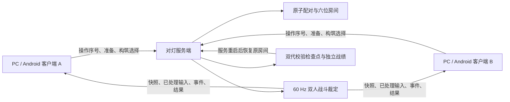

# 联机体系设计：对灯、匹配、六位房间与恢复

0.3.0 已按本设计实现独立双人实时对战「对灯」，复用 Godot 4.7.2 固定 60 Hz 战斗与原生成资源。本文说明设计与恢复约束；实际运行数据、包体哈希和适用边界见[第 40 篇交付验收](40-online-delivery.md)，不能将设计规格当作测试结论。

## 可玩的目标

保留离线十一层肉鸽，新增独立双人对战。双方可选六角色、32 武器、18 技能，不受离线解锁、善缘或改档影响。先赢两轮获胜；平局最多延长到五轮。每轮有服务器生成的四选一构筑，来自 32 件适用于 PvP 的遗物，30 秒未选自动选第一项。沿用余烬标记、焚债、身法、散射、近战、蓄力、射线和可控子弹，配套原生成角色动作、武器动作、地图、粒子和音效。没有单机击杀或清房的条件道具不混入 PvP 候选。

自由匹配自动配对同协议、同内容版本的两人。六位数字保留前导零，例如 `003719`；第一人输入后创建开放房间，第二人输入相同数字加入。房间最多两人、双方准备后开始；第三人、格式错误、已经开始的其他房间和重复请求都有明确反馈。房间码是寻找开放房间的方式，恢复权限由独立随机凭据验证。

## 架构决定

采用专用服务器裁定，客户端上传操作而不上传坐标、血量、伤害或胜负。服务器直接复用当前 GDScript 战斗规则及数据，独立处理双人目标、回合、构筑和网络生命周期。新建 `server/` 存放启动入口、配置、部署说明和运行数据约定；共用联机协议与战斗适配放在 `game/scripts/network/`。

连接采用 WebSocket，局域网使用 `ws`，公网使用有正常证书验证的 `wss`。现有游戏是原生 Godot 客户端；选择可靠通道便于处理认证、准备、选择和重连事务。固定时钟控制战斗，不以包到达次数决定玩家速度；限制发送频率、消息大小和积压，网络过慢时明确显示状态。

客户端请求只接受带类型标记的 JSON，单包上限 4 KiB；输入 30 Hz、快照 20 Hz。服务端快照使用有标记、受限解压的原生 Variant 值编码，压缩和解压均限 512 KiB，并继续校验结构和节点预算。解码只调用 `bytes_to_var`，不使用允许实例化对象的 `bytes_to_var_with_objects`。这项格式优化与异步检查点使小容量实测能维持接近 60 Hz；协议 v1 与规则集 `duel-2`、内容指纹共同阻止不兼容客户端入局。[Godot 值解码 API](https://docs.godotengine.org/en/stable/classes/class_@globalscope.html#class-globalscope-method-bytes-to-var)。

Godot 官方支持原生无图形服务端，以及持续 `poll()` 的 WebSocket 连接：[专用服务器](https://docs.godotengine.org/en/stable/tutorials/export/exporting_for_dedicated_servers.html)、[WebSocketPeer](https://docs.godotengine.org/en/stable/classes/class_websocketpeer.html)。这些 API 能力不替代本项目的负载和恢复验收。

## 三个状态流程

| 对象 | 状态 | 约束 |
| --- | --- | --- |
| 连接 | 未连接 → 连接中 → 验证 → 在线 → 重连／失效 | 验证完成才允许操作；新连接接管旧连接，旧连接不能继续控制 |
| 房间 | 等待第二人 → 准备 → 构筑 → 倒数 → 对战 → 回合结果 → 终局 | 双方确认和加载后开战；已离开或过期的连接不能重新混进对局 |
| 恢复 | 暂停保留 → 重新验证 → 完整快照 → 准备恢复 → 倒数 → 同一 Tick 继续 | 恢复前清空旧按键；从服务器已确认的序号继续，不重发旧技能 |

房间、对局、连接编号分别使用独立随机身份。每条控制请求带唯一请求序号，重复的准备、选择、取消、离开和再战返回相同结果。输入包含单调递增序号；只处理合法的新输入，限制连续操作时长，超时自动归零。伤害和回合结束由服务器唯一提交。

## 断线与重连规格

1. 客户端持续心跳，检测无响应、连接关闭与移动端后台。任何丢联立即清空移动、开火和技能状态，展示正在重连及剩余保留时间。
2. 首次握手发放高熵恢复凭据，客户端独立保存，服务器持久化其摘要。重连凭据不使用房间码或昵称；日志不记录凭据。
3. 自动重试采用短延迟起步、有上限的指数退避和抖动；提供立即重试、明确放弃和返回主菜单。放弃操作需确认，不能通过误按 Esc 直接结束比赛。
4. 对局中任一人断线，双方战斗暂停并保留位置、血量、子弹、技能冷却、构筑、随机流、比分和已确认输入。断线期间不会被击杀或自动消耗技能。
5. 对手看到等待状态，可等待或确认离开。双方断线同样保留原对局，服务器不把无人比赛继续推进。
6. 重连成功下发完整状态；双方都连接、准备后倒数恢复，客户端不拿旧缓存继续裁定。应用关闭重开可恢复同一身份和仍在保留期内的对局。
7. 保留时间到期后，服务器提交唯一的中断／胜负结果并释放房间码；过期凭据无法复活旧房间，也不会加入后来复用同码的新房间。
8. 服务端使用带校验的双代检查点；计划停机前 flush，重启后所有未完成对局停在恢复等待。最新检查点损坏可回退上一完整代；不能恢复时给出明确终止原因。

实际退避、心跳、保留时间、检查点间隔以共享协议常量和服务端配置为准，验收时记录真实数值及对应边界。

当前默认：2 秒心跳、8 秒静默判定、0.25 秒无新输入归零；重试间隔 0.5／1／2／4／8 秒并加抖动。断线／暂停保留 90 秒，空等房间 300 秒。恢复凭据为 48 位随机十六进制，服务器只存其 SHA-256 摘要。恢复过期要明确确认新身份，不能悄悄丢弃旧凭据。

周期检查点由单个后台写盘线程提交；主线程先复制不可变数据，工作线程不接触场景节点。准备、构筑、离开与胜负等控制事务在确认前仍同步等待完整持久化。两代 registry 各自引用准确的房间修订文件，不能把不同代拼装成一局。写盘失败主动通知双方并清空旧按键、冻结权威战斗；存储修复后从原房间继续。正在写盘时不会并发启动另一份提交。

## 双人战斗适配

客户端不运行权威伤害。服务器为两名玩家建立独立角色／装备上下文，在同一固定 Tick 先更新双方位置，再执行双方攻击，再统一提交命中，避免第一名玩家永远先造成死亡。原武器组合与技能规则通过适配上下文复用；双方不得误伤自己。

对战血量、回合时限、出生保护和技能能量按独立规则配置，不直接套用单机小怪数值。图像沿用当前场景的内侧围墙碰撞，不放大房间使人走到墙外。射线／范围命中同样在服务器计算；自控子弹读取其所属玩家的最新合法瞄准。

快照按独立节奏发送，携带服务器 Tick、双方身份、已处理输入序号、回合与当前快照版本。画面平滑与本地移动响应只用于表现；服务器纠正后保持在有效碰撞区域。事件采用递增编号，避免重连后重复爆炸、音效、伤害弹字或结果。

## 菜单与操作

主菜单新增「对灯」，进入联机大厅后依次选择还愿人、武器和技能，可自由匹配或输入六位数字开房／加入。服务器地址与昵称放在可展开连接设置中；显示连接、延迟和版本错误。房间页显示两人头像、装备、房间码、准备与离开。

所有按钮沿用资源圆体、得意黑、圆角卡片与现有图标；头像、武器、技能直接复用生成素材。接入 UI/UX Pro Max 的键盘焦点、触控热区、表单错误和等待反馈规则，颜色与字体继续服从当前 `game_theme.gd`。

方向键／Tab 导航、Enter 确认、Esc 返回／退出确认。四选一继续支持数字 1～4。六位输入使用数字软键盘并保留前导零；手机返回先收键盘。对战中 Esc 打开联机菜单并申请暂停，不伪装成单机本地暂停。移动端继续左手移动、右手瞄准及技能，后台、失焦、切口和旋转清空输入。

## 存档与数据

离线三槽愿簿和 schema 2 独立保留。联机身份、服务器配置和战绩使用单独目录，不把网络快照写进单人肉鸽的进行中存档，不奖励离线成就。服务器战绩按唯一对局身份提交，客户端展示服务器结果；恢复和重复结果不会多算胜场。

联网实际处理连接 IP、匿名身份、昵称、匹配／房间信息、玩家操作和对局结果。隐私政策已升级到 1.4，Android 已配置 INTERNET 权限；首次连接每个地址前显示数据告知，可取消并继续离线。客户端最多保留八个服务器身份。服务器每分钟清理脱离房间超过 14 天的身份、过期结算记录和未被两代 registry 引用的旧房间；当前房间、恢复引用、外部备份与代理日志不能混删。IP 不写入房间检查点，服务日志不打印凭据。公网地址、TLS 证书、运营者及额外日志保留策略由实际部署方配置。

## 运行与稳定性

所有本机开发、测试与服务直接使用 Windows 原生 Godot／Python／PowerShell，不调用 Docker、WSL 或虚拟化。提供本机和局域网启动命令、可配置监听地址／端口、检查点目录、容量上限、健康检查、优雅停机与恢复说明。公网可在原生常驻主机运行并由 TLS 反向代理转发 WebSocket；没有公网主机时不能把本机测试描述为公网部署完成。

默认容量为两间房、16 条连接；超出房间容量明确反馈，不能把可配置上限当作实测容量。容量控制还包括消息大小／频率、等待房间 TTL、无操作输入归零、慢连接积压断开和握手超时。攻击产物限制每人 120 弹丸、64 场域及 128 延迟攻击。健康接口显示房间、连接、Tick、P95/P99 处理时间、发送字节和持久化错误，与游戏服务使用同一配置监听地址、端口加一；部署方限制健康端口到可信网络并配置日志轮转。

## 完成证据

必须实际运行服务端和两个独立客户端，完成自由匹配、双方输入同码、准备、选择、攻击命中、技能、回合、终局、再战和离开。还要验证第三人被拒、重复请求、非法输入、版本不匹配、取消匹配、旧连接接管、断线双方等待、恢复完整状态、应用重启恢复、保留超时、服务重启及检查点损坏回退。

客户端需要真实原生窗口／输入验证及联机截图；PC 键盘与移动布局覆盖完整流程。Windows 和 Android 导出包必须包含当前联机模块；Android INTERNET 权限必须从实际 APK 检查。负载结果注明房间数、时长、Tick 延迟、发送字节和内存，不能把两人成功连通说成大规模稳定性证明。
