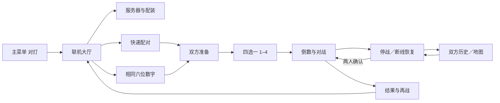
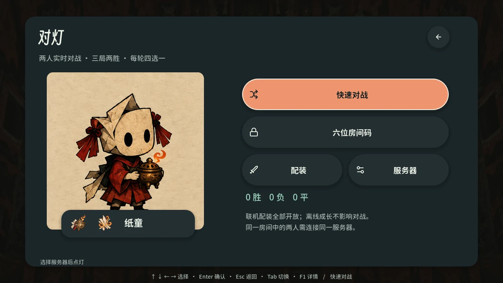
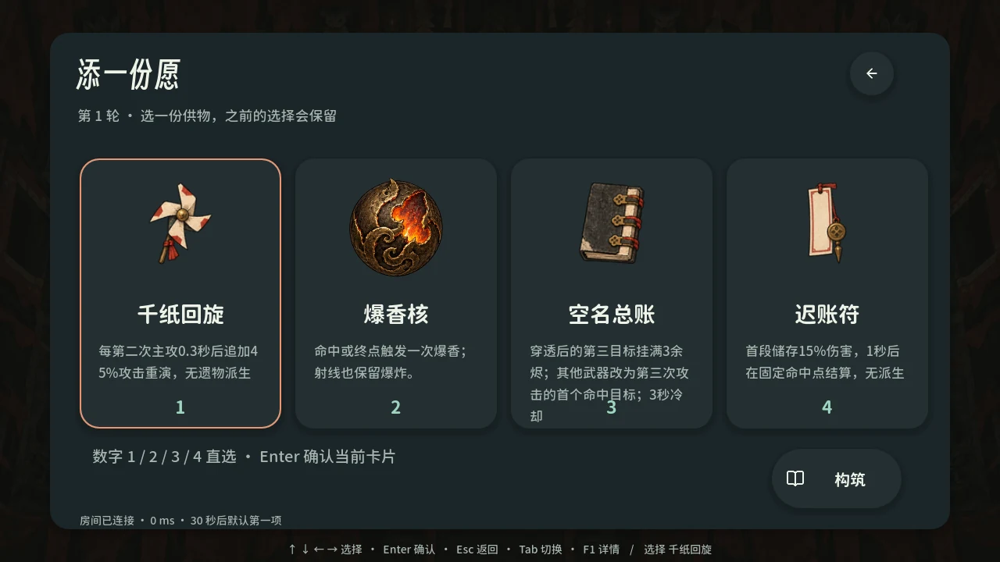
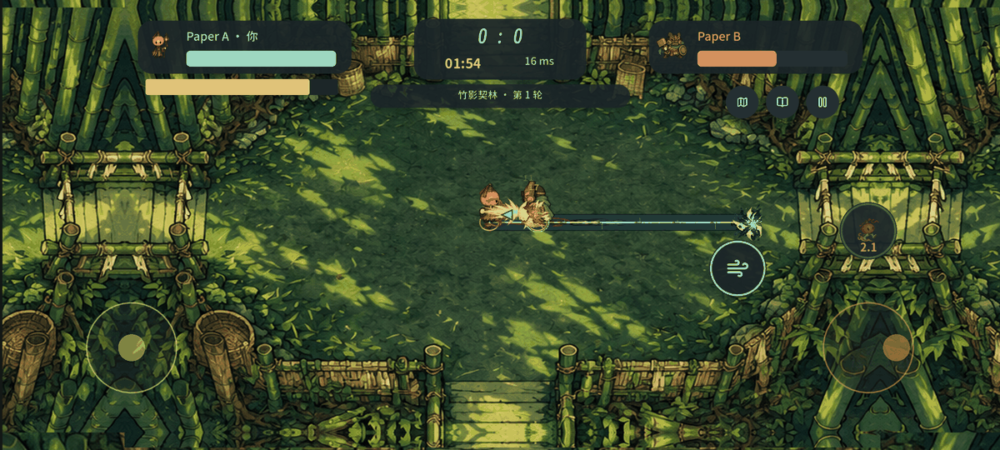
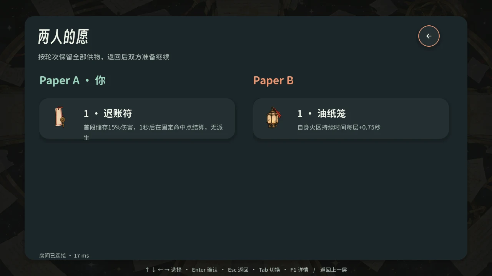
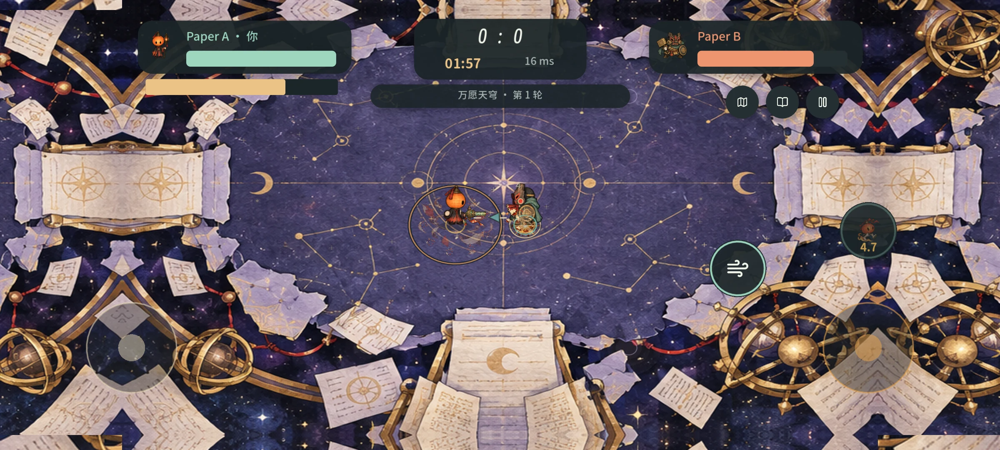

# 0.3.0 对灯联机客户端与独立服务端

0.3.0 新增可实际对战的双人「对灯」。保留十一层离线肉鸽，主菜单提供独立联机大厅：选择配装、快速匹配或六位开房、双方准备、每轮构筑、实时战斗、暂停与恢复、结果及再战。设计与协议约束见[第 39 篇](39-online-architecture.md)；本篇对应实际运行证据，最终安装包哈希见[交付回执](reports/online-2026-10-11/delivery.json)与[发布清单](../releases/v0.3.0-alpha.1.manifest.json)。

## 玩法与菜单

| 项目 | 当前实现 |
| --- | --- |
| 模式 | 两人实时 PvP，先赢两轮获胜，含平局最多五轮；每轮 120 秒 |
| 配装 | 6 角色、32 武器、18 技能全部开放，离线解锁不影响 PvP |
| 构筑 | 32 件适合 PvP 的遗物，每轮四选一；限制叠加上限、排除不适用清房／掉落类条件，30 秒未选自动第一项 |
| 快速对战 | 同服务器 FIFO 配对，两人各自确认准备 |
| 六位房间 | 第一人创建、第二人输入同数加入；如 `003719` 保留开头 0，第三人被拒；房间码用于找到开放房间，身份恢复由随机凭据认证 |
| 战斗画面 | 当前 20 套生成主题、校准内侧墙、真实主角与持械、射线／近战／蓄力／控制弹／范围特效、音乐及音效 |
| 键盘 | 方向／Tab 导航，Enter 确认，Esc 返回／停战，1–4 构筑，I 双方历史，Tab 战术图；战斗沿用 WASD、方向射击、Q 与 Space |
| 移动 | 左侧只移动，右侧瞄准／射击、位移与技能；继承长屏铺满、密度与安全区。PvP 没有单机主动道具奖励，相关按钮停用 |
| 数据 | 联机身份／战绩独立保存，不上传或修改离线三槽愿簿，不发放单机成就 |

静态截图来自真实 Windows EXE 原生 QA。GIF 由相同版本的原生 Godot 加载该 EXE 内的编译脚本与资源，外部录制脚本驱动真实右摇杆，原 PNG 在后台保存以避免截图编码阻塞而触发输入超时保护。GIF 连续 20 帧，100 ms 对照播放、无声，用于动效对照。双方为独立身份、真实 WebSocket 客户端，对手会话同处检查进程，服务端是另一原生进程。长屏触控为 Windows 原生夹具。原 PNG、转换文件、执行方式及 EXE 哈希见[媒体清单](reports/online-2026-10-11/media-manifest.json)。

## 恢复与异常处理

客户端操作 30 Hz、服务器固定步长 60 Hz、快照 20 Hz。本地移动预测只改变画面，不能决定坐标碰撞、伤害、冷却、生命或结果。对手位置平滑使用 50 ms 窗口；快照过旧停止输入。单包、解压、树结构、发包速率与积压都有上限，服务器不反序列化可执行对象。

断线、后台和失焦清空旧输入；2 秒心跳、8 秒静默判定，自动重试采用 0.5／1／2／4／8 秒上限和抖动。服务器暂停双方，90 秒内保存位置、血量、弹丸、冷却、供物、比分和随机流。恢复后双方确认并倒数；单方准备不会让另一人仍断线时继续受伤。超时、离开、旧连接接管与重复控制请求均有唯一的服务器处理结果。

恢复凭据为 48 位随机十六进制，本机独立保存；服务端仅留摘要。失效不会静默清掉身份，用户可明确确认新身份。新连接接管旧连接时，旧端停止自动重试。恢复时把序号下限与原 pending 请求接续，丢失确认后的重发不再次添加供物或胜场。

后台单一写盘线程先提交房间不可变修订，再提交 registry。两代 registry 分别引用准确的房间文件；不能拼装不同代状态。控制与结果 ACK 在持久化之后发送。强制终止可能丢失尚未提交的战斗尾部；一秒是捕获间隔，实际尾部还受写盘耗时影响。重启后未完对局停在双方恢复页。最新一代损坏回退到上一组一致代；均损坏则保留原件并拒绝启动。

写盘失败主动通知两端并清空移动／射击／技能，冻结服务器 Tick 战斗推进及控制事务；磁盘恢复后重新提交、回到原房间。故障期间客户端不能继续预测着打完比赛。

## 实际检查

| 检查 | 数量与结果 | 证据 |
| --- | --- | --- |
| 双人规则 | 271 项通过：全部 32 武器命中／精确恢复、18 技能激活、32 遗物候选、输入边界、回合、随机流、移动预测墙内／冲刺／击退一致 | [combat.json](reports/online-2026-10-11/combat.json) |
| 真实传输 | 26 项通过：匹配、准备、构筑、移动与伤害、断线双方冻结、重连、双确认、结果一次、同码／前导零、第三人拒绝、取消排队 | [transport.json](reports/online-2026-10-11/transport.json) |
| 真实 EXE 服务重启 | 四场景、57 项通过：强制终止与新客户端进程恢复、索引损坏、房间损坏、接管／超时／迟到恢复／丢失 ACK；测试过期窗口配置缩短为 10 秒 | [recovery.json](reports/online-2026-10-11/recovery.json) |
| 写盘故障 | 7 项通过：仅在隔离目录放置空目录阻挡临时写入，不改 ACL；验证主动通知、双方禁战、Tick 冻结、修复恢复及旧移动清空 | [storage.json](reports/online-2026-10-11/storage.json) |
| 原生菜单／输入 | 源码及实际 Windows EXE 各 30 项、33 张捕获：首连告知、配装、快速匹配、1–4、射击技能、双方构筑、地图、重连、2400×1080 触控、同码和退出，离线保存哈希不变 | [native.json](reports/online-2026-10-11/native.json)、[源码记录](reports/online-2026-10-11/native-source.json) |
| 编译包右摇杆／GIF | 相同 Godot 加载实际 EXE 的编译包，外部录制脚本复测 33 项／33 张捕获，增加右摇杆真实伤害、持续持指开火、右手技能服务器响应 | [native-touch.json](reports/online-2026-10-11/native-touch.json) |
| 离线键盘回归 | 实际 EXE 107 项通过；原肉鸽愿簿／技能／商店／特殊房／导入恢复路径复测 | [keyboard.json](reports/online-2026-10-11/keyboard.json) |
| Windows／APK 包体 | 2167 项通过，86 份编译脚本一致；动作图集、拾取纹理与导入映射核对，应用哈希绑定报告 | [package-parity.json](reports/online-2026-10-11/package-parity.json) |
| Android | 0.3.0 / code 6、arm64、调试签名同前一份 0.2.3 APK、INTERNET、联机模块、边到边与 Expand；3810 项运行资源 | [android.json](reports/online-2026-10-11/android.json) |

检查类别存在交集，不相加作为覆盖率。没有把多个会话当成多台物理设备，也没有把 Windows 原生触控夹具当成 Android 真机。

## 负载与默认容量

最终发布服务端 SHA-256：`61c4846f92f36ce06d26f464e66b2d74ce02195c22dd278b830c2fc441a0b8d8`。压测使用真实原生 EXE、独立原生流量进程与 WebSocket，无本地伪造战斗快照。最终两房／四客户端使用照骨线 `w14` 与裂页弩 `w25`，持续攻击、移动、技能、倒数及重开 60 秒。

| 指标 | 最终两房 60 秒测试 |
| --- | --- |
| 平均 Tick | 59.43 Hz |
| P95 ping | 18 ms，原生本机回环网络 |
| 快照间隔 P95／P99／最高 | 67／133／317 ms |
| 物理步长处理 P95／P99／最高 | 2.054／4.134／133.368 ms |
| 进程帧处理 P95／P99／最高 | 9.403／16.216／272.026 ms |
| 进程工作集峰值 | 130,355,200 字节，约 124.3 MiB |
| 快照数量／发送字节 | 4,106／18,070,335 |
| 持久化错误／发送积压峰值 | 0／0 |

完整采样见[最终负载报告](reports/online-2026-10-11/load.json)。上述最高值来自真实采样，不能以 P95 掩盖罕见停顿。持久化控制事务仍可能引发短暂停顿，需要在实际主机持续监测。

较早版本另做两房 180 秒实战，59.86 Hz、P95 ping 34 ms、无写盘错误；它发生在最后一项主动存储故障通知修订之前，服务器 SHA 为 `ab0afeefe5540cd02c1bef23a270d57e8d0b6824420cd08da67a1063329ca186`，因此保留为[注明原构建的历史补充](reports/online-2026-10-11/load-180s-prior-build.json)，不冒充最终二进制证据。

扩容探索：最初同步快照／检查点的八房测试约 42 Hz，未通过；后台写盘及原生快照后八房约 52 Hz，仍未通过。四房 60 秒可达约 59.36 Hz，但 P95 ping 150 ms、最高快照间隔 650 ms。故默认设 **2 房／16 连接**，连接数包括排队和握手，不等于同时能开八房。更多容量可配置，但须先在目标主机重新验收；本机短测不证明公网延迟、长时稳定性或任意机器的性能。

## 运行、版本和保存

`server/` 提供原生入口、配置样例、源码启动器、发布包启动／停机脚本和[中英运维说明](../../server/README.md)。服务端 EXE 约 105.7 MiB，不含客户端美术／音频，独立运行无需 Godot 或 Python。客户端 EXE／APK 按实际导出包验收，不把旧安装包换名字充作新版本。

同电脑地址 `ws://127.0.0.1:18777`；手机或另一台电脑填服务主机 LAN IPv4。Windows 允许 TCP 18777，健康端口为同监听地址的 18778，应限可信网络。公网需要常驻主机、有效 WSS 证书与反向代理；当前没有预设或部署公共游戏主机。

离线 schema 2 与三愿簿槽延续。对灯使用 `user://online-client`；服务端发布启动器用旁边 `data/`。完整备份需先优雅停机再复制整个 data，不只选最新 JSON。协议 v1、规则集 `duel-2` 及内容指纹限定兼容；内容／规则变化不能读取旧比赛，升级前完成旧比赛并备份，再采用新数据目录。

原生两代检查点、源规则 SHA、实际应用 SHA 与验收报告均收录[delivery.json](reports/online-2026-10-11/delivery.json)。此前 0.2.3 的 368 项移动／282 项屏幕矩阵保留为版本明确的[历史基线](reports/online-2026-10-11/baseline-0.2.3/current-product-status.json)；本轮新增原生联机触控流程与 APK 包核对，不能将旧全量矩阵改标签冒充 0.3.0 复测。

## 隐私与交付边界

政策 **1.4** 已部署至[公开 HTTPS 网页](https://xhz.sidcloud.cn/privacy-policy)，主体 **吴国黎**、邮箱 **carzyg@outlook.com**，现行 Word 13 页完成逐页核对。首页、别名、三版历史正文、三份 Word 与资源共 11 项匿名 HTTPS 均为 200；公开 Word 的哈希与审核文件一致。[公开核验](reports/online-2026-10-11/privacy-https.json)与[实现审计](../legal/privacy-implementation-audit.md)区分所选游戏服务器和独立 Vercel 政策网站。

首次连接前告知实际地址与处理范围。服务端默认 14 天清理已脱离房间的旧身份、过期结算和不再被两代引用的房间；不会删活动恢复数据。外部备份、代理日志及自选服务的运营者管理需另行配置。

本轮直接使用 Windows 原生工具，无 Docker、WSL、虚拟化、安卓模拟器或浏览器标签页。Windows 发行签名、真实 Android 安装／温控／后台体验、真实手柄、互联网抖动／丢包／公网部署、长时稳定性和人类平衡测试仍待实际验收；Android 是调试签名，iOS 只保留 0.2.0 交接、没有 IPA。

## English delivery notes

0.3.0 delivers a playable, separate two-player Duel mode, updated Windows/Android clients and a standalone native Windows server. Quick FIFO matching and six-digit open rooms use the same selected endpoint/version. All heroes, weapons and skills are available; players draft each round, inspect both build histories, pause mutually, reconnect and rematch. Offline save slots and achievements stay independent.

The authoritative server owns combat and settlement. Clients send controls and render snapshots with display-only prediction. Recovery uses consistent generation references, durable control acknowledgments, random resume credentials, takeover, stale-input clearing and mutual confirmation. Storage faults proactively freeze combat; corrupt newest generations fall back consistently. An abrupt kill may lose the uncommitted battle tail.

Evidence tables and JSON bind actual binary hashes: 271 combat, 26 transport, 57 process-recovery and seven storage-fault checks; 30 online checks/33 captures for both source and exported client; an additional 33 checks using the accepted compiled EXE pack and an external touchscreen recording driver; 107 offline keyboard checks and package verification. Native touch and multiple test identities are not physical Android or separate-machine acceptance.

The final two-room/four-client 60-second beam/split-shot benchmark sustained 59.43 Hz and 18 ms loopback P95 ping. A prior-build 180-second run is separately labeled. Higher-capacity exploration exposed stalls, so defaults remain two rooms/16 connections. Public hosting/WSS, WAN conditions, long-running capacity and human balance need further deployment acceptance. Vercel hosts the published privacy policy, not the game server; Android is debug-signed and has not been physically tested.
