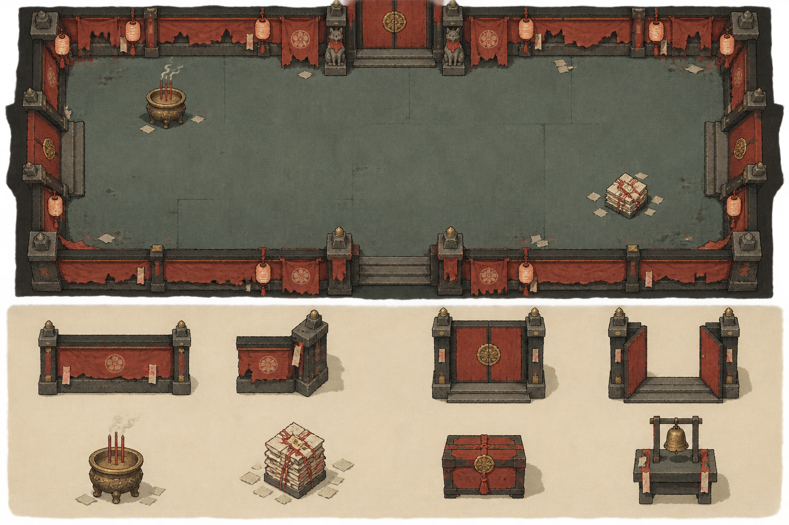
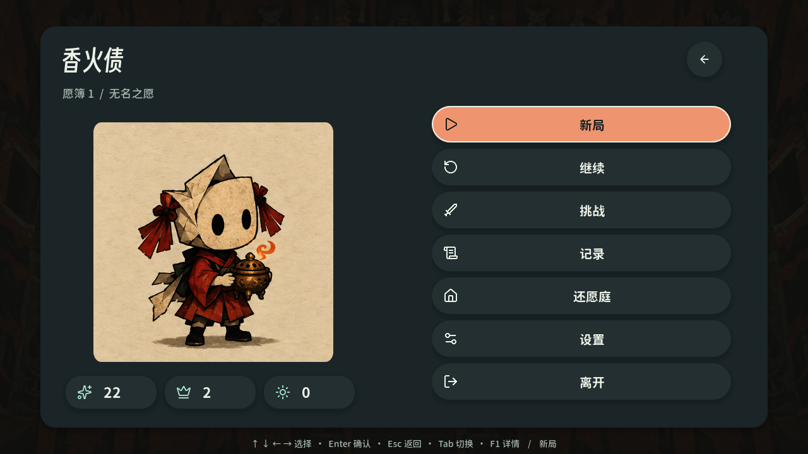
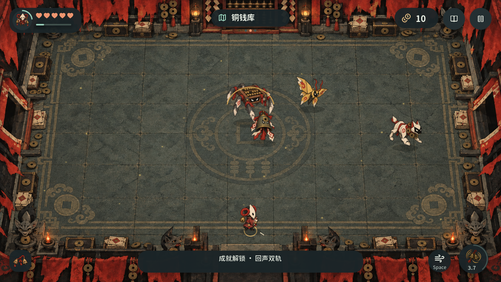

# 《香火债》十一重旧账 Alpha · 设计与运行记录 v0.2.1

英文名：Incense Debt。建立日期：2026-10-03。产品目标：PC、Android、iOS 共用核心玩法和内容的横屏、离线、单人 2D 房间动作肉鸽。

玩家扮演六种由未还之愿化生的角色，在十一重旧账里，用“挂余烬—连债—焚债—收灰”建立构筑，选择是否赊愿，最终决定如何处理总账。当前扩展以第23—26篇与 reports/expansion-delivery.json 为准；第26篇落实内墙碰撞、射线／范围动效、60/40跨主题遭遇及早期两个独立Boss房。早期三章数值与通关报告保留为历史兼容基线。

本目录是方向 01 的专属设计来源。此前的五案提案保留为选型记录；方向 01 的详细规则以本目录和 `data/` 为准。内容规格、生成素材、可玩实现、平台验收分别记录状态，避免把概念稿视作成品资源。

## 阅读顺序与文档职责

| 文件 | 回答的问题 |
| --- | --- |
| [00 产品与体验目标](00-product-vision.md) | 游戏为什么好玩、成品包含什么、何时算做完 |
| [01 世界与故事](01-world-story.md) | 愿、债、纸人、六名主角、NPC 和结局如何关联 |
| [02 流程与关卡](02-game-loop-levels.md) | 一间房、一层、一局和重开如何组织 |
| [03 可玩角色](03-playable-characters.md) | 六名角色如何形成不同打法并共享操作 |
| [04 战斗与打击](04-combat-hit-feedback.md) | 命中、伤害、余烬、债链、焚债、身法如何结算 |
| [05 成长与构筑](05-progression-builds.md) | 六条成长路线、局内选择、局外解锁如何协作 |
| [06 掉落、经济与债约](06-loot-economy-debt.md) | 掉什么、何时掉、怎样防止重复领取、为什么值得冒险 |
| [07 技能与搭配](07-skills-synergies.md) | 18 种技能形态、54 件遗物、24 套示例联动如何组合 |
| [08 敌人与 Boss](08-enemies-bosses.md) | 原始规则；共296种小怪、99名首领，新增主题池见第23、25篇与数据库 |
| [09 交互、输入与可访问性](09-ui-ux-input.md) | 鼠键、手柄、双摇杆触控怎样玩同一个游戏 |
| [10 美术设定](10-art-bible.md) | 纸、墨、火、线、铜的统一视觉语言是什么 |
| [11 素材生产](11-asset-production.md) | 具体生成什么、尺寸、锚点、动画、导入和验收如何做 |
| [12 声音与叙事呈现](12-audio-narrative.md) | 听觉反馈、配乐、对白和叙事触发如何工作 |
| [13 跨端工程](13-cross-platform-engineering.md) | 引擎、架构、存档、性能和三个平台的构建路线 |
| [14 数值与验证](14-balance-telemetry.md) | 哪些数值是起点、怎样证明公平、手感和性能 |
| [15 制作与交付](15-production-validation.md) | 分阶段制作顺序、依赖和最终发布验收 |
| [16 内容数据库](16-content-catalog.generated.md) | 全部角色、武器、技能、遗物、成长节点、敌人和特殊房间的稳定 ID |
| [17 视觉一致性约定](17-visual-contract.md) | 如何严格对照原设计图，以及现代 UI、字体和实机截图的验收规则 |
| [18 系统覆盖矩阵](18-system-coverage.md) | 设计、数据、代码、测试、素材与剩余人工/设备验收怎样逐项对应 |
| [19 发布准入清单](19-release-readiness.md) | 软件准入、真人构筑、Android 真机和 iOS/macOS 验收的可执行签字规则 |
| [20 方向1系统圣经](20-direction1-system-bible.md) | 产品承诺、房间、战斗、成长、UI、素材、声音、存档与维护顺序的唯一总装配入口 |
| [21 外部验收落档手册](21-external-acceptance-runbook.md) | 如何用当前哈希启动 Android/iOS 真机与真人平衡验收，并保持 pending 证据诚实 |
| [22 菜单、存档槽与角色成就](22-menu-save-achievements.md) | 对照以撒式层级拆分标题、槽位、角色、暂停、终局与成就愿簿的运行契约 |
| [23 十一重扩展](23-eleven-floor-expansion.md) | 十一层故事、双首领、动态障碍、新攻击、派生种子与完整验收 |
| [24 独立环境主题](24-environment-theme-revision.md) | 二十套独立主色、材质、建筑、动态氛围与四十张新背景 |
| [25 主题遭遇池](25-themed-encounters.md) | 每套地图12种小怪与3—7名配套Boss、素材与生成规则 |
| [26 本轮战斗修复](26-combat-boundary-mixed-encounters.md) | 内墙碰撞与房门、射线／范围特效、60/40混编、早期两个独立Boss房及旧局迁移 |
| [33 动作与移动操作修订](33-action-mobile-update.md) | 六角色独立动作、十四项触控问题修复、随机曲库、隐私主体与当前包体验证 |
| [35 全量怪物动作交付](35-creature-action-completion.md) | 402 个身份、24,048 帧独立攻击／受击、四向原生截图及两端包体一致性 |

## 可执行的数据来源

[内容数据](data/catalog.json)保存内容定义和关联；[基础规则](data/rules.json)保存战斗、成长、掉落和平台预算；[素材清单](data/asset-manifest.json)保存素材规格与实际状态。所有 ID 使用稳定 ASCII 字符，界面名称使用中文。数据库中的数值是设计起点，平衡结论需要可玩版本的测试证据。

工具位于项目根目录 `tools/design/`。`validate_design.py` 校验引用、资源边界、奖励概率、技能事件规则和素材状态；`render_catalog.py` 从数据生成第 16 篇目录。[校验报告](reports/design-validation.md)记录文档与数据一致性及成品未验证项。

当前正式局扩展为十一层；包含20套地图、40张背景、296种小怪、99名首领与32件器具。正式遭遇按60%本土、40%一个随机高对比外来主题混编；第1—5层每层两个独立单Boss房。美术以Sub2原始板及新增特效关键帧板为来源；0.2.1 六名主角改为独立绘制的六状态、四朝向、六帧动作；旧敌人动作保留原方法。完整原生截图、资源数量与当前构建哈希见[扩展交付](reports/expansion-delivery.json)。早期三章报告保留为兼容基线，四份CC0低音量音频纹理的来源见[音频来源审计](reports/runtime/audio-source-research.json)。

## 本轮视觉来源

上排从左到右：纸童、铃师、灯客；下排从左到右：傩面、伞灵、墨吏。

以上均通过指定的 `sub2-image-gen` / `gpt-image-2.5` 生成。角色板和环境板用于锁定设计；正式精灵和动作条已完成透明、锚点、切片与原生加载检查，技术证据见[素材验证](reports/runtime/asset-verification.json)。

## 成品验收总线

当前内容覆盖六名可玩角色、六条成长路线、三十二件武器、十八种焚债形态、五十四件遗物、三十六个行愿节点、九类债约、二十套环境、二百九十六种普通敌人、六种精英变体、九十九名首领。每个主题使用12种专属小怪与3名首领，最终天穹为7名首领；原始通用敌人保留用于兼容与试演。献灯、判官、观音、破阵、商店、事件、秘密房及双首领支路均纳入种子地图。

成品完成证据包括：上述内容的可玩实现、完整通关与失败重开、三种输入方式、保存恢复、经规范处理的正式素材、Windows 构建、Android 真机安装与长时测试、iOS 真机构建与测试。文档完成和数据校验不替代这些产品证据。

技术基线选用 Godot 4.7.2、GDScript 和 Compatibility 渲染器，详见跨端工程文档。iOS 导出与签名需要 macOS 和 Xcode；当前工作区为 Windows，平台验收将按真实能力分别记录。

## 直接查看与运行

[项目中英双语说明与实机展示](../../README.md) · [本地导出与操作说明](../../build/README.md) · [iOS原生交接说明](../../build/ios-handoff/README.md) · [Godot工程](../../game/project.godot)。应用包不进入Git仓库；本地导出后，Windows打开 `build/windows/IncenseDebt.exe` 即可，Android调试签名arm64包位于 `build/android/IncenseDebt.apk`。iOS源码交接不是已签名的IPA。

WASD移动，鼠标瞄准，左键攻击，右键/Q焚债，Space身法；方向键可直接瞄准并持续射击。清房后朝发光门口走入切房，E用于靠近断绳入口时的交互/提示；Tab行路图，I愿簿，Esc暂停，F11全屏。奖励、技能、商店和债约候选支持数字键 `1/2/3/4` 直接提交；暂停页“本局记录”查看本局所有历史成长选择与当前构筑。手机采用独立双摇杆与施术/身法触点。

[当前交付矩阵](reports/current-product-status.md)与[十一层交付索引](reports/expansion-delivery.json)记录当前实现、验证与包体哈希。[原方向1完成审计](reports/product-completion-audit.md)、[原系统覆盖矩阵](18-system-coverage.md)及[原方向1系统审计](reports/runtime/direction1-system-audit.md)保留三章兼容基线；[方向1系统圣经](20-direction1-system-bible.md)保留核心体系来源。[跨端内容一致性报告](reports/platforms/platform-parity.json)核对 Windows 工程、Android APK、iOS 共享源码的完整 `game/` 树与运行资源；[外部验收证据](reports/external-acceptance.md)保留实际玩家与设备记录；[设计与实机对照](reports/runtime/design-vs-runtime.png)和[二十套环境实机总览](reports/platforms/windows/expansion/twenty-themes-overview.png)落实视觉要求。

存档已升级为账号与单局共同保存的schema2，真实旧版迁移、文件/压缩文字传递、预览确认与导入前备份恢复通过51项检查；新增三个本地愿簿槽位，槽位1兼容原 `user://save_bundle`，槽位2/3独立隔离，另有[菜单/存档/成就回归](reports/runtime/achievement-tests.json)覆盖 32 项成就、重复观察幂等与槽位选择。十四套规则合计590项，另有96种手持搭配和576对身体/手帧检查；新增四向物理房门与反向回访回归、真实瞄准朝向核对；二十四套技能组合及七个独立遗物钩子已由矩阵逐项触发验证，六名角色的两条本职路线与两种技能演化另有24次真实三章自动路线矩阵，灯摊待售器具可在不扣钱的独立靶场试射。最新Windows编译程序保存90张原生截图、75项GUI操作检查，包含物理门口导航、组合册、角色详情、未留名角色的触屏预览、十八技能真实试演、PC 数字键 1—4 直接选择、暂停页本局成长记录、灯摊试射返回、实际死亡后受击/愿页复盘及原进度保护。手机文件选择器、软键盘、剪贴板与iOS运行仍需真实设备验收。

UI采用24圆角面板、圆形/胶囊按钮、57个工具图标、紧凑战斗HUD与点击展开的供物详情。正文为[资源圆体](https://github.com/CyanoHao/Resource-Han-Rounded)的授权子集，标题为[得意黑](https://github.com/atelier-anchor/smiley-sans)，完整中文回退使用Noto Sans SC；字体OFL、Lucide ISC与Godot声明随包。[UI前后对照](reports/runtime/ui-refresh/ui-before-after.png)和[原生组件设计图](reports/platforms/windows/ui-style.png)固定后续界面基准。

## v0.2 装备与战斗打磨

[27 主动道具、单槽饰品、稀有掉落与攻击叠加](27-equipment-loot-attack-polish.md)：12主动、12饰品、12攻击修饰；66件供物，80条新特效、480独立帧与395份敌弹参数。F使用主动、E换装、Tab查看完整十一层线。存档仍兼容schema 2。规则和素材追溯、编译实机检查见对应记录；以上早期三章和旧版计数为历史记录。

[28 发布品牌选型](28-brand-publication.md)：沿用当前原始纸偶形象，记录不透明应用图标与透明纯“香火债”字标。

[29 发布 Banner、海报与交付索引](29-release-promo-assets.md)：原始纸偶宣传成稿、分层素材包，以及 Windows、Android、图标、LOGO、Banner、海报文件表。

[30 商店发布文案与素材包](30-store-publishing-kit.md)：详细游戏简介、开发者的话、首页推荐语，十二张原生截图、120 秒实机录屏、45 秒宣传片、五张宣传图、横竖封面、游戏库壁纸与无 LOGO 图。

[31 发布图片规范与复查](31-publication-image-rules.md)：图标不透明、LOGO 透明且仅含游戏名、宣传图片仅含游戏名；提供本轮纯图片上传包与验证入口。

[32 安卓键位与移动端适配审查](32-android-controls-audit.md)：14 项问题、完整流程复查、三种比例的原生截图与双拇指布局提案；区分源码／软件复现与真机验收，给出输入、UI、密度和武器操作的分阶段优化方案。

[33 动作与移动操作修订](33-action-mobile-update.md)：0.2.1 的四项追加要求和实际验收。Windows、Android 新包哈希以该篇关联记录为准；本目录旧 iOS 全树／扩展原生报告保留历史范围。

[35 全量怪物动作交付](35-creature-action-completion.md)：全部小怪、Boss、精英与召唤符的四向独立攻击／受击动作，1,002 张图集、24,048 帧；完整目录门禁、逐帧原生证据、战斗事件采样与新 Windows／APK 验收。最新包体哈希和动作范围以第 35 篇及当前交付清单为准。
