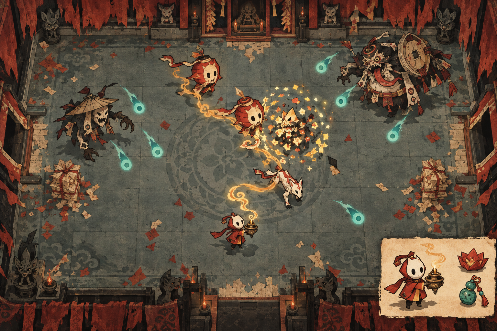
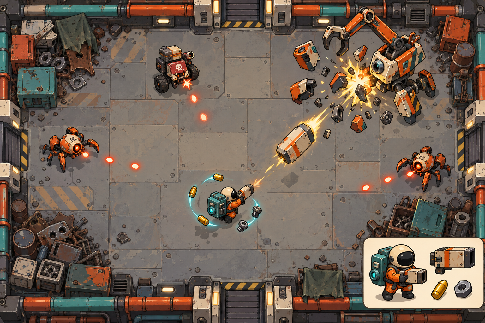
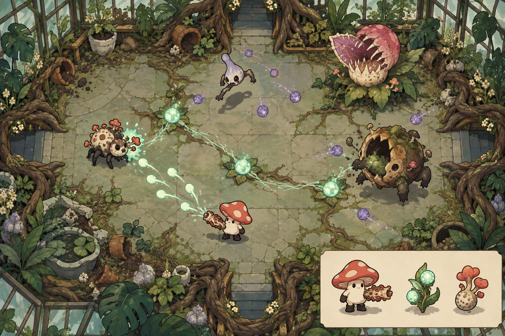
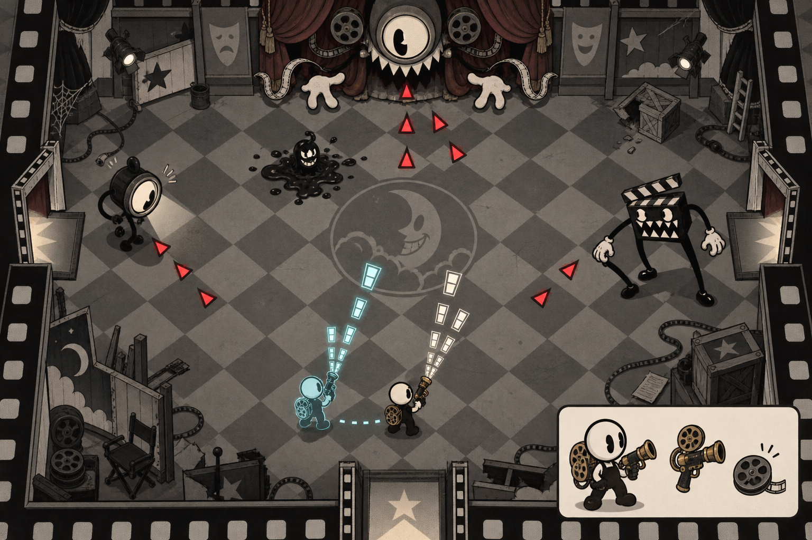
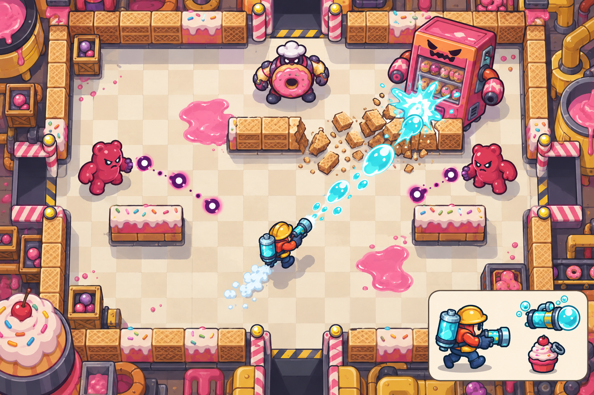

# 平面动作肉鸽：五个游戏方向

制作日期：2026-10-03。用途：选择项目方向，随后锁定玩法与美术，制作可玩的首个原型。

2026-10-04补充：本文保留五案的原始选型记录。方向01已进入[《香火债》专属设计与可玩工程](incense-debt/README.md)，当前技术基线为原生Godot 4.7.2；文末Phaser方案为选型时的建议。后续美术、地图、UI和字体按[视觉一致性约定](incense-debt/17-visual-contract.md)与锁定设计图执行，实际交付及平台证据见[当前记录](incense-debt/reports/current-product-status.md)。

这五案共享“俯视射击、房间探索、随机奖励、道具联动、精英与 Boss、失败后重新开局”的基本骨架。每案另有一种贯穿战斗、成长和视觉表现的核心动作，使差异能够在实际操作中被感受到。

目标体验：进入房间便能开打，短时间内形成一次令人记住的连锁反应；获得新道具时，能看见射击方式、战场关系或角色外观的变化。参考《以撒的结合》的构筑联动与风险收益选择，以及《元气骑士》的直观射击、武器差异和短时反馈。

概念图由用户指定的 sub2-image-gen 路线、gpt-image-2.5 模型生成。这些图用于确认美术方向，属于战斗场景概念稿。后续角色、环境、特效和 UI 将分别生成、处理并接入游戏。

| 编号 | 游戏名 / 英文名 | 核心动作 | 美术语言 | 选择理由 |
| --- | --- | --- | --- | --- |
| 01 | 香火债 / Incense Debt | 点燃、连债、焚债、收灰 | 木版年画、剪纸、朱砂与墨色 | 喜欢中式怪诞、连锁爆发与冒险交易 |
| 02 | 废星快递 / Scrap Express | 磁吸、压包、反击、改枪 | 复古太空、手绘铁皮玩具、橙青撞色 | 喜欢主动反击、武器变化和工业喜剧 |
| 03 | 菌核暴走 / Myco Riot | 播种、变异、长菌、引爆 | 菌类图鉴、手绘生态、珊瑚与荧绿 | 喜欢逐步失控的生物构筑与战场扩张 |
| 04 | 噩梦放映室 / Nightmare Reel | 走位、留片、回放、夹击 | 黑白橡皮管动画、旧胶片、双色提示 | 喜欢操作技巧、双线攻击与怪诞动画 |
| 05 | 糖壳破坏者 / Sugarbreach | 开火、积压、开罐、拆场 | 糖纸印刷、粗线漫画、糖果工厂 | 喜欢场景破坏、大爆炸和轻快街机体验 |

## 01 · 《香火债》 / Incense Debt

**一句话构思：** 在一座把愿望当借据的地下神庙里，你是纸扎出来的讨债童子；向怪物借力量，再用燃烧的香火把整间房的债一口气讨回来。

**世界与角色。** 庙宇以“借愿—还愿”维持运转。失控的愿望变成灯笼鬼、纸犬、铜钱精和面具判官。主角身穿短朱袍，戴米白纸面具，提一只青铜香炉；轮廓靠大头、短身、香炉三部分建立。初始角色为“纸童”，后续可解锁擅长挂债的铃师、近距离焚债的灯客。

**核心玩法。** 普通射击产生香火弹，命中给敌人挂上“余烬”；右键“焚债”引爆有标记的敌人。部分遗物把相邻目标连成债链，爆炸沿链传递。击杀回收灰烬，为下次焚债补充香火。第一分钟就能体验“点几只怪—焚债—整串炸开—灰烬回流”。

**肉鸽特色。** 偏火的构筑强化灼烧和范围；偏灰的构筑强化回收与反击；偏线的构筑强化连债与跨目标传递。香炉、铃铛、纸钱等作为基础武器，改变出手节奏。特殊祭坛允许“赊愿”：拿强力遗物，同时接受明确可预览的债约，例如部分普通房间增加一只讨债鬼。到楼层尽头，可花资源还愿。额外敌人有入场预告和数量上限。

**示例构筑。** “红绳结”连接近邻目标 + “火星灯”让焚债向附近敌人补上余烬 + “回魂灰”让击杀后灰弹回到玩家。实战画面是先打前排、按一次焚债、连锁蔓延到后排、灰弹返还。连锁事件限制同轮重复触发，保持节奏与可读性。

**爽感来源。** 遗物先让“炸一只”变成“炸一串”，再让“炸一串”补出下一次技能。焚债前一瞬红绳绷紧，命中时纸屑迸散、铜铃敲响；精英倒下时出现短促金色爆圈。关键爆发使用很短的顿帧和轻震屏，设置中可调低。

**美术风格。** 木版年画与剪纸拼贴，粗墨线、纸纤维、平涂阴影；主色朱砂红、煤黑、米白、旧金。场景用低饱和灰绿压住，敌弹用带黑边的玉青尖形表示，玩家火焰用橙金圆形表示。人物可爱，怪物诡异，整体有庙会式的荒诞感。

**区域与 Boss。** 纸灯巷、铜钱库、无主神殿。首个 Boss“债主判官”以算盘阵和朱印弹幕封路；击碎其身边的纸签能把焚债传到本体，给予玩家主动创造爆发窗口的机会。

**单局节奏与成长。** 目标约 18–25 分钟、三段区域。局外用“还愿簿”解锁新债约、角色、遗物和支路，主要扩大选择。每层必须在安全奖励、赊愿奖励和秘密祭坛之间做取舍。

**首个原型。** 纸童、香炉和铃弹两种出手方式、余烬/焚债/收灰闭环、六种普通敌人、八种能相互作用的遗物、一种债约、判官 Boss、一套纸灯巷房间素材。先证明清场节奏与连锁反馈。

**制作重点。** 连锁关系必须清楚；大面积纸纹只放在静态边缘。生成素材时统一纸材质与线粗，角色、房间、遗物分别制图，避免装饰淹没弹幕。

## 02 · 《废星快递》 / Scrap Express

**一句话构思：** 你是废弃星球上最后一个还在送件的快递员，用磁吸背包收走敌人的弹药，压成“超重包裹”当场退回。

**世界与角色。** 全自动物流星失控后，拆件机器人、走私包裹和垃圾吊机争抢快件。主角穿橙色旧航天服、圆头盔，背青色方形磁吸箱。荒唐的快递委托贯穿关卡，例如把会爆炸的蛋送给一台情绪不稳定的售货机。

**核心玩法。** 玩家正常移动和射击；右键短时磁吸，捕获近身且标记为可吸的金属子弹。初始最多储存三颗。下次射击把储存物压成重击包裹，造成穿透、击退或范围伤害。磁吸有冷却，激光和重型炸弹用独立形状标示，玩家靠走位或闪避处理。

**肉鸽特色。** 武器由“底盘、包芯、签收章”三个部分组合：底盘决定散射、连发或蓄力；包芯决定磁铁、锯片、炸药等载荷；签收章决定命中后的弹跳、追踪、拆解效果。使用少量清晰部件产生看得见的武器变化。房间中的部分金属废料也能被吸入，为空场时补充反击材料。

**示例构筑。** 霰弹底盘 + 锯片包芯 + 退件签收章，生成反弹后回来的锯片群；配“超重包裹”后，磁吸捕获的敌弹变成一大团压缩钢屑，一击穿过机器人队列。玩家主动贴近弹幕边缘，吸入、位移、反送，连续形成风险与回报。

**爽感来源。** 敌弹被“叮叮叮”地收进背包，箱体短促膨胀；反击让前排被撞退并把后排带倒。掉落的螺母和零件成串吸回，武器部件在角色手上真的改变轮廓。近距离磁吸的节奏是该案的手感核心。

**美术风格。** 复古太空工业玩具，粗墨轮廓、两三档明暗、手绘掉漆；奶油白铁皮、烧橙、青绿、深海军蓝。角色和武器像能拿在手里把玩的机械玩具。地面大块钢板保持低对比，磁场用青色弧线、敌弹用橙红尖形、压缩包裹用金黄重块。

**区域与 Boss。** 分拣站、垃圾轨道、报废发射港。首个 Boss“终审吊机”投掷机械臂和废料球；玩家吸收小型碎片，在吊机落臂后的窗口把超重包裹反送到关节。

**单局节奏与成长。** 目标约 15–22 分钟。局内选择配送支路与部件改装，局外用“配送信誉”解锁快递员、委托、部件和地图支线。任务是可选加分项，不强制拖延战斗。

**首个原型。** 一名快递员、磁吸与反送闭环、三种武器底盘、六种包芯/签收组件、六种敌人、一个吊机 Boss、一个分拣站主题。先把吸入时机和包裹命中做顺。

**制作重点。** 可吸弹与不可吸攻击从外形上区分。控制同时储存和反射的数量，保留躲避空间；素材生成重点是共享同一机械语言的武器组件和机器人。

## 03 · 《菌核暴走》 / Myco Riot

**一句话构思：** 一只误吃实验菌核的小蘑菇，在腐坏温室里不断变异，把敌人尸体变成自己的菌群，再让整张菌网同时开火。

**世界与角色。** 园艺实验室试图培养能修复世界的菌核，却令果实、根系和孢子发生暴走。主角是大珊瑚红菌帽、乳白身体的小蘑菇，武器为生物化的种子臂。每次关键变异让菌帽、臂部或根足出现一个可辨认的新部件。

**核心玩法。** 主角发射种子弹；击杀按条件留下菌点，初始一间房最多三处。菌点互相连接，并周期性发射弱小孢子。右键“共鸣开花”沿菌网爆出攻击。玩家边走边打，自然把先前的击杀位置变成后续战斗的支点。

**肉鸽特色。** 菌帽、菌臂、根足三个变异位，分别影响孢子规则、主攻击、位移与地形关系。变异分支具有取舍：刺孢偏穿透、泡孢偏延时爆炸、寄生孢偏追踪与扩散。强力共生变异同时带来一个可见限制，例如菌点上限增加，但闪避冷却稍长。菌点随房间结束清空，构筑随单局保留。

**示例构筑。** “分叉孢子”让命中弹分成两颗 + “寄生根”让中寄生的敌人死亡时优先长出菌点 + “爆裂开花”让共鸣脉冲引爆种子。画面从一条直线射击，长成扇形播种，再变成菌点与主角交叉覆盖的阵地。

**爽感来源。** 角色逐步变成不同模样，子弹从单发进化成分裂、寄生、爆裂。一次漂亮走位把敌人引到自己留下的菌点之间，按共鸣后成片开花。生长、爆开与回收使用清脆的软质音效，具有独特的“有机弹性”。

**美术风格。** 古怪菌类图鉴与手绘生态绘本，粗轮廓、水粉块面、剪纸叶片；鼠尾草绿地面、珊瑚红菌帽、乳白菌体、薄荷荧光、灰紫阴影。友方种子为米黄圆粒，敌方孢子为紫色尖核，菌网细而低亮。奇异但轻巧，腐坏感通过枯叶与空洞果壳表达。

**区域与 Boss。** 玻璃温室、腐果冷库、根系心室。首个 Boss“母株”会伸根占住地面；攻击根节能长出临时菌点，玩家通过站位连接菌点，再用共鸣打开其核心。

**单局节奏与成长。** 目标约 20–25 分钟。每层带来一次主要形态选择，加上若干小型共生奖励。局外用“标本册”解锁新菌株、变异支路、区域和敌人图鉴。

**首个原型。** 一只蘑菇、三处菌点、种子射击与共鸣闭环、三个主攻击变异、六种共生奖励、六种敌人、一个母株 Boss、一套温室素材。

**制作重点。** 变异限定为可组合的几个部位，使动画和命中体积稳定；菌点和弹幕设上限；生命感通过少量开合、轻摆和形变实现。玩法节奏保持移动射击，生长由战斗自动触发。

## 04 · 《噩梦放映室》 / Nightmare Reel

**一句话构思：** 被困在废弃片场的放映员，能把自己刚才的动作变成一段胶片；让过去的自己继续开火，和现在的自己夹击噩梦。

**世界与角色。** 被剪掉的电影片段活了过来：聚光灯长脚、场记板咬人、幕布张开眼睛。主角是圆米白面孔、黑背带裤、黄铜卷片背包的小放映员。围绕“废片想重新成为主角”建立荒诞剧情。

**核心玩法。** 系统记录最近两秒的房间内移动与射击。右键放出一名回放残影，按原路径、原朝向重演这两秒的攻击；玩家本人继续移动开火。残影不承受伤害和碰撞，也不回放拾取或受伤；初始只能存在一个，有明确冷却。玩家用刚走过的路线创造交叉火力和下一次走位空间。

**肉鸽特色。** 胶片遗物改写回放规则，例如残影射击穿透、末帧爆破、终点留下定格炮台。基础武器是卷片弹、聚光射线、场记板震波。房间以不同电影题材引入简明规则：西部片侧重反弹掩体，黑色电影侧重可辨识的光区，怪兽片侧重大目标与破坏。

**示例构筑。** “双重曝光”强化残影弹 + “贯穿胶片”赋予穿透 + “末帧炸点”在回放结束时引爆终点。玩家先横向绕过敌阵，再回放那段侧向射击，同时自己换到正面开火，最后用末帧炸点收掉追过来的敌人。

**爽感来源。** 操作得好的两秒能被重复使用，一次走位带来两轮攻击。残影和本体的弹道交汇，有“自己给自己配合”的满足感。回放启动带卷片声，结束有短促场记板咔嗒声；角色挤压拉伸、敌人被打成墨块，动作表情鲜明。

**美术风格。** 黑白橡皮管动画与旧胶片印刷，煤黑、米白、灰色为主体；淡青专属于玩家残影，朱红专属于敌方危险。武器保留少量旧铜色。大轮廓、少阴影、静态背景局部半调网点，角色动画用弹性形变体现年代感。

**区域与 Boss。** 遗弃摄影棚、午夜影院、剪辑室。首个 Boss“总导演”改变舞台布景，并在出招后留下侧面窗口；玩家预先录下一段横向射击，利用回放和本体从两个角度压制它。

**单局节奏与成长。** 目标约 18–24 分钟。局内收集胶片与武器特性，局外用“失落片库”解锁题材、角色、胶片遗物与支路。学习回放时机提供重复游玩的技术成长。

**首个原型。** 一名放映员、两秒记录与单残影回放、两种武器、八种胶片遗物、五种敌人、一个导演 Boss、一套摄影棚素材。

**制作重点。** 回放规则必须稳定且容易读懂；限制残影数量和子弹密度；制作时先验证记录重演与房间边界，再扩展题材。手绘动画的工作量主要来自形变和表演，原型可用拆层动画验证。

## 05 · 《糖壳破坏者》 / Sugarbreach

**一句话构思：** 一座糖果工厂的零食全体造反，汽水维修工靠高压泡沫和破拆武器，边打边把威化墙、糖壳掩体拆成新的战斗路线。

**世界与角色。** 超负荷的糖果生产线把食物变成脾气暴躁的守卫。主角穿橙红工作服、黄安全帽、青色汽水罐背包，拿小型泡沫炮。区域像夸张的食品流水线，剧情是“停掉生产线，给这座工厂降压”。

**核心玩法。** 连续开火积累汽压；右键“开罐”把压力释放为强力喷射，附带短距后坐位移。压满后继续开火会短暂喷空，提示玩家主动安排释放时机。泡沫重击能拆掉指定的威化掩体，打开射线与走位缺口；普通外墙和出口结构保持稳定。

**肉鸽特色。** 武器提供泡沫散射、棒棒糖锤、爆米花连发等不同节奏。添加物改变物理效果：跳跳糖产生二次碎裂，弹弹糖产生弹跳，焦糖形成黏连。部分掩体被拆后掉糖屑，可回复少量汽压；由此形成持续推进行为。糖浆地面减速、薄荷地面助滑，双方都遵守清晰的地面规则。

**示例构筑。** 泡沫散射 + “跳跳糖”命中二次碎裂 + “焦糖粘连”把敌人连到可破坏糖墙。先把前排黏住，蓄够压力，开罐把糖墙和前排一起炸开，碎片再打中后排；场地出现一个真实可用的新缺口。

**爽感来源。** 大块威化墙在重击下断开、甜甜圈盾被打飞、汽水泡沫啪地撑开。压力上升伴随背包鼓动和汽泡声，开罐有清脆拉环声与短促后坐。获得的是能改变战场的破坏，而每次爆炸都能看清目标和结果。

**美术风格。** 糖纸印刷与粗线漫画，深蓝轮廓、暖白地面、青色泡沫、珊瑚粉糖果、奶油黄机械。表面为哑光水粉与印刷纹理，敌人有软糖弹性，墙体是硬脆几何块。敌弹用深紫尖核与白中心，危险地面用明确图案边界。

**区域与 Boss。** 软糖车间、饼干仓、汽水灌装塔。首个 Boss“暴走售货机”以罐弹封路，并给自己放置威化挡板；玩家蓄压拆掉挡板，用新缺口攻击其售货口。

**单局节奏与成长。** 目标约 12–20 分钟，偏快节奏。局内围绕压力管理、添加物和破坏奖励构筑，局外用“维修手册”解锁工具、饮料配方、车间与角色。

**首个原型。** 一名维修工、射击积压与开罐闭环、两类可破坏掩体、三种武器、八种添加物、六种敌人、一个售货机 Boss、一套软糖车间素材。

**制作重点。** 破坏基于有限的模块与格子状态；碎片是短时视觉特效，及时回收。地图生成保证起始通路，破坏只增加战术路线。强反馈集中在少数关键命中，避免全屏糖屑。

## 共用的落地方案

- **运行形态：** 首先制作 Windows 上直接运行和本地浏览器可玩的 2D 原型，建议 Phaser + TypeScript + Vite。使用本机运行时，全流程遵守不调用 Docker、WSL 等虚拟化环境的约束。需要浏览器验证时，完成后关闭新增且不用的标签页。
- **操作：** WASD 移动，鼠标瞄准，左键主攻击，右键本案特色能力，空格闪避，E 交互。输入映射支持后续键盘与手柄调整。首版采用固定俯视镜头与房间切换。
- **战斗基础：** 有明确前摇的敌人攻击、稳定命中体积、受伤短暂无敌、闪避冷却、精英与 Boss 阶段、易辨识的友敌弹幕。每种敌人至少逼出一种明确应对动作。
- **随机结构：** 房间模板组成可探索的路线图，分布战斗、奖励、商店、风险房和 Boss。种子控制布局与掉落，调试时可复现同一局。
- **构筑设计：** 先做八至十二项具有行为差异的奖励，验证三条以上可辨认的联动路线；用射击规则、触发条件、战场关系和外观变化表达成长。
- **素材规范：** 玩家按 64–96 像素显示尺寸设计清楚轮廓，普通敌人约 64–128 像素、Boss 约 192–256 像素；生成图先保留较高分辨率，再统一缩放、裁切、透明边缘与锚点。地面、墙、门、道具、角色、特效分别处理，统一视角和光照。
- **制作责任：** 我负责游戏程序、地图生成、战斗与数值、UI、存档、动画、素材处理、音效接入和调试；视觉素材按选定规范通过 sub2-image-gen 生成，再处理为引擎可用资源。
- **工程边界：** 游戏规则独立于渲染，随机与存档可序列化，素材通过清单加载，战斗特效和弹幕按上限与对象池管理；菜单和文字信息采用清晰的覆盖层。
- **验收方式：** 首个原型包含完整的小局，从进入、探索、获得构筑、击败 Boss 到结算和重开。检查普通射击是否有节奏、特色能力是否值得主动使用、三条构筑是否带来不同打法、爆发时敌弹是否可辨识，并完成性能与输入验证。

## 建议选择

如果希望项目一开始就建立鲜明的文化与视觉记忆，优先 **01《香火债》**；如果更重视立刻能感受到的操作反馈和武器改装，优先 **02《废星快递》**。

**03《菌核暴走》** 更偏向形态进化与连锁构筑；**04《噩梦放映室》** 更偏向操作和回放技巧；**05《糖壳破坏者》** 更偏向场景破坏与短局街机。

选定后先锁定一案的主角、首区、主攻击和特色能力。第一个可玩版本以完整的 5–8 分钟小局为目标，验证该方向最核心的一种爽感，再扩展内容。

提示词保存在 `docs/concepts/prompts/`。概念图保存在 `output/imagegen/concepts/`。
