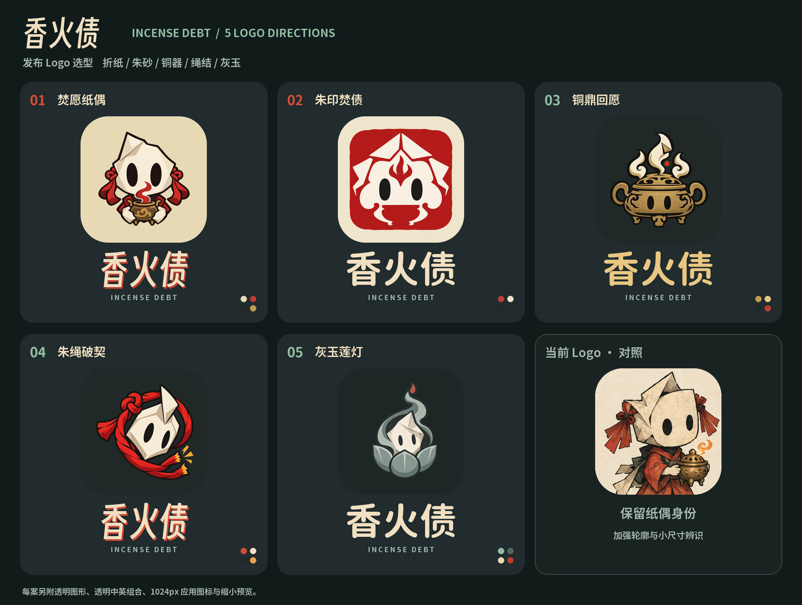
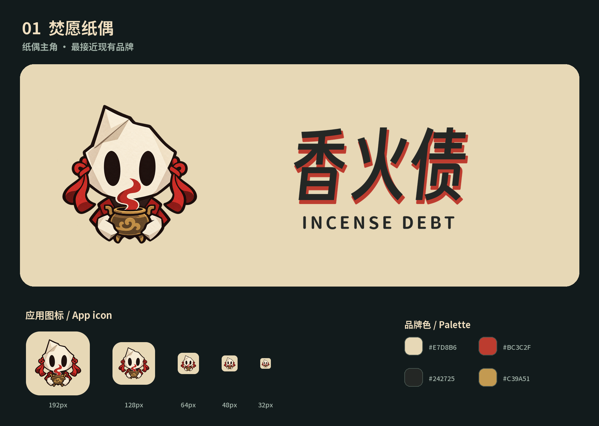
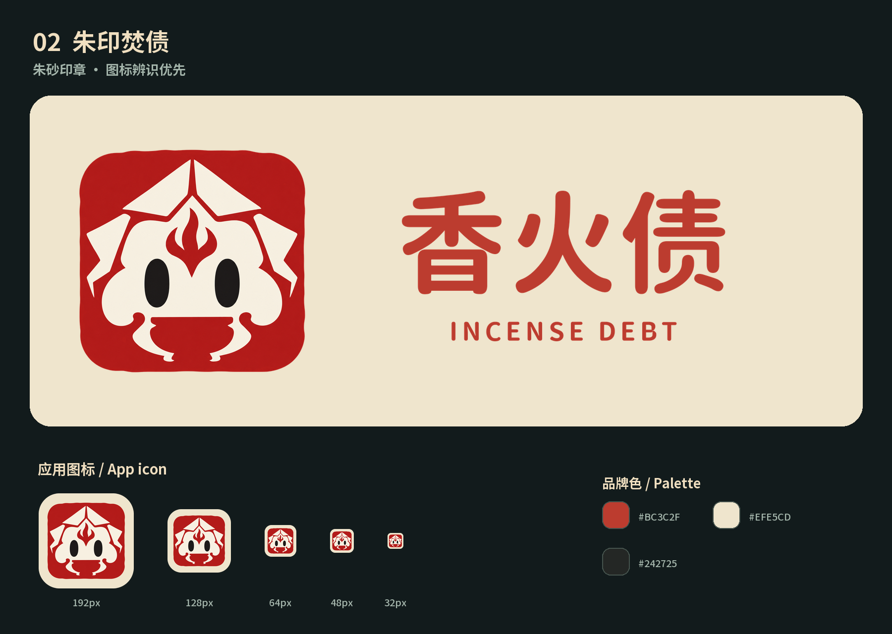
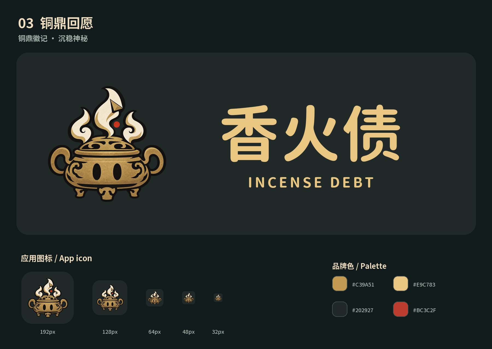
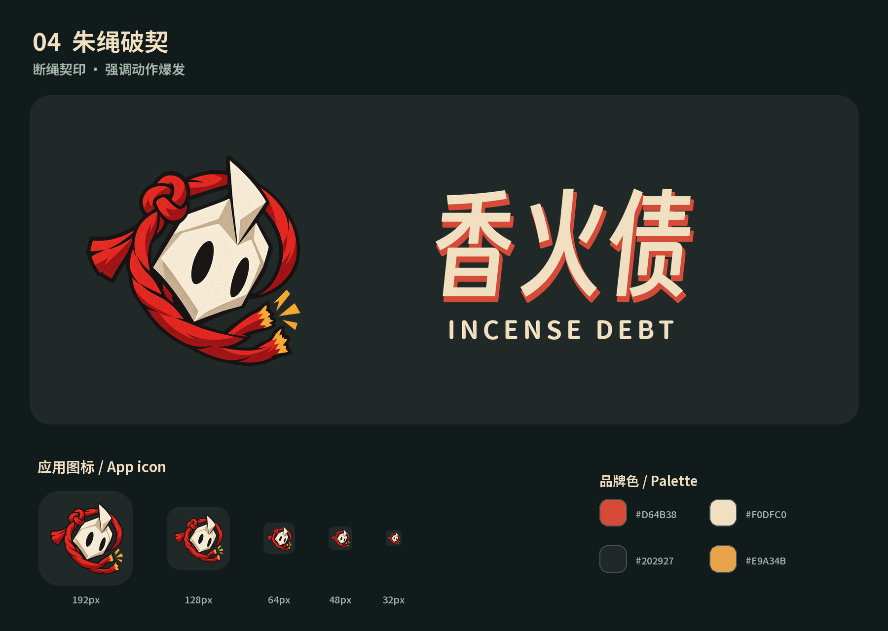
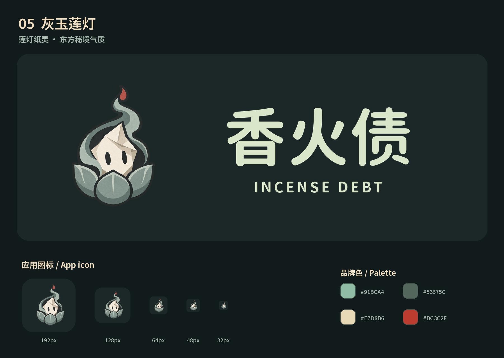

# 香火债 / Incense Debt · 发布 Logo 五案

日期：2026-10-08。以当前折纸脸、椭圆黑眼、红绳和铜香炉为来源，保留中式纸扎 / 木版气质，针对发布图标与品牌锁定图重新构建。

| 编号 | 方向 | 特征 | 优先用途 |
| --- | --- | --- | --- |
| 01 | 焚愿纸偶 | 把现有纸童收拢成大头标志，保留折纸脸、黑眼、红结与小香炉；亲近感和角色识别最强。 | 主品牌、应用图标、头像、开屏 |
| 02 | 朱印焚债 | 将纸脸与焚债火焰压成朱砂印记，粗轮廓和负形在小尺寸下更清楚，东方识别直接。 | 桌面与移动图标、小尺寸头像、角标 |
| 03 | 铜鼎回愿 | 让铜香炉成为主形，把纸偶眼睛和纸焰融进炉身；适合深色启动页与发布封面。 | 深色开屏、发布封面、横向品牌锁定图 |
| 04 | 朱绳破契 | 以红绳连债、断契焚烧为记忆点，倾斜纸脸与断开的绳环让标志更有动作感。 | 动作宣传、视频片头、活动封面 |
| 05 | 灰玉莲灯 | 把纸脸、烟焰和莲灯融合成灰玉标志，保留朱砂火芯，强调世界观与安静的神秘感。 | 世界观主视觉、深色主题、品牌周边 |

选型建议：01 最贴近当前角色，适合主品牌；02 轮廓最简洁，适合小图标；03 偏铜器秘境；04 突出连债 / 焚债动作；05 偏灰玉庙宇氛围。

每案的 `*-generated.png` 是 Sub2API / gpt-image-2.5 / high 实际生成原图；`*-symbol.png` 是统一留白后的 1024px 透明图形；`*-lockup.png` 是 2400×840px 透明中英组合；`*-app-icon-1024.png` 是无预切圆角的应用底图。另有 256/128/64/48/32px 预览。圆角在评审图中模拟，应用交付原图保留完整方形，避免系统裁切造成重复圆角。

游戏名固定为 `香火债` / `INCENSE DEBT`。文字使用本游戏已有得意黑与 Incense Rounded 精确排版；说明使用 Noto Sans SC。栅格设计，没有宣称为矢量文件。当前为选型候选素材。

## 01 · 焚愿纸偶

把现有纸童收拢成大头标志，保留折纸脸、黑眼、红结与小香炉；亲近感和角色识别最强。

## 02 · 朱印焚债

将纸脸与焚债火焰压成朱砂印记，粗轮廓和负形在小尺寸下更清楚，东方识别直接。

## 03 · 铜鼎回愿

让铜香炉成为主形，把纸偶眼睛和纸焰融进炉身；适合深色启动页与发布封面。

## 04 · 朱绳破契

以红绳连债、断契焚烧为记忆点，倾斜纸脸与断开的绳环让标志更有动作感。

## 05 · 灰玉莲灯

把纸脸、烟焰和莲灯融合成灰玉标志，保留朱砂火芯，强调世界观与安静的神秘感。

## English

Five release-brand directions derived from the existing paper spirit, oval eyes, red knots and bronze incense burner. Real Sub2-generated artwork is composed with accurately typeset Chinese/English titles. Each option includes a transparent symbol, transparent bilingual lockup, a full-square 1024px app icon, and several reduced-size previews. Review boards simulate system corner masks; shipped app-icon source images remain square. These are raster candidates for selection.
